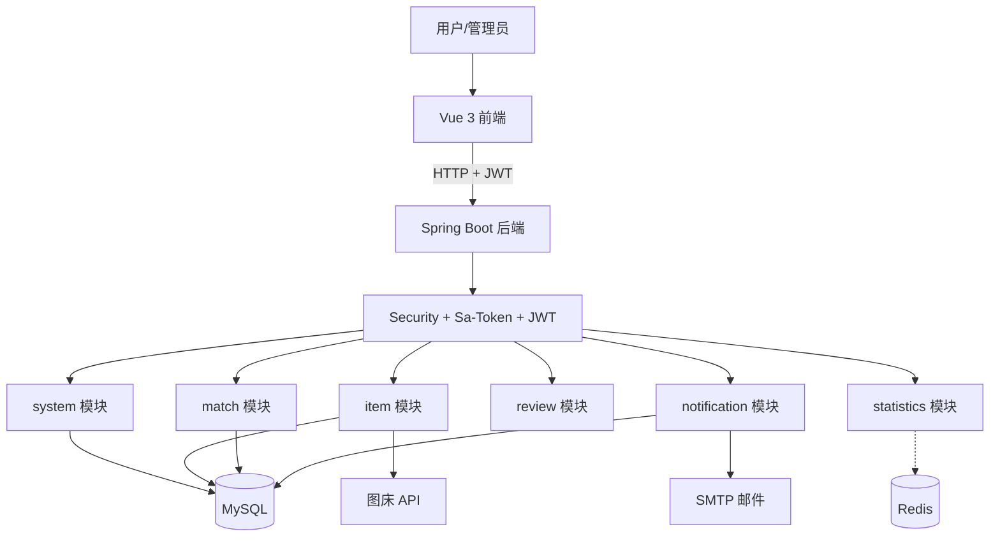
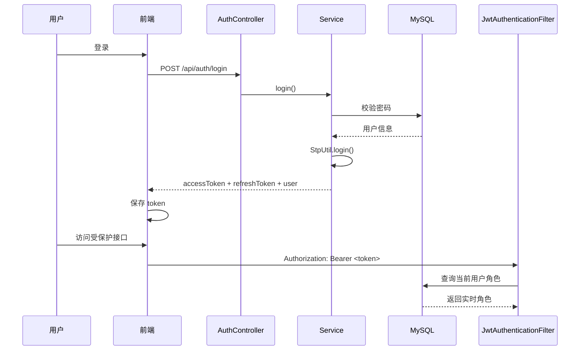
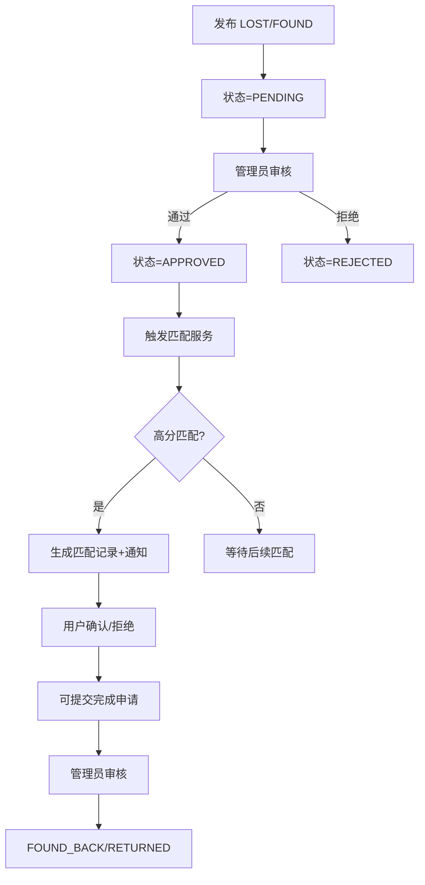

# 校园失物招领平台

面向高校师生的失物招领信息管理系统，采用前后端分离架构，实现寻物启示发布、失物招领信息管理、智能匹配推荐、用户管理等功能。

## 技术栈

| 层级 | 技术 | 说明 |
|------|------|------|
| 前端 | Vue 3 + Vite + Element Plus | 渐进式前端框架 |
| 后端 | Spring Boot 3.2 + JDK 17 | 企业级 Java 框架 |
| 数据访问 | MyBatis Plus 3.5.5 | 自动 CRUD，无 XML 映射 |
| 数据库 | MySQL 8 | utf8mb4 字符集 |
| 缓存 | Redis 7 + Lettuce | Lettuce 连接池 |
| 认证授权 | Sa-Token + Spring Security + JJWT | 三件套协作鉴权 |
| 文档 | SpringDoc OpenAPI 2.2.0 | Swagger UI |
| 邮件 | Jakarta Mail | 匹配通知/审核结果邮件 |
| 图床 | 外部图床 HTTP API | 无本地存储 |

## 项目结构

```
校园失物招领平台/
├── backend/                           # Spring Boot 后端（端口 18090）
├── frontend/                         # Vue 3 + Vite 前端（端口 3000）
├── docs/                             # 设计与说明文档
│   └── sql/                          # 数据库脚本
│       ├── schema.sql                # 建表脚本
│       ├── data.sql                  # 初始化数据
│       ├── phase9_migration.sql      # 旧库升级
│       ├── phase10_remove_reward.sql # 旧库升级
│       └── phase17_email_unique.sql  # 邮箱唯一约束 + 脏数据清理
├── pom.xml                           # Maven 父 POM
└── start-*.bat                       # 启动脚本
```

### 后端结构

```
backend/src/main/java/com/campus/lostfound/
├── CampusLostFoundApplication.java   # 启动类
├── common/                           # 公共层
│   ├── constant/                     #   枚举/常量
│   ├── dto/request/                   #   入参 DTO
│   ├── exception/                     #   异常处理
│   ├── result/                        #   统一响应
│   └── util/                          #   工具类
├── config/                           # 框架配置
├── security/                          # 认证授权
└── modules/                           # 业务模块
    ├── system/                        #   用户/认证
    ├── item/                          #   物品/图片/位置
    ├── match/                         #   智能匹配
    ├── notification/                 #   通知/邮件
    ├── review/                        # 管理员审核(物品/认领/完成申请)
    └── statistics/                    #   统计
```

### 前端结构

```
frontend/src/
├── views/                            # 页面视图
├── components/                       # UI 组件
├── stores/                            # Pinia 状态管理
├── router/                            # 路由与守卫
├── utils/                             # Axios 封装/工具
└── config/                            # 站点配置
```

## 系统架构



## 登录鉴权流程



## 核心模块

| 模块 | 职责 |
|------|------|
| system | 登录注册、个人中心、用户管理、实名认证 |
| item | 物品 CRUD、位置管理、图片上传、完成申请 |
| match | 智能匹配、匹配确认/拒绝、证件失主通知 |
| review | 物品审核、认领审核、完成申请审核 |
| notification | 站内通知、邮件提醒 |
| statistics | 首页统计、后台报表 |

## 物品业务流程



## 快速启动

### 环境要求
- JDK 17+
- Node.js 18+
- MySQL 8+
- Redis 7+（可选）

### 1. 初始化数据库

```bash
mysql -u root -p < docs/sql/schema.sql
mysql -u root -p < docs/sql/data.sql
```

### 2. 配置后端

复制 `backend/src/main/resources/application-local.yml.example.yml` 为 `application.yml`，修改数据库和邮件配置。

### 3. 启动后端

```bash
mvn -f backend/pom.xml spring-boot:run
# 或双击 start-backend.bat
```

### 4. 启动前端

```bash
cd frontend && npm install && npm run dev
# 或双击 start-frontend.bat
```

## 测试账号

| 用户名 | 密码 | 角色 |
|--------|------|------|
| superadmin | 123456 | 超级管理员 |
| campusadmin | 123456 | 校园管理员 |
| testuser | 123456 | 普通用户 |
| user_qq | 123456 | 普通用户(真实邮箱,可收通知) |

## API 文档

启动后访问：http://localhost:18090/swagger-ui.html

## 相关文档

- [功能与API](功能与API.md) - 功能说明与接口文档
- [数据库设计](数据库设计.md) - 表结构与关系
- [智能匹配设计](智能匹配设计.md) - 匹配算法说明
- [测试与质量](testing-and-quality.md) - 测试基线与方法
- [第十八轮验收报告](test-run-2026-06-07-phase18.md) - 2026-06-07 端到端验收
