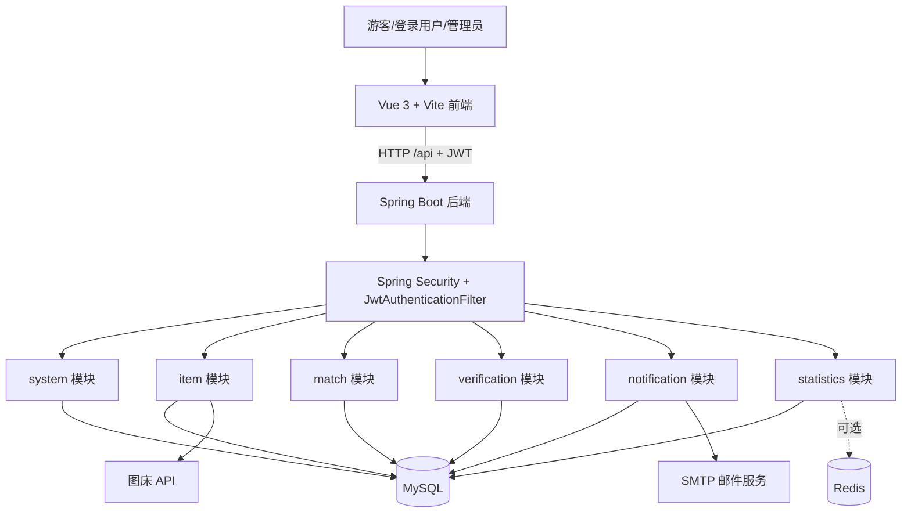
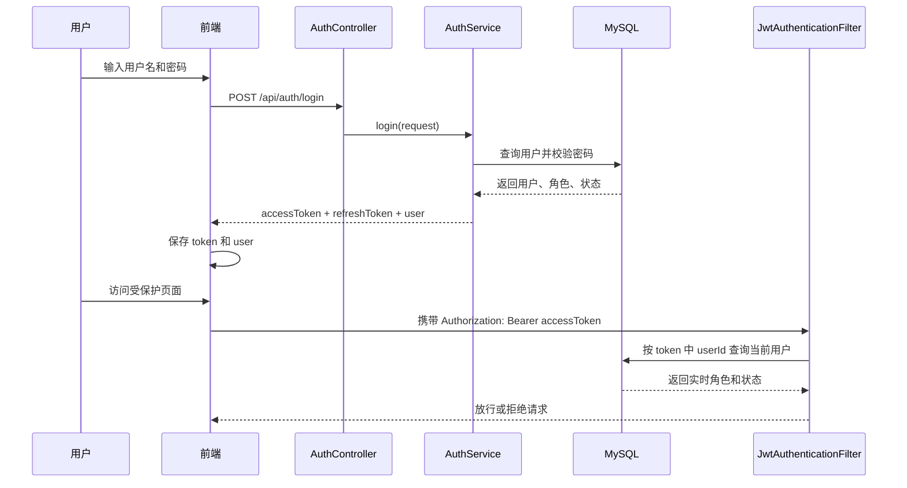
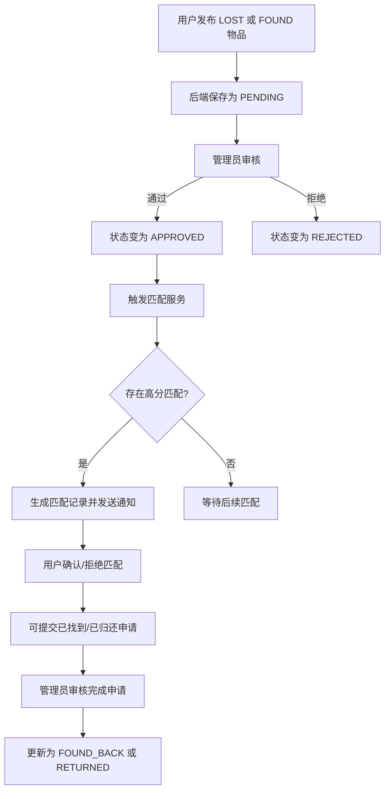

# 校园失物招领平台 - 实现架构总览

## 1. 文档定位
- 本文描述当前代码库已经落地的系统架构，而不是最初的目标设计稿。
- 适用对象：项目维护者、联调同学、答辩汇报、后续接手开发人员。
- 代码基线：`backend/` + `frontend/` 当前实现。

## 2. 总体架构

## 3. 前端分层
- `views/`：页面级视图，覆盖首页、列表、详情、发布、个人中心和管理员页面。
- `components/`：公共 UI 组件，如 `Header`、`Footer`、`ItemCard`、登录/注册弹窗。
- `stores/`：Pinia 状态管理，当前核心为 `user`、`item`、`notification`。
- `router/`：路由表与前端门禁，负责游客页、登录用户页、管理员页切换。
- `utils/`：Axios 封装、消息提示、格式化函数。

## 4. 后端模块职责

| 模块 | 职责 | 代表能力 |
|---|---|---|
| `system` | 登录注册、个人中心、用户管理、实名认证、数据库修复工具 | JWT 登录、管理员用户管理、实名认证审核 |
| `item` | 物品 CRUD、位置管理、图片上传、完成申请 | 发布、编辑、删除、图片持久化、完成申请 |
| `match` | 智能匹配、匹配确认/拒绝、证件失主通知 | 串号精确匹配、加权匹配、证件号找失主 |
| `verification` | 物品审核、认领审核 | 待审核列表、通过/拒绝、认领审核 |
| `notification` | 站内通知、邮件提醒 | 未读数、已读、匹配邮件 |
| `statistics` | 首页公开统计、后台统计报表 | 概览、今日统计、类别/位置统计 |

## 5. 登录鉴权链路

### 鉴权实现要点
- 只接受 `access token` 进入受保护接口。
- 不信任 token 里的旧角色，真正权限以数据库当前用户角色为准。
- 禁用用户即使持有旧 token 也会被拒绝。
- 管理接口区分 `CAMPUS_ADMIN` 与 `SUPER_ADMIN`，数据库修复接口只允许超管。

## 6. 物品发布到匹配的业务闭环

## 7. 实名认证与证件匹配
- 实名认证为可选能力，不阻塞普通用户浏览、搜索和发布。
- 用户提交实名信息后进入待审核；管理员审核通过后状态变为 `VERIFIED`。
- 当招领信息为证件类且证件号与已实名用户一致时，系统会触发“疑似失主通知”。
- 当前实现是“证件号精确匹配 + 人工审核确认”的闭环，不包含 OCR 或第三方实名接口接入。

## 8. 对外依赖
- MySQL：核心业务数据存储。
- 图床 API：物品图片上传，当前后端做代理转发，默认目标存储为 `r2`。
- 邮件服务：用于测试邮件和匹配提醒邮件。
- Redis：已具备配置入口，但当前主流程并不强依赖 Redis 才能运行。

## 9. 当前架构特点
- 优点：权限边界、认证链路、审核链路和状态机已经基本闭环。
- 优点：前后端分层清晰，业务领域划分明确，便于继续拆测试和写文档。
- 风险：`DbFixController` 仍属于高危运维入口，只适合开发/演示环境。
- 风险：前端尚未建立自动化测试基线，当前质量保障仍以后端测试 + 前端构建 + 浏览器人工回归为主。
