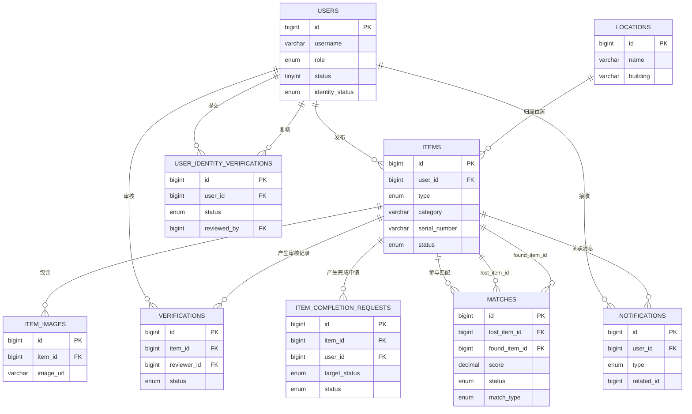
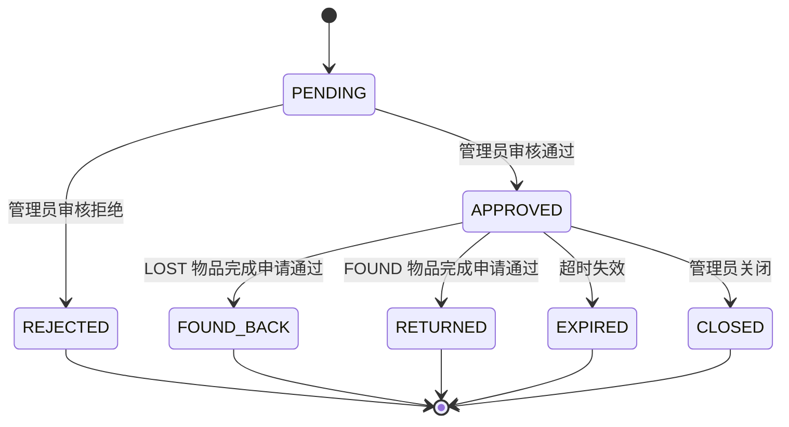
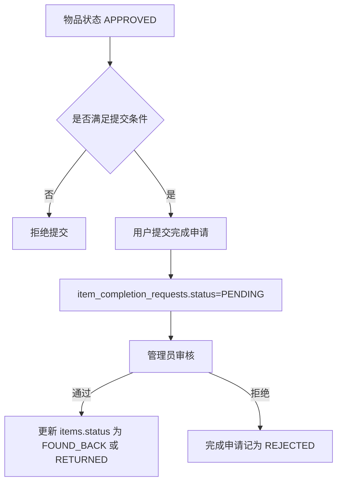

# 校园失物招领平台 - 数据库设计与状态流转

## 1. 文档说明
- 本文以 `docs/sql/complete_init.sql` 为当前数据库全量基线。
- 若历史库已存在，应先执行 `docs/sql/phase9_migration.sql`，再按需启用运行时自动补库。
- 本文只描述当前已落地的核心表、关系和状态流转。

## 2. 核心数据表

| 表名 | 作用 | 关键字段 |
|---|---|---|
| `users` | 用户主表 | `role`、`status`、`identity_status`、`real_name`、`id_card` |
| `user_identity_verifications` | 实名认证申请记录 | `status`、`review_reason`、`reviewed_by`、`reviewed_at` |
| `locations` | 校园位置字典 | `name`、`building`、`floor` |
| `items` | 物品主表 | `type`、`category`、`location_id`、`serial_number`、`status` |
| `item_images` | 物品图片 | `item_id`、`image_url`、`image_type` |
| `matches` | 匹配记录 | `lost_item_id`、`found_item_id`、`match_type`、`score`、`status` |
| `verifications` | 物品与认领审核记录 | `item_id`、`reviewer_id`、`status` |
| `item_completion_requests` | 已找到/已归还申请 | `target_status`、`status`、`reviewed_by` |
| `notifications` | 站内通知 | `type`、`title`、`content`、`related_id` |
| `daily_statistics` | 每日统计 | `stat_date`、`total_lost`、`total_found`、`total_matched` |

## 3. 实体关系图

## 4. 核心枚举

### 4.1 用户角色
- `SUPER_ADMIN`：超级管理员。
- `CAMPUS_ADMIN`：校园管理员。
- `USER`：普通用户。

### 4.2 用户实名状态
- `UNVERIFIED`：未实名。
- `PENDING`：已提交，待审核。
- `VERIFIED`：审核通过。
- `REJECTED`：审核拒绝。

### 4.3 物品主状态
- `PENDING`：待审核。
- `APPROVED`：审核通过，允许公开展示。
- `REJECTED`：审核拒绝。
- `FOUND_BACK`：寻物已找到。
- `RETURNED`：招领已归还。
- `EXPIRED`：已过期。
- `CLOSED`：人工关闭。

### 4.4 匹配状态
- `PENDING`：待用户确认。
- `CONFIRMED`：用户确认匹配。
- `REJECTED`：用户拒绝匹配。

### 4.5 完成申请状态
- `PENDING`：待审核。
- `APPROVED`：审核通过。
- `REJECTED`：审核拒绝。

## 5. 物品状态流转

## 6. 完成申请审核流

## 7. 设计约束
- `users.id_card` 在实名通过后用于证件类失主精确匹配，前后端都需统一转大写，避免 `x/X` 漏匹配。
- `items.serial_number` 同时承载普通序列号与证件号语义，证件类匹配应配合分类判断使用。
- `item_images` 与 `items` 分表，避免主表字段膨胀，并支持多图排序。
- `matches` 只记录匹配关系，不再把“已匹配”写回物品主状态；高分匹配标签由查询时派生。
- `notifications.related_id` 作为跳转关联字段，目前复用到物品、匹配、审核等多种业务对象。

## 8. 迁移与初始化建议
- 新库初始化：使用 `docs/sql/complete_init.sql`。
- 老库升级：优先执行 `docs/sql/phase9_migration.sql`。
- 本地开发兜底：可通过 `APP_AUTO_FIX_SCHEMA=true` 启用运行时自动补库。
- 风险提示：运行时补库适合开发环境，生产环境仍应优先采用显式迁移脚本。
