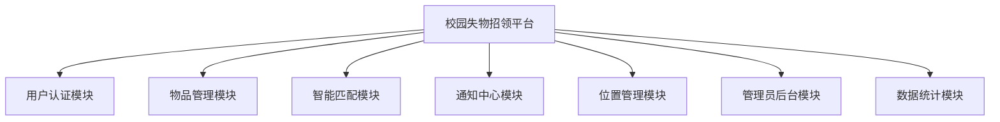
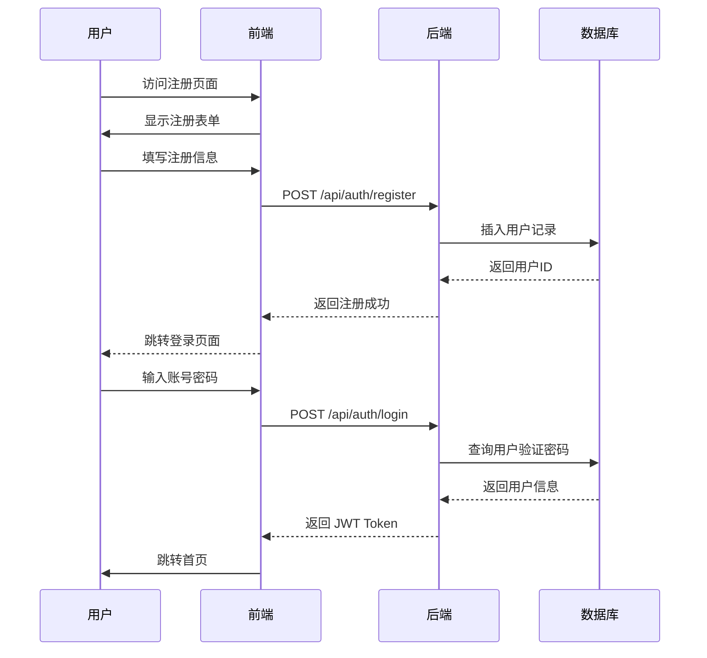
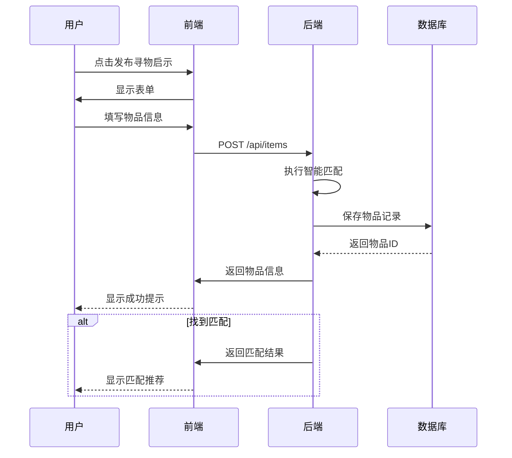
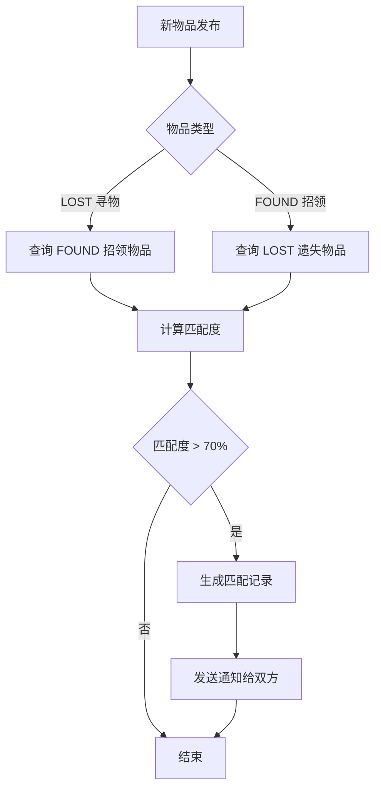
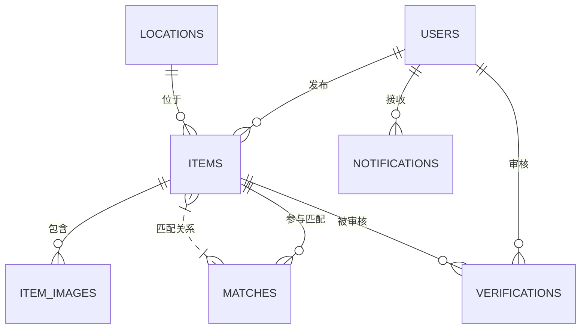
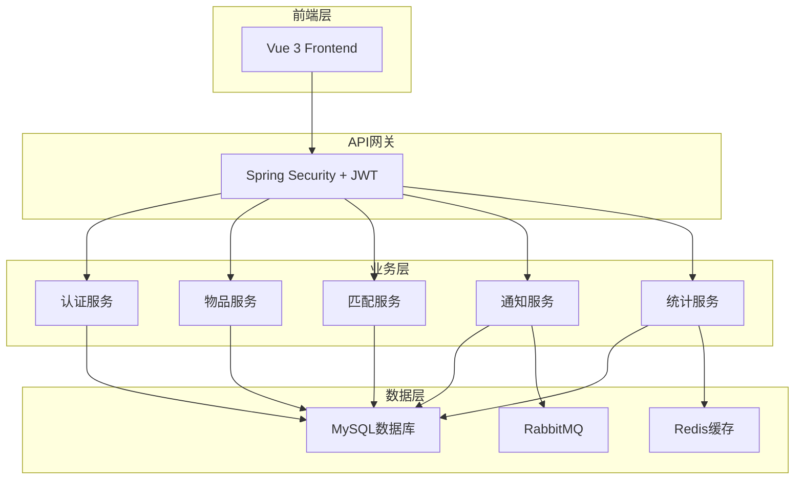
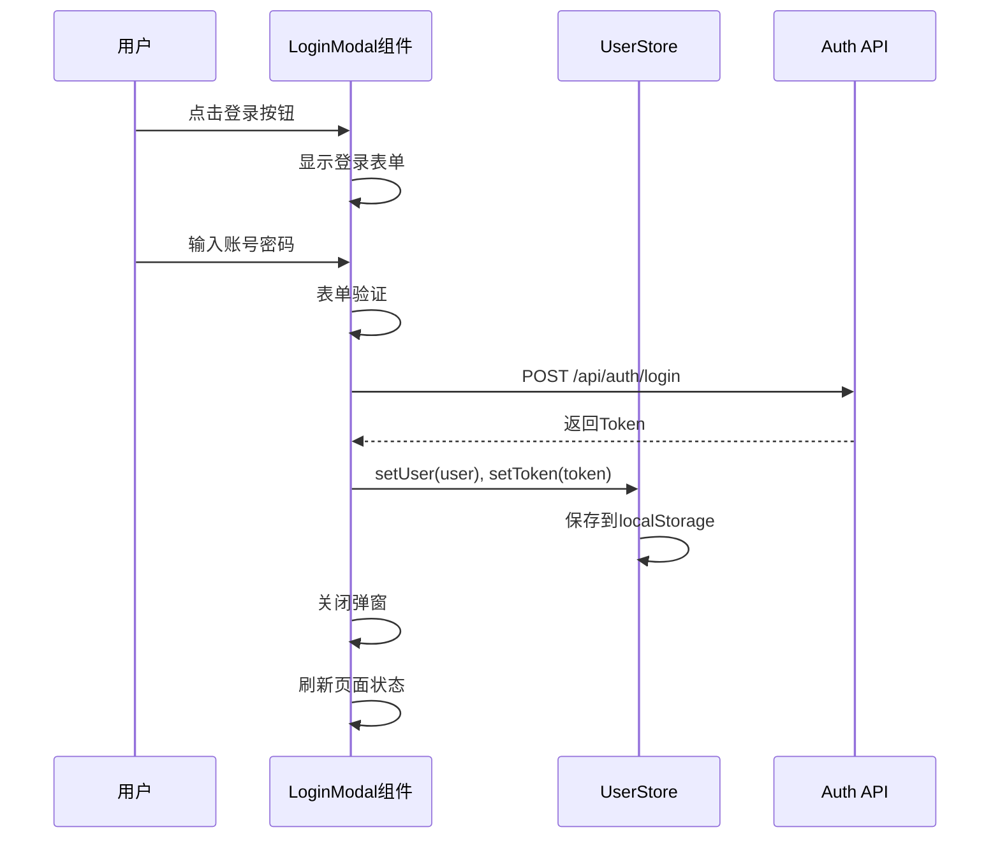
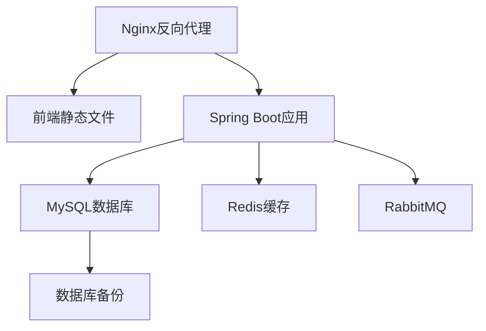

# 校园失物招领平台 - 功能设计规划文档

## 1. 项目概述

### 1.1 项目背景
随着校园规模的扩大，学生遗失物品的情况日益增多。传统的失物招领方式（如公告栏、班级群）效率低下，物品找回率低。本平台旨在利用现代信息技术，建立一个智能化的失物招领系统，通过**智能匹配算法**提高物品找回率，为师生提供便捷的失物招领服务。

### 1.2 项目目标
- 建立统一的失物招领信息平台
- 通过智能匹配算法自动关联遗失物品和招领信息
- 提高失物找回率至 60% 以上
- 提供便捷的用户体验和完善的管理功能

### 1.3 核心创新点：智能匹配系统
基于物品特征（类别、品牌、颜色、位置、时间、序列号等）的多维度智能匹配算法，自动为用户推荐可能匹配的物品。

---

## 2. 功能需求分析

### 2.1 用户角色定义

| 角色 | 权限描述 |
|------|----------|
| **普通用户** | 发布寻物启示、发布招领信息、查看物品列表、匹配查询、个人中心管理 |
| **校园管理员** | 审核物品信息、管理位置信息、处理用户反馈、查看统计数据 |
| **超级管理员** | 所有权限，包括用户管理、系统配置、数据统计 |

### 2.2 功能模块划分



### 2.3 详细功能清单

#### 2.3.1 用户认证模块

| 功能 | 描述 | 所属角色 |
|------|------|----------|
| 用户注册 | 学生/教职工注册账号 | 所有用户 |
| 用户登录 | 账号密码登录 | 所有用户 |
| 实名认证 | 身份证号、姓名认证（用于证件匹配） | 所有用户 |
| 密码找回 | 通过邮箱/手机号找回密码 | 所有用户 |
| JWT Token 认证 | 接口安全认证 | 所有用户 |

#### 2.3.2 物品管理模块

| 功能 | 描述 | 所属角色 |
|------|------|----------|
| 发布寻物启示 | 填写物品信息，发布丢失信息 | 普通用户 |
| 发布招领信息 | 填写物品信息，发布招领信息 | 普通用户 |
| 物品列表查询 | 分页查询物品列表，支持筛选 | 所有用户 |
| 物品详情查看 | 查看物品详细信息 | 所有用户 |
| 物品编辑 | 修改待审核的物品信息 | 发布者 |
| 物品删除 | 删除待审核的物品信息 | 发布者/管理员 |
| 物品审核 | 审核用户发布的物品信息 | 管理员 |
| 物品认领 | 申请认领物品 | 普通用户 |
| 认领确认 | 确认认领成功 | 发布者/管理员 |

#### 2.3.3 智能匹配模块

| 功能 | 描述 | 所属角色 |
|------|------|----------|
| 自动匹配 | 系统自动为遗失物品匹配可能的招领信息 | 系统 |
| 匹配推荐 | 向用户推荐匹配度高的物品 | 所有用户 |
| 匹配详情 | 查看匹配详情和相似度 | 所有用户 |
| 手动匹配 | 管理员手动建立匹配关系 | 管理员 |
| 证件自动匹配 | 根据证件号自动匹配失主 | 系统 |

#### 2.3.4 通知中心模块

| 功能 | 描述 | 所属角色 |
|------|------|----------|
| 站内通知 | 系统消息推送 | 所有用户 |
| 邮件通知 | 重要消息邮件提醒 | 所有用户 |
| 通知列表 | 查看通知历史 | 所有用户 |
| 通知设置 | 设置通知偏好 | 所有用户 |

#### 2.3.5 位置管理模块

| 功能 | 描述 | 所属角色 |
|------|------|----------|
| 位置列表 | 查看所有预设位置 | 所有用户 |
| 位置添加 | 添加新位置 | 管理员 |
| 位置编辑 | 修改位置信息 | 管理员 |
| 位置删除 | 删除位置 | 管理员 |

#### 2.3.6 管理员后台模块

| 功能 | 描述 | 所属角色 |
|------|------|----------|
| 用户管理 | 查看、禁用、启用用户 | 管理员 |
| 物品管理 | 审核、删除物品 | 管理员 |
| 匹配管理 | 查看、确认匹配关系 | 管理员 |
| 系统配置 | 配置系统参数 | 超级管理员 |

#### 2.3.7 数据统计模块

| 功能 | 描述 | 所属角色 |
|------|------|----------|
| 数据概览 | 物品总数、找回率等统计 | 管理员 |
| 趋势分析 | 按时间维度的统计分析 | 管理员 |
| 分类统计 | 按类别/位置的统计 | 管理员 |

---

## 3. 业务流程设计

### 3.1 用户注册登录流程



### 3.2 发布寻物启示流程



### 3.3 智能匹配流程图



---

## 4. 数据库设计

### 4.1 数据库表结构

#### 4.1.1 用户表 (users)

| 字段名 | 类型 | 约束 | 说明 |
|--------|------|------|------|
| id | BIGINT | PRIMARY KEY, AUTO_INCREMENT | 用户ID |
| username | VARCHAR(50) | NOT NULL, UNIQUE | 用户名 |
| password | VARCHAR(255) | NOT NULL | 密码(BCrypt加密) |
| email | VARCHAR(100) | UNIQUE | 邮箱 |
| student_id | VARCHAR(20) | UNIQUE | 学号/工号 |
| phone | VARCHAR(20) | | 手机号 |
| real_name | VARCHAR(50) | | 真实姓名(实名认证) |
| id_card | VARCHAR(18) | UNIQUE | 身份证号(实名认证) |
| role | VARCHAR(20) | NOT NULL | 角色: USER/CAMPUS_ADMIN/SUPER_ADMIN |
| status | TINYINT | NOT NULL DEFAULT 1 | 状态: 0禁用/1启用 |
| last_login_time | DATETIME | | 最后登录时间 |
| created_at | DATETIME | NOT NULL | 创建时间 |
| updated_at | DATETIME | NOT NULL | 更新时间 |
| deleted | TINYINT | NOT NULL DEFAULT 0 | 逻辑删除 |

#### 4.1.2 物品表 (items)

| 字段名 | 类型 | 约束 | 说明 |
|--------|------|------|------|
| id | BIGINT | PRIMARY KEY, AUTO_INCREMENT | 物品ID |
| user_id | BIGINT | FOREIGN KEY | 发布者ID |
| type | VARCHAR(20) | NOT NULL | 类型: LOST/FOUND |
| category | VARCHAR(50) | NOT NULL | 类别: 电子产品/证件/书籍等 |
| title | VARCHAR(100) | NOT NULL | 标题 |
| description | TEXT | | 描述 |
| brand | VARCHAR(50) | | 品牌 |
| color | VARCHAR(20) | | 颜色 |
| location_id | BIGINT | FOREIGN KEY | 位置ID |
| lost_time | DATETIME | | 丢失时间 |
| found_time | DATETIME | | 拾到时间 |
| serial_number | VARCHAR(50) | | 序列号/证件号 |
| contact_info | VARCHAR(100) | | 联系方式 |
| reward | INT | DEFAULT 0 | 悬赏金额(元) |
| status | VARCHAR(20) | NOT NULL | 状态: PENDING/APPROVED/CLAIMED/EXPIRED/CLOSED |
| view_count | INT | DEFAULT 0 | 浏览次数 |
| match_score | DECIMAL(5,2) | | 匹配分数 |
| match_item_id | BIGINT | FOREIGN KEY | 匹配物品ID |
| created_at | DATETIME | NOT NULL | 创建时间 |
| updated_at | DATETIME | NOT NULL | 更新时间 |
| deleted | TINYINT | NOT NULL DEFAULT 0 | 逻辑删除 |

#### 4.1.3 位置表 (locations)

| 字段名 | 类型 | 约束 | 说明 |
|--------|------|------|------|
| id | BIGINT | PRIMARY KEY, AUTO_INCREMENT | 位置ID |
| name | VARCHAR(100) | NOT NULL | 位置名称 |
| building | VARCHAR(50) | NOT NULL | 所属建筑 |
| floor | INT | | 楼层 |
| description | VARCHAR(200) | | 描述 |
| created_at | DATETIME | NOT NULL | 创建时间 |
| updated_at | DATETIME | NOT NULL | 更新时间 |
| deleted | TINYINT | NOT NULL DEFAULT 0 | 逻辑删除 |

#### 4.1.4 匹配记录表 (matches)

| 字段名 | 类型 | 约束 | 说明 |
|--------|------|------|------|
| id | BIGINT | PRIMARY KEY, AUTO_INCREMENT | 匹配ID |
| lost_item_id | BIGINT | FOREIGN KEY | 遗失物品ID |
| found_item_id | BIGINT | FOREIGN KEY | 招领物品ID |
| score | DECIMAL(5,2) | NOT NULL | 匹配分数 |
| status | VARCHAR(20) | NOT NULL | 状态: PENDING/CONFIRMED/REJECTED |
| created_at | DATETIME | NOT NULL | 创建时间 |
| updated_at | DATETIME | NOT NULL | 更新时间 |

#### 4.1.5 物品图片表 (item_images)

| 字段名 | 类型 | 约束 | 说明 |
|--------|------|------|------|
| id | BIGINT | PRIMARY KEY, AUTO_INCREMENT | 图片ID |
| item_id | BIGINT | FOREIGN KEY | 物品ID |
| image_url | VARCHAR(500) | NOT NULL | 图片URL |
| image_type | VARCHAR(20) | | MAIN/OTHER |
| sort_order | INT | DEFAULT 0 | 排序 |
| created_at | DATETIME | NOT NULL | 创建时间 |

#### 4.1.6 通知表 (notifications)

| 字段名 | 类型 | 约束 | 说明 |
|--------|------|------|------|
| id | BIGINT | PRIMARY KEY, AUTO_INCREMENT | 通知ID |
| user_id | BIGINT | FOREIGN KEY | 用户ID |
| type | VARCHAR(20) | NOT NULL | 通知类型 |
| title | VARCHAR(100) | NOT NULL | 标题 |
| content | TEXT | NOT NULL | 内容 |
| link | VARCHAR(500) | | 链接 |
| is_read | TINYINT | DEFAULT 0 | 是否已读 |
| created_at | DATETIME | NOT NULL | 创建时间 |

#### 4.1.7 审核记录表 (verifications)

| 字段名 | 类型 | 约束 | 说明 |
|--------|------|------|------|
| id | BIGINT | PRIMARY KEY, AUTO_INCREMENT | 审核ID |
| item_id | BIGINT | FOREIGN KEY | 物品ID |
| reviewer_id | BIGINT | FOREIGN KEY | 审核人ID |
| status | VARCHAR(20) | NOT NULL | 审核结果: APPROVED/REJECTED |
| remark | VARCHAR(200) | | 审核备注 |
| created_at | DATETIME | NOT NULL | 创建时间 |

#### 4.1.8 每日统计表 (daily_statistics)

| 字段名 | 类型 | 约束 | 说明 |
|--------|------|------|------|
| id | BIGINT | PRIMARY KEY, AUTO_INCREMENT | ID |
| stat_date | DATE | NOT NULL, UNIQUE | 统计日期 |
| total_lost | INT | DEFAULT 0 | 遗失物品数 |
| total_found | INT | DEFAULT 0 | 招领物品数 |
| total_matched | INT | DEFAULT 0 | 匹配成功数 |
| total_claimed | INT | DEFAULT 0 | 已认领数 |
| created_at | DATETIME | NOT NULL | 创建时间 |

### 4.2 实体关系图 (ERD)



---

## 5. 后端系统设计

### 5.1 技术栈

| 分类 | 技术 | 版本 |
|------|------|------|
| 语言 | Java | 21 |
| 框架 | Spring Boot | 3.2.x |
| ORM | MyBatis Plus | 3.5.x |
| 数据库 | MySQL | 8.0+ |
| 缓存 | Redis | 7.0+ |
| 消息队列 | RabbitMQ | 3.12+ |
| JWT | jjwt | 0.12.x |
| API文档 | SpringDoc OpenAPI | 2.3.x |

### 5.2 架构设计



### 5.3 目录结构

```
backend/
├── src/main/java/com/campus/lostfound/
│   ├── CampusLostFoundApplication.java  # 启动类
│   ├── config/                          # 配置类
│   │   ├── CorsConfig.java
│   │   ├── MybatisPlusConfig.java
│   │   ├── RedisConfig.java
│   │   ├── RabbitMQConfig.java
│   │   └── SwaggerConfig.java
│   ├── security/                        # 安全模块
│   │   ├── JwtAuthenticationFilter.java
│   │   ├── config/WebSecurityConfig.java
│   │   └── util/JwtUtils.java
│   ├── common/                          # 公共模块
│   │   ├── dto/                         # 数据传输对象
│   │   │   ├── request/
│   │   │   └── response/
│   │   ├── entity/                      # 基础实体
│   │   ├── exception/                   # 异常处理
│   │   │   ├── BusinessException.java
│   │   │   └── GlobalExceptionHandler.java
│   │   └── result/                      # 统一响应
│   │       ├── ApiResponse.java
│   │       └── PageResponse.java
│   ├── modules/                         # 业务模块
│   │   ├── auth/                        # 认证模块
│   │   │   ├── controller/AuthController.java
│   │   │   ├── service/AuthService.java
│   │   │   ├── service/impl/AuthServiceImpl.java
│   │   │   ├── entity/User.java
│   │   │   └── repository/UserRepository.java
│   │   ├── item/                        # 物品模块
│   │   │   ├── controller/ItemController.java
│   │   │   ├── controller/LocationController.java
│   │   │   ├── service/ItemService.java
│   │   │   ├── service/impl/ItemServiceImpl.java
│   │   │   ├── entity/Item.java
│   │   │   ├── entity/Location.java
│   │   │   ├── entity/ItemImage.java
│   │   │   └── repository/
│   │   ├── match/                       # 匹配模块
│   │   │   ├── controller/MatchController.java
│   │   │   ├── service/MatchService.java
│   │   │   ├── service/impl/MatchServiceImpl.java
│   │   │   ├── entity/Match.java
│   │   │   └── repository/MatchRepository.java
│   │   ├── notification/                # 通知模块
│   │   ├── admin/                       # 管理模块
│   │   └── statistics/                  # 统计模块
│   └── util/                            # 工具类
├── src/main/resources/
│   ├── application.yml                  # 应用配置
│   └── mapper/                          # MyBatis映射文件
└── pom.xml                              # Maven配置
```

### 5.4 核心接口设计

#### 5.4.1 认证接口

| API路径 | HTTP方法 | 描述 | 需要认证 |
|---------|----------|------|----------|
| /api/auth/register | POST | 用户注册 | 否 |
| /api/auth/login | POST | 用户登录 | 否 |
| /api/auth/logout | POST | 用户登出 | 是 |
| /api/auth/refresh | POST | 刷新Token | 是 |
| /api/auth/profile | GET | 获取用户信息 | 是 |
| /api/auth/profile | PUT | 更新用户信息 | 是 |
| /api/auth/verify | POST | 实名认证 | 是 |

#### 5.4.2 物品接口

| API路径 | HTTP方法 | 描述 | 需要认证 |
|---------|----------|------|----------|
| /api/items | GET | 分页查询物品列表 | 否 |
| /api/items/{id} | GET | 获取物品详情 | 否 |
| /api/items | POST | 创建物品 | 是 |
| /api/items/{id} | PUT | 更新物品 | 是 |
| /api/items/{id} | DELETE | 删除物品 | 是 |
| /api/items/{id}/claim | POST | 申请认领 | 是 |
| /api/items/{id}/verify | POST | 审核物品 | 管理员 |

#### 5.4.3 匹配接口

| API路径 | HTTP方法 | 描述 | 需要认证 |
|---------|----------|------|----------|
| /api/matches | GET | 查询匹配列表 | 是 |
| /api/matches/{id} | GET | 获取匹配详情 | 是 |
| /api/matches/{id}/confirm | POST | 确认匹配 | 是 |
| /api/matches/{id}/reject | POST | 拒绝匹配 | 是 |

#### 5.4.4 位置接口

| API路径 | HTTP方法 | 描述 | 需要认证 |
|---------|----------|------|----------|
| /api/locations | GET | 获取位置列表 | 否 |
| /api/locations/{id} | GET | 获取位置详情 | 否 |
| /api/locations | POST | 创建位置 | 管理员 |
| /api/locations/{id} | PUT | 更新位置 | 管理员 |
| /api/locations/{id} | DELETE | 删除位置 | 管理员 |

#### 5.4.5 通知接口

| API路径 | HTTP方法 | 描述 | 需要认证 |
|---------|----------|------|----------|
| /api/notifications | GET | 获取通知列表 | 是 |
| /api/notifications/{id} | GET | 获取通知详情 | 是 |
| /api/notifications/{id}/read | POST | 标记已读 | 是 |
| /api/notifications/read-all | POST | 全部标记已读 | 是 |

#### 5.4.6 管理员接口

| API路径 | HTTP方法 | 描述 | 需要认证 |
|---------|----------|------|----------|
| /api/admin/users | GET | 查询用户列表 | 管理员 |
| /api/admin/users/{id} | GET | 获取用户详情 | 管理员 |
| /api/admin/users/{id} | PUT | 更新用户状态 | 管理员 |
| /api/admin/statistics | GET | 获取统计数据 | 管理员 |

### 5.5 智能匹配算法设计

#### 5.5.1 匹配评分规则

| 匹配维度 | 权重 | 匹配方式 |
|----------|------|----------|
| 类别匹配 | 30% | 完全匹配得满分 |
| 品牌匹配 | 15% | 完全匹配得满分 |
| 颜色匹配 | 10% | 完全匹配得满分 |
| 位置匹配 | 20% | 相同位置得满分，相邻位置得50% |
| 时间匹配 | 15% | 时间差越小分数越高 |
| 序列号匹配 | 10% | 完全匹配得满分 |

#### 5.5.2 匹配流程

```
输入: 新发布物品(item)
输出: 匹配列表(按分数降序)

1. 根据物品类型确定查询方向
   - LOST -> 查询 FOUND 物品
   - FOUND -> 查询 LOST 物品

2. 构建查询条件
   - 相同类别
   - 时间范围: ±7天

3. 对每个候选物品计算匹配分数
   score = category_weight * category_match
         + brand_weight * brand_match  
         + color_weight * color_match
         + location_weight * location_match
         + time_weight * time_match
         + serial_weight * serial_match

4. 筛选分数 > 50% 的匹配
5. 按分数降序返回
```

---

## 6. 前端系统设计

### 6.1 技术栈

| 分类 | 技术 | 版本 |
|------|------|------|
| 框架 | Vue | 3.4.x |
| UI组件 | Element Plus | 2.6.x |
| 路由 | Vue Router | 4.3.x |
| 状态管理 | Pinia | 2.1.x |
| HTTP客户端 | Axios | 1.6.x |
| 构建工具 | Vite | 5.2.x |
| 图标 | Lucide Vue | 0.36.x |

### 6.2 页面结构

```
frontend/src/
├── App.vue                              # 根组件
├── main.js                              # 入口文件
├── router/                              # 路由配置
│   └── index.js
├── stores/                              # 状态管理
│   ├── user.js                          # 用户状态
│   ├── item.js                          # 物品状态
│   └── notification.js                  # 通知状态
├── components/                          # 公共组件
│   ├── Header.vue                       # 页头组件
│   ├── Footer.vue                       # 页脚组件
│   ├── LoginModal.vue                   # 登录弹窗
│   ├── RegisterModal.vue                # 注册弹窗
│   ├── ItemCard.vue                     # 物品卡片
│   ├── MatchCard.vue                    # 匹配卡片
│   └── NotificationBell.vue             # 通知铃铛
├── views/                               # 页面视图
│   ├── Home.vue                         # 首页
│   ├── ItemList.vue                     # 物品列表页
│   ├── ItemDetail.vue                   # 物品详情页
│   ├── PublishItem.vue                  # 发布物品页
│   ├── MyItems.vue                      # 我的物品页
│   ├── MatchList.vue                    # 匹配列表页
│   ├── Profile.vue                      # 个人中心页
│   ├── AdminDashboard.vue               # 管理员仪表盘
│   ├── AdminUsers.vue                   # 用户管理页
│   ├── AdminItems.vue                   # 物品管理页
│   └── AdminStatistics.vue              # 统计页
├── utils/                               # 工具函数
│   ├── axios.js                         # Axios配置
│   └── format.js                        # 格式化工具
└── assets/                              # 静态资源
    ├── css/                             # 样式文件
    └── images/                          # 图片资源
```

### 6.3 页面功能说明

#### 6.3.1 首页 (Home.vue)
- 展示物品统计概览
- 快速搜索物品
- 展示最新物品列表
- 发布入口快捷按钮

#### 6.3.2 物品列表页 (ItemList.vue)
- 筛选功能（类型、类别、位置）
- 搜索功能（关键字）
- 分页展示物品卡片
- 物品卡片展示基本信息

#### 6.3.3 物品详情页 (ItemDetail.vue)
- 展示物品详细信息
- 显示匹配推荐
- 申请认领按钮
- 分享功能

#### 6.3.4 发布物品页 (PublishItem.vue)
- 物品类型选择（寻物/招领）
- 表单填写（标题、类别、描述等）
- 位置选择（下拉选择预设位置）
- 图片上传

#### 6.3.5 我的物品页 (MyItems.vue)
- 展示用户发布的物品
- 物品状态筛选
- 编辑/删除操作

#### 6.3.6 匹配列表页 (MatchList.vue)
- 展示匹配记录
- 匹配分数显示
- 确认/拒绝匹配操作

#### 6.3.7 个人中心页 (Profile.vue)
- 用户信息展示
- 实名认证入口
- 修改密码
- 通知设置

#### 6.3.8 管理员仪表盘 (AdminDashboard.vue)
- 数据统计概览
- 快捷操作入口
- 待审核物品提醒

### 6.4 组件交互设计

#### 6.4.1 登录弹窗交互



---

## 7. 部署与运维设计

### 7.1 部署架构



### 7.2 环境配置

#### 开发环境
- 数据库：localhost:3306
- Redis：localhost:6379
- RabbitMQ：localhost:5672
- 前端：http://localhost:3000
- 后端：http://localhost:8081

#### 生产环境
- 数据库：独立MySQL服务
- Redis：独立缓存服务
- RabbitMQ：独立消息队列服务
- 前端：Nginx静态资源服务
- 后端：Spring Boot应用服务

### 7.3 配置文件管理

| 配置项 | 开发环境 | 生产环境 |
|--------|----------|----------|
| 数据库URL | localhost:3306 | 生产DB地址 |
| 数据库用户名 | root | 生产用户名 |
| 数据库密码 | xxx | 生产密码 |
| Redis地址 | localhost:6379 | 生产Redis地址 |
| JWT密钥 | 开发密钥 | 生产密钥 |
| 日志级别 | DEBUG | INFO |

---

## 8. 项目开发计划

### 8.1 开发阶段划分

| 阶段 | 时间 | 任务内容 |
|------|------|----------|
| 第一阶段 | 2周 | 基础架构搭建、用户认证模块 |
| 第二阶段 | 3周 | 物品管理模块、位置管理模块 |
| 第三阶段 | 3周 | 智能匹配模块、通知模块 |
| 第四阶段 | 2周 | 管理员后台、统计模块 |
| 第五阶段 | 2周 | 前端页面开发、联调测试 |
| 第六阶段 | 1周 | Bug修复、性能优化、文档完善 |

### 8.2 里程碑

| 里程碑 | 完成标准 |
|--------|----------|
| M1 | 用户注册登录功能完成 |
| M2 | 物品CRUD功能完成 |
| M3 | 智能匹配算法上线 |
| M4 | 管理员后台完成 |
| M5 | 前端页面全部完成 |
| M6 | 项目上线部署 |

---

## 9. 安全设计

### 9.1 认证与授权

- JWT Token认证
- 角色权限控制（USER/CAMPUS_ADMIN/SUPER_ADMIN）
- API接口权限校验

### 9.2 数据安全

- 密码BCrypt加密存储
- 身份证号加密存储
- 敏感信息脱敏展示

### 9.3 接口安全

- 请求参数校验
- SQL注入防护（MyBatis预编译）
- XSS攻击防护
- CSRF防护

### 9.4 文件上传安全

- 文件类型白名单校验
- 文件大小限制
- 文件存储路径隔离

---

## 10. 附录

### 10.1 物品类别枚举

| 类别 | 说明 |
|------|------|
| 电子产品 | 手机、电脑、耳机、充电宝等 |
| 证件 | 校园卡、身份证、学生证等 |
| 书籍 | 教材、图书、笔记本等 |
| 衣物 | 外套、围巾、帽子等 |
| 饰品 | 手表、项链、钥匙等 |
| 文具 | 笔、书包、计算器等 |
| 其他 | 不属于以上类别的物品 |

### 10.2 用户角色枚举

| 角色 | 说明 |
|------|------|
| USER | 普通用户 |
| CAMPUS_ADMIN | 校园管理员 |
| SUPER_ADMIN | 超级管理员 |

### 10.3 物品状态枚举

| 状态 | 说明 |
|------|------|
| PENDING | 待审核 |
| APPROVED | 已审核 |
| CLAIMED | 已认领 |
| EXPIRED | 已过期 |
| CLOSED | 已关闭 |

---

**文档版本**: v1.0  
**创建日期**: 2026-05-26  
**作者**: 开发团队
