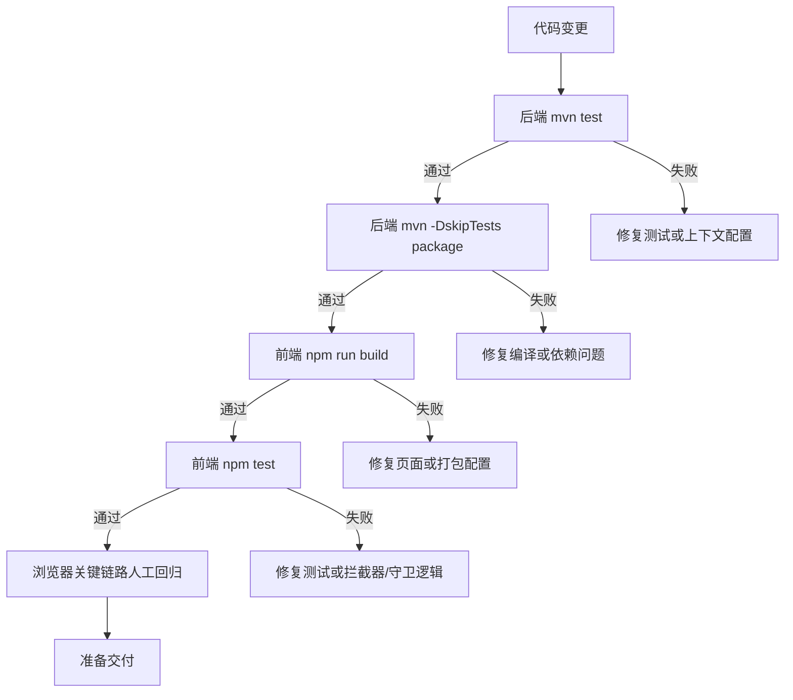
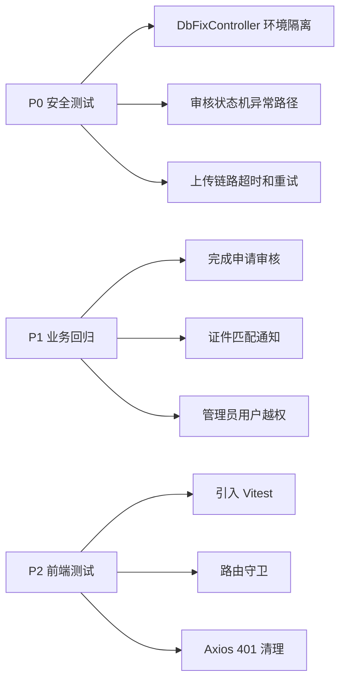

# 校园失物招领平台 - 测试与质量说明

## 1. 当前质量基线
- 截至 `2026-05-28`，后端自动化测试与前端构建均已重新验证。
- 本次验证以真实命令执行结果为准，不引用历史口头结论。

## 2. 已执行验证

| 类别 | 命令 | 结果 | 备注 |
|---|---|---|---|
| 后端单元/集成测试 | `mvn test` | 通过 | 共 49 个测试，12 个测试文件 |
| 后端打包 | `mvn -DskipTests package` | 通过 | 可正常产出可运行 JAR |
| 前端单元测试 | `npm test` | 通过 | 6 个测试，2 个测试文件 |
| 前端构建 | `npm run build` | 通过 | 存在大包体积告警，但不阻塞构建 |

## 3. 当前测试清单

| 测试文件 | 类型 | 覆盖重点 |
|---|---|---|
| `CampusLostFoundApplicationTest` | 上下文测试 | Spring Boot 基础启动 |
| `DataMaskUtilsTest` | 单元测试 | 敏感字段脱敏 |
| `AuthServiceTest` | 单元测试 | 注册/登录核心服务 |
| `ItemServiceImplTest` | 单元测试 | 物品状态门禁 |
| `ItemCompletionRequestServiceImplTest` | 单元测试 | 完成申请审核状态流、重复审核拦截 |
| `MatchingEngineTest` | 单元测试 | 匹配算法打分 |
| `ReviewConcurrencyIntegrationTest` | 集成测试 | 审核链路数据库级并发拦截 |
| `VerificationServiceImplTest` | 单元测试 | 认领审核状态流、重复审核拦截、通知异常兜底 |
| `WebSecurityConfigTest` | WebMvc 权限测试 | 匿名、管理员、超管接口边界 |
| `ImageUploadServiceImplTest` | 单元测试 | 图片大小、MIME、后缀、图床异常、成功返回 |
| `JwtSecurityIntegrationTest` | 集成测试 | access token、refresh token、角色漂移、禁用用户 |
| `DbFixControllerConditionalTest` | 上下文测试 | `DbFixController` 条件装配开关可见性 |

## 4. 质量门禁流程

## 5. 本轮新增发现
- `WebSecurityConfigTest` 曾因新增 `UserIdentityVerificationRepository` 后未补 `@MockBean` 而导致上下文加载失败，当前已修复。
- `DbFixController` 条件装配曾写错属性键名，导致测试环境虽然打开了配置但控制器没有注册；当前已通过权限测试和失败分支测试锁定。
- `ImageUploadServiceImpl` 已新增安全单元测试，覆盖空文件、超大文件、非法类型、图床失败和成功返回。
- 已新增 `DbFixControllerConditionalTest`，验证 `app.db-fix-enabled` 关闭时不注册、开启时才注册该控制器。
- 已新增完成申请与认领审核状态机测试，覆盖重复审核拦截、审核通过状态落库和通知异常兜底。
- 已新增审核接口 WebMvc 测试，覆盖拒绝原因不能为空、非法 `approved` 参数返回 `400`、以及显式 `@PathVariable("id")` 命名避免运行时 `IllegalArgumentException`。
- 已将认领审核与完成申请审核改为按 `id + PENDING` 条件原子更新，并新增测试覆盖缺失 `approved` 参数、并发二次审核拦截、关联物品状态已变更时的回滚保护。
- 已新增 `ReviewConcurrencyIntegrationTest`，使用真实 H2 数据库、真实事务和双线程并发，验证同一条认领审核/完成申请只能有一个线程成功更新。
- 已引入 Vitest，并补齐路由守卫与 `401` 清理登录态的最小前端自动化测试基线。

## 6. 当前质量风险

### 6.1 高优先级
- 审核状态机仍缺更多缺参组合、边界状态和 MySQL 实际并发场景测试。

### 6.2 中优先级
- 前端自动化测试已建立基线，但覆盖仍较少，管理员门禁与登录态清理需继续扩展到关键页面交互。
- 认证链路虽然已有 JWT 集成测试，但异常 token 场景仍可继续补足。
- 打包产物里 `ui-vendor` 仍超过 1 MB，说明前端性能优化尚未完成。

## 7. 建议补测路线

## 8. 推荐补测项
- 后端：
  - `ImageUploadServiceImpl` 的远端超时、重试、日志与异常返回测试。
  - `VerificationController` 和完成申请审核接口的缺参组合、边界状态、MySQL 实际并发测试。
  - `AdminUserController` 的自提权、自删除、越权修改测试。
- 前端：
  - 为登录弹窗补最小交互测试（打开/关闭、登录成功写入登录态、登录失败提示）。
  - 为管理员页面补最小交互测试（用户列表加载失败提示、禁用/启用操作门禁与反馈）。
  - 为发布页补最小交互测试（必填校验、图片上传失败提示、提交成功跳转）。

## 9. 当前结论
- 后端自动化测试已具备基础回归能力，尤其是权限矩阵和 JWT 鉴权链路已经可用。
- 前端已具备 Vitest 基线，但仍需要把测试从“守卫/拦截器”扩展到“登录弹窗、管理员页面、发布页”等高价值交互。
- 如果下一阶段继续提升交付质量，优先级应是“补安全测试”和“扩展前端测试覆盖”。
