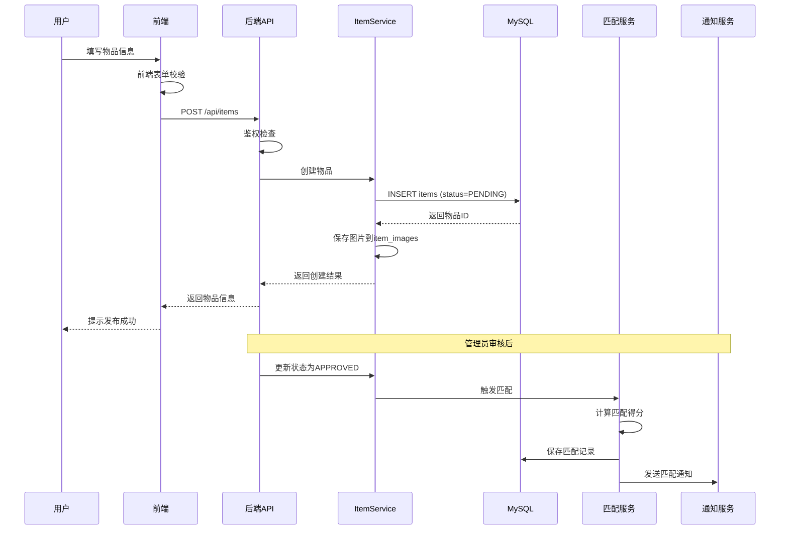

# 实现说明

## 1. 智能匹配实现

### 1.1 核心架构

智能匹配系统采用**多维度加权算法**，通过六个维度综合评分实现物品的自动匹配。

**核心组件**：
- `MatchingEngine`：评分算法核心引擎
- `MatchingServiceImpl`：匹配服务实现
- `DocumentOwnerMatchServiceImpl`：证件主人匹配服务（快通道）

### 1.2 算法实现

#### 1.2.1 评分权重配置

```java
// 权重配置（总计100%）
private static final double TEXT_WEIGHT = 0.35;        // 文本相似度 35%
private static final double CATEGORY_WEIGHT = 0.25;    // 类别 25%
private static final double LOCATION_WEIGHT = 0.15;    // 位置 15%
private static final double BRAND_WEIGHT = 0.10;       // 品牌 10%
private static final double COLOR_WEIGHT = 0.05;       // 颜色 5%
private static final double TIME_WEIGHT = 0.10;        // 时间 10%
private static final double MATCH_THRESHOLD = 0.65;    // 匹配阈值
private static final double SERIAL_CONFLICT_PENALTY = 0.40;  // 串号冲突惩罚
```

#### 1.2.2 文本相似度计算

使用 **Dice Coefficient** 算法计算文本相似度：

```java
private double calculateTextSimilarity(String text1, String text2) {
    if (StringUtils.isEmpty(text1) || StringUtils.isEmpty(text2)) {
        return 0.5;  // 任一为空，返回中性分数
    }

    // 分词处理
    Set<String> tokens1 = tokenize(text1);
    Set<String> tokens2 = tokenize(text2);

    // Dice系数公式: 2 * |A ∩ B| / (|A| + |B|)
    int intersection = 0;
    for (String token : tokens1) {
        if (tokens2.contains(token)) {
            intersection++;
        }
    }

    int union = tokens1.size() + tokens2.size();
    return (2.0 * intersection) / union;
}

private Set<String> tokenize(String text) {
    Set<String> tokens = new HashSet<>();
    // 中文生成二元组
    for (int i = 0; i < text.length() - 1; i++) {
        tokens.add(text.substring(i, i + 2));
    }
    // 英文/数字按非字母数字字符分隔
    String[] words = text.split("[^a-zA-Z0-9]+");
    for (String word : words) {
        if (word.length() >= 2) {
            tokens.add(word.toLowerCase());
        }
    }
    return tokens;
}
```

#### 1.2.3 时间评分（指数衰减）

```java
private double calculateTimeScore(LocalDateTime lostTime, LocalDateTime foundTime) {
    if (lostTime == null || foundTime == null) {
        return 0.5;  // 任一为空，返回中性分数
    }

    long daysDiff = Math.abs(ChronoUnit.DAYS.between(lostTime, foundTime));
    double tau = 10.0;  // 半衰期约7天
    return Math.exp(-daysDiff / tau);
    // days=0 → 1.00, days=7 → 0.50, days=30 → 0.05
}
```

#### 1.2.4 序列号精确匹配

```java
if (StringUtils.isNotBlank(item.getSerialNumber()) &&
    StringUtils.isNotBlank(candidate.getSerialNumber())) {

    if (item.getSerialNumber().trim().equalsIgnoreCase(candidate.getSerialNumber().trim())) {
        // 精确匹配，直接返回1.00
        return new ScoredCandidate(candidate, BigDecimal.ONE, MatchType.SERIAL_EXACT);
    }
}
```

#### 1.2.5 串号冲突惩罚

```java
// 检查串号冲突
if (StringUtils.isNotBlank(item.getSerialNumber()) &&
    StringUtils.isNotBlank(candidate.getSerialNumber()) &&
    !item.getSerialNumber().trim().equalsIgnoreCase(candidate.getSerialNumber().trim())) {
    // 双方都有串号但不相同，惩罚总分
    totalScore = totalScore.multiply(BigDecimal.valueOf(SERIAL_CONFLICT_PENALTY));
}
```

### 1.3 匹配流程

```java
public void match(Long itemId) {
    // 1. 获取待匹配物品
    Item item = itemService.getById(itemId);
    if (item == null || item.getStatus() != ItemStatus.APPROVED) {
        return;
    }

    // 2. 确定目标类型（LOST→FOUND, FOUND→LOST）
    ItemType targetType = item.getType() == ItemType.LOST ? ItemType.FOUND : ItemType.LOST;

    // 3. 筛选候选集
    List<Item> candidates = findCandidates(item, targetType);

    // 4. 计算每个候选的得分
    List<ScoredCandidate> scoredCandidates = new ArrayList<>();
    for (Item candidate : candidates) {
        ScoredCandidate scored = calculateScore(item, candidate);
        if (scored.getScore().compareTo(BigDecimal.ZERO) > 0) {
            scoredCandidates.add(scored);
        }
    }

    // 5. 按得分降序排序，保留Top-20
    scoredCandidates.sort((a, b) -> b.getScore().compareTo(a.getScore()));
    scoredCandidates = scoredCandidates.stream().limit(20).collect(Collectors.toList());

    // 6. 保存匹配记录
    for (ScoredCandidate scored : scoredCandidates) {
        if (scored.getScore().compareTo(BigDecimal.valueOf(MATCH_THRESHOLD)) >= 0) {
            saveMatchRecord(item, scored);
        }
    }
}
```

### 1.4 触发机制

```java
// 在物品审核通过时自动触发匹配
@Transactional
public void approveItem(Long itemId) {
    Item item = itemService.getById(itemId);
    item.setStatus(ItemStatus.APPROVED);
    itemService.updateById(item);

    // 触发智能匹配
    matchingService.match(itemId);
}
```

---

## 2. 物品信息发布实现

### 2.1 发布流程



### 2.2 核心代码实现

#### 2.2.1 物品创建

```java
@Service
public class ItemServiceImpl implements ItemService {

    @Autowired
    private ItemMapper itemMapper;

    @Autowired
    private ItemImageMapper itemImageMapper;

    @Transactional
    public Item createItem(ItemCreateRequest request, Long userId) {
        // 1. 创建物品记录
        Item item = new Item();
        item.setUserId(userId);
        item.setType(request.getType());
        item.setCategory(request.getCategory());
        item.setTitle(request.getTitle());
        item.setDescription(request.getDescription());
        item.setBrand(request.getBrand());
        item.setColor(request.getColor());
        item.setLocation(request.getLocation());
        item.setLostTime(request.getLostTime());
        item.setFoundTime(request.getFoundTime());
        item.setSerialNumber(request.getSerialNumber());
        item.setContactInfo(request.getContactInfo());
        item.setStatus(ItemStatus.PENDING);  // 默认待审核
        item.setViewCount(0);

        itemMapper.insert(item);

        // 2. 保存图片
        if (request.getImages() != null && !request.getImages().isEmpty()) {
            for (int i = 0; i < request.getImages().size(); i++) {
                ItemImage image = new ItemImage();
                image.setItemId(item.getId());
                image.setImageUrl(request.getImages().get(i));
                image.setImageType(i == 0 ? ImageType.MAIN : ImageType.DETAIL);
                image.setSortOrder(i);
                itemImageMapper.insert(image);
            }
        }

        return item;
    }
}
```

#### 2.2.2 图片上传

```java
@Service("localImageUploadService")
public class LocalImageUploadServiceImpl implements ImageUploadService {

    private final String uploadPath;
    private final String baseUrl;

    @Override
    public Map<String, Object> upload(MultipartFile file) {
        try {
            // 1. 生成文件名
            String originalFilename = file.getOriginalFilename();
            String extension = FilenameUtils.getExtension(originalFilename);
            String newFilename = UUID.randomUUID().toString() + "." + extension;

            // 2. 按日期组织目录
            LocalDate now = LocalDate.now();
            String dateDir = now.format(DateTimeFormatter.ofPattern("yyyy/MM"));
            Path targetDir = Paths.get(uploadPath, dateDir);
            Files.createDirectories(targetDir);

            // 3. 保存文件
            Path targetPath = targetDir.resolve(newFilename);
            Files.copy(file.getInputStream(), targetPath, StandardCopyOption.REPLACE_EXISTING);

            // 4. 构建访问URL
            String url = "/api/uploads/images/" + dateDir + "/" + newFilename;

            Map<String, Object> result = new HashMap<>();
            result.put("url", url);
            result.put("filename", newFilename);
            return result;

        } catch (IOException e) {
            throw new BusinessException("图片上传失败: " + e.getMessage());
        }
    }
}
```

#### 2.2.3 静态资源映射

```java
@Configuration
public class WebMvcConfig implements WebMvcConfigurer {

    @Value("${app.upload.path:./uploads}")
    private String uploadPath;

    @Override
    public void addResourceHandlers(ResourceHandlerRegistry registry) {
        // 映射图片访问路径
        registry.addResourceHandler("/api/uploads/images/**")
                .addResourceLocations("file:" + System.getProperty("user.dir") + "/" + uploadPath + "/");
    }
}
```

### 2.3 审核流程

```java
@RestController
@RequestMapping("/api/admin/items")
public class AdminItemReviewController {

    @Autowired
    private ItemService itemService;

    @Autowired
    private MatchingService matchingService;

    @Autowired
    private NotificationService notificationService;

    @PutMapping("/{id}/review")
    public ApiResponse<Void> reviewItem(
            @PathVariable Long id,
            @RequestBody ItemReviewRequest request) {

        Item item = itemService.getById(id);
        if (item == null) {
            return ApiResponse.error("物品不存在");
        }

        if (request.isApproved()) {
            // 审核通过
            item.setStatus(ItemStatus.APPPROVED);
            itemService.updateById(item);

            // 触发智能匹配
            matchingService.match(id);

            // 发送审核通过通知
            notificationService.sendNotification(
                item.getUserId(),
                NotificationType.VERIFICATION_RESULT,
                "物品审核通过",
                "您的物品《" + item.getTitle() + "》已通过审核，现已公开展示。",
                item.getId()
            );
        } else {
            // 审核拒绝
            item.setStatus(ItemStatus.REJECTED);
            itemService.updateById(item);

            // 发送审核拒绝通知
            notificationService.sendNotification(
                item.getUserId(),
                NotificationType.VERIFICATION_RESULT,
                "物品审核未通过",
                "您的物品《" + item.getTitle() + "》审核未通过。原因：" + request.getReason(),
                item.getId()
            );
        }

        return ApiResponse.success();
    }
}
```

---

## 3. 邮件收发实现

### 3.1 邮件配置

```yaml
# application.yml
spring:
  mail:
    host: smtp.163.com
    port: 465
    username: 19721623703@163.com
    password: XXXXXXXX  # 授权码
    protocol: smtp
    default-encoding: UTF-8
    properties:
      mail:
        smtp:
          auth: true
          ssl:
            enable: true  # 使用SSL
          socketFactory:
            class: javax.net.ssl.SSLSocketFactory
            fallback: false
```

### 3.2 邮件服务实现

```java
@Service
public class MailServiceImpl implements MailService {

    @Autowired
    private JavaMailSender mailSender;

    @Autowired
    private TemplateEngine templateEngine;

    @Async
    @Override
    public void sendHtmlEmail(String to, String subject, String content) {
        try {
            MimeMessage message = mailSender.createMimeMessage();
            MimeMessageHelper helper = new MimeMessageHelper(message, true, "UTF-8");

            helper.setFrom("校园失物招领平台 <19721623703@163.com>");
            helper.setTo(to);
            helper.setSubject(subject);
            helper.setText(content, true);  // true表示HTML格式

            mailSender.send(message);
            log.info("邮件发送成功: {}", to);

        } catch (Exception e) {
            log.error("邮件发送失败: {}", to, e);
        }
    }

    @Override
    public void sendMatchNotification(User user, Match match, Item lostItem, Item foundItem) {
        // 使用Thymeleaf模板渲染邮件内容
        Context context = new Context();
        context.setVariable("username", user.getUsername());
        context.setVariable("lostItem", lostItem);
        context.setVariable("foundItem", foundItem);
        context.setVariable("matchScore", match.getScore());

        String content = templateEngine.process("email/match-notification", context);

        sendHtmlEmail(
            user.getEmail(),
            "【匹配提醒】发现可能的失物匹配",
            content
        );
    }
}
```

### 3.3 邮件模板

```html
<!-- src/main/resources/templates/email/match-notification.html -->
<!DOCTYPE html>
<html xmlns:th="http://www.thymeleaf.org">
<head>
    <meta charset="UTF-8">
    <title>匹配提醒</title>
</head>
<body>
    <div style="font-family: Arial, sans-serif; max-width: 600px; margin: 0 auto;">
        <h2 style="color: #1976d2;">🎉 发现可能的失物匹配</h2>

        <p>亲爱的 <strong th:text="${username}"></strong>：</p>

        <p>系统为您发现了一个高匹配度的失物信息：</p>

        <div style="background: #f5f5f5; padding: 20px; border-radius: 8px; margin: 20px 0;">
            <h3>寻物信息</h3>
            <p><strong>标题：</strong><span th:text="${lostItem.title}"></span></p>
            <p><strong>类别：</strong><span th:text="${lostItem.category}"></span></p>
            <p><strong>位置：</strong><span th:text="${lostItem.location}"></span></p>

            <hr style="margin: 20px 0; border: none; border-top: 1px solid #ddd;">

            <h3>招领信息</h3>
            <p><strong>标题：</strong><span th:text="${foundItem.title}"></span></p>
            <p><strong>类别：</strong><span th:text="${foundItem.category}"></span></p>
            <p><strong>位置：</strong><span th:text="${foundItem.location}"></span></p>
        </div>

        <p><strong>匹配得分：</strong><span th:text="${matchScore}" style="color: #4caf50; font-weight: bold;"></span></p>

        <p>请登录系统查看详情并确认匹配。</p>

        <p style="color: #999; font-size: 12px; margin-top: 30px;">
            此邮件由系统自动发送，请勿回复。<br>
            校园失物招领平台
        </p>
    </div>
</body>
</html>
```

### 3.4 异步发送

```java
@Configuration
@EnableAsync
public class AsyncConfig {

    @Bean(name = "taskExecutor")
    public Executor taskExecutor() {
        ThreadPoolTaskExecutor executor = new ThreadPoolTaskExecutor();
        executor.setCorePoolSize(5);
        executor.setMaxPoolSize(10);
        executor.setQueueCapacity(100);
        executor.setThreadNamePrefix("mail-async-");
        executor.initialize();
        return executor;
    }
}
```

---

## 4. 权限管理实现

### 4.1 用户角色定义

```java
public enum UserRole {
    SUPER_ADMIN,  // 超级管理员：拥有全部权限
    CAMPUS_ADMIN, // 校园管理员：管理物品审核、位置、统计等
    USER          // 普通用户：使用基本功能
}
```

### 4.2 Sa-Token + Spring Security 集成

```java
@Configuration
public class SaTokenConfig {

    @Bean
    public SaTokenDao saTokenDao(RedisConnectionFactory redisConnectionFactory) {
        // 使用Redis存储Token
        return new SaTokenDaoRedisJackson(redisConnectionFactory);
    }
}

@Configuration
@EnableWebSecurity
public class WebSecurityConfig {

    @Bean
    public SecurityFilterChain filterChain(HttpSecurity http) throws Exception {
        http
            .csrf(AbstractHttpConfigurer::disable)
            .cors(Customizer.withDefaults())
            .sessionManagement(session -> session
                .sessionCreationPolicy(SessionCreationPolicy.STATELESS)
            )
            .authorizeHttpRequests(auth -> auth
                // 公开接口
                .requestMatchers("/api/auth/**").permitAll()
                .requestMatchers(HttpMethod.GET, "/api/items").permitAll()
                .requestMatchers(HttpMethod.GET, "/api/items/{id}").permitAll()
                .requestMatchers(HttpMethod.GET, "/api/statistics/**").permitAll()
                .requestMatchers(HttpMethod.GET, "/api/uploads/images/**").permitAll()
                .requestMatchers("/swagger-ui/**", "/v3/api-docs/**").permitAll()

                // 需要登录的接口
                .requestMatchers("/api/users/**").authenticated()
                .requestMatchers("/api/items/my").authenticated()
                .requestMatchers("/api/matches/**").authenticated()
                .requestMatchers("/api/notifications/**").authenticated()

                // 管理员接口
                .requestMatchers("/api/admin/**").hasAnyRole("SUPER_ADMIN", "CAMPUS_ADMIN")

                // 其他所有请求需要登录
                .anyRequest().authenticated()
            )
            .addFilterBefore(new SaTokenAuthenticationFilter(), UsernamePasswordAuthenticationFilter.class);

        return http.build();
    }
}
```

### 4.3 权限拦截器

```java
@Component
public class SaTokenAuthenticationFilter extends OncePerRequestFilter {

    @Override
    protected void doFilterInternal(HttpServletRequest request,
                                    HttpServletResponse response,
                                    FilterChain filterChain) throws ServletException, IOException {

        // 1. 从Header中获取Token
        String token = request.getHeader("Authorization");
        if (token != null && token.startsWith("Bearer ")) {
            token = token.substring(7);

            // 2. 验证Token
            if (StpUtil.stpLogic.getLoginIdByToken(token) != null) {
                // Token有效，设置登录信息
                StpUtil.setLoginId(StpUtil.stpLogic.getLoginIdByToken(token));
            }
        }

        filterChain.doFilter(request, response);
    }
}
```

### 4.4 角色权限接口

```java
@Component
public class StpInterfaceImpl implements StpInterface {

    @Autowired
    private UserService userService;

    @Override
    public List<String> getPermissionList(Object loginId, String loginType) {
        // 返回权限列表（暂未实现细粒度权限）
        return Collections.emptyList();
    }

    @Override
    public List<String> getRoleList(Object loginId, String loginType) {
        User user = userService.getById((Long) loginId);
        if (user == null) {
            return Collections.emptyList();
        }

        // 返回用户角色
        return Collections.singletonList(user.getRole().name());
    }
}
```

### 4.5 控制器权限注解

```java
@RestController
@RequestMapping("/api/admin/users")
public class AdminUserController {

    @Autowired
    private UserService userService;

    // 只有SUPER_ADMIN和CAMPUS_ADMIN可以访问
    @GetMapping
    public ApiResponse<Page<User>> getUsers(
            @RequestParam(required = false) String keyword,
            @RequestParam(defaultValue = "1") int page,
            @RequestParam(defaultValue = "10") int pageSize) {

        // 检查权限
        StpUtil.checkRoleOr("SUPER_ADMIN", "CAMPUS_ADMIN");

        // 业务逻辑
        Page<User> users = userService.getUsers(keyword, page, pageSize);
        return ApiResponse.success(users);
    }

    // 只有SUPER_ADMIN可以修改用户角色
    @PutMapping("/{id}/role")
    public ApiResponse<Void> updateUserRole(
            @PathVariable Long id,
            @RequestBody UpdateRoleRequest request) {

        // 检查权限
        StpUtil.checkRole("SUPER_ADMIN");

        // 业务逻辑
        userService.updateUserRole(id, request.getRole());
        return ApiResponse.success();
    }
}
```

### 4.6 用户权限校验

```java
@Service
public class ItemServiceImpl implements ItemService {

    @Autowired
    private ItemMapper itemMapper;

    @Autowired
    private UserService userService;

    public Item updateItem(Long itemId, ItemUpdateRequest request) {
        // 1. 获取物品
        Item item = itemMapper.selectById(itemId);
        if (item == null) {
            throw new BusinessException("物品不存在");
        }

        // 2. 权限校验
        Long currentUserId = StpUtil.getLoginIdAsLong();
        User currentUser = userService.getById(currentUserId);

        // 只有物品所有者或管理员可以修改
        if (!item.getUserId().equals(currentUserId) &&
            !currentUser.getRole().equals(UserRole.SUPER_ADMIN) &&
            !currentUser.getRole().equals(UserRole.CAMPUS_ADMIN)) {
            throw new BusinessException("无权限修改此物品");
        }

        // 3. 更新物品
        // ... 更新逻辑

        return item;
    }
}
```

### 4.7 登录认证

```java
@Service
public class AuthServiceImpl implements AuthService {

    @Autowired
    private UserService userService;

    @Autowired
    private PasswordEncoder passwordEncoder;

    @Override
    public LoginResponse login(LoginRequest request) {
        // 1. 查询用户
        User user = userService.getByUsername(request.getUsername());
        if (user == null) {
            throw new BusinessException("用户名或密码错误");
        }

        // 2. 校验密码
        if (!passwordEncoder.matches(request.getPassword(), user.getPassword())) {
            throw new BusinessException("用户名或密码错误");
        }

        // 3. 检查账号状态
        if (user.getStatus() == 0) {
            throw new BusinessException("账号已被禁用");
        }

        // 4. 生成Token
        StpUtil.login(user.getId());

        String accessToken = (String) StpUtil.getTokenValue();
        String refreshToken = StpUtil.createLoginSession(user.getId(), 7 * 24 * 60 * 60);  // 7天

        // 5. 更新最后登录时间
        user.setLastLoginTime(LocalDateTime.now());
        userService.updateById(user);

        // 6. 返回登录信息
        LoginResponse response = new LoginResponse();
        response.setToken(accessToken);
        response.setAccessToken(accessToken);
        response.setRefreshToken(refreshToken);
        response.setUser(user);

        return response;
    }
}
```

---

## 5. 技术要点总结

### 5.1 智能匹配

- **多维度评分**：文本、类别、位置、品牌、颜色、时间六个维度综合评分
- **精确匹配优先**：序列号精确匹配直接确认，无需人工确认
- **冲突惩罚机制**：双方都有序列号但不一致时，惩罚总分降低
- **Top-K保留**：仅保留得分最高的Top-20条匹配
- **指数衰减时间**：使用指数衰减函数计算时间相似度

### 5.2 物品发布

- **本地文件存储**：图片上传到本地文件系统，按日期组织目录
- **静态资源映射**：通过Spring MVC配置静态资源访问路径
- **审核流程**：物品发布后默认PENDING状态，需管理员审核通过后才能公开展示
- **触发匹配**：审核通过后自动触发智能匹配

### 5.3 邮件收发

- **SMTP配置**：使用163邮箱的SMTP服务，SSL加密传输
- **Thymeleaf模板**：使用Thymeleaf模板引擎渲染HTML邮件
- **异步发送**：使用Spring的@Async注解实现异步邮件发送
- **邮件通知**：匹配成功、审核结果等关键事件发送邮件通知

### 5.4 权限管理

- **Sa-Token认证**：使用Sa-Token进行身份认证和权限管理
- **角色权限**：定义SUPER_ADMIN、CAMPUS_ADMIN、USER三种角色
- **Spring Security集成**：Sa-Token与Spring Security集成，统一权限管理
- **细粒度校验**：在Service层进行细粒度的权限校验
- **Token刷新**：支持Access Token和Refresh Token双Token机制