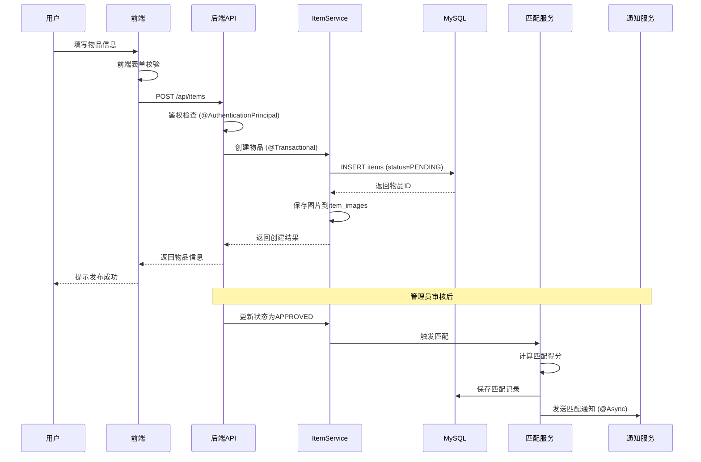

# 实现说明

---

## 1. 智能匹配实现

### 1.1 核心架构

智能匹配系统采用**多维度加权算法**，通过六个维度综合评分实现物品的自动匹配。

**核心组件**：
- `MatchingEngine`：评分算法核心引擎
- `MatchingServiceImpl`：匹配服务实现
- `DocumentOwnerMatchServiceImpl`：证件主人匹配服务（快通道）

### 1.2 算法实现

#### 1.2.1 评分权重配置

```java
// 权重配置（总计100%）
private static final double TEXT_WEIGHT = 0.35;        // 文本相似度 35%
private static final double CATEGORY_WEIGHT = 0.25;    // 类别 25%
private static final double BRAND_WEIGHT = 0.15;       // 品牌 15%
private static final double COLOR_WEIGHT = 0.10;       // 颜色 10%
private static final double TIME_WEIGHT = 0.15;        // 时间 15%
private static final double MATCH_THRESHOLD = 0.65;    // 匹配阈值
private static final double SERIAL_CONFLICT_PENALTY = 0.40;  // 串号冲突惩罚
```

#### 1.2.2 文本相似度计算

使用 **Dice Coefficient** 算法计算文本相似度：

```java
private double calculateTextSimilarity(String text1, String text2) {
    if (StringUtils.isEmpty(text1) || StringUtils.isEmpty(text2)) {
        return 0.5;  // 任一为空，返回中性分数
    }

    Set<String> tokens1 = tokenize(text1);
    Set<String> tokens2 = tokenize(text2);

    int intersection = 0;
    for (String token : tokens1) {
        if (tokens2.contains(token)) {
            intersection++;
        }
    }

    int union = tokens1.size() + tokens2.size();
    return (2.0 * intersection) / union;
}

private Set<String> tokenize(String text) {
    Set<String> tokens = new HashSet<>();
    // 中文生成二元组
    for (int i = 0; i < text.length() - 1; i++) {
        tokens.add(text.substring(i, i + 2));
    }
    String[] words = text.split("[^a-zA-Z0-9]+");
    for (String word : words) {
        if (word.length() >= 2) {
            tokens.add(word.toLowerCase());
        }
    }
    return tokens;
}
```

#### 1.2.3 时间评分（指数衰减）

```java
private double calculateTimeScore(LocalDateTime lostTime, LocalDateTime foundTime) {
    if (lostTime == null || foundTime == null) {
        return 0.5;
    }

    long daysDiff = Math.abs(ChronoUnit.DAYS.between(lostTime, foundTime));
    double tau = 10.0;
    return Math.exp(-daysDiff / tau);
}
```

#### 1.2.4 序列号精确匹配

```java
if (StringUtils.isNotBlank(item.getSerialNumber()) &&
    StringUtils.isNotBlank(candidate.getSerialNumber())) {
    if (item.getSerialNumber().trim().equalsIgnoreCase(candidate.getSerialNumber().trim())) {
        return new ScoredCandidate(candidate, BigDecimal.ONE, MatchType.SERIAL_EXACT);
    }
}
```

### 1.3 匹配流程

```java
public void match(Long itemId) {
    Item item = itemService.getById(itemId);
    if (item == null || item.getStatus() != ItemStatus.APPROVED) {
        return;
    }

    ItemType targetType = item.getType() == ItemType.LOST ? ItemType.FOUND : ItemType.LOST;
    List<Item> candidates = findCandidates(item, targetType);

    List<ScoredCandidate> scoredCandidates = new ArrayList<>();
    for (Item candidate : candidates) {
        ScoredCandidate scored = calculateScore(item, candidate);
        if (scored.getScore().compareTo(BigDecimal.ZERO) > 0) {
            scoredCandidates.add(scored);
        }
    }

    scoredCandidates.sort((a, b) -> b.getScore().compareTo(a.getScore()));
    scoredCandidates = scoredCandidates.stream().limit(20).collect(Collectors.toList());

    for (ScoredCandidate scored : scoredCandidates) {
        if (scored.getScore().compareTo(BigDecimal.valueOf(MATCH_THRESHOLD)) >= 0) {
            saveMatchRecord(item, scored);
        }
    }
}
```

---

## 2. 物品信息发布实现

### 2.1 发布流程



### 2.2 核心代码实现

#### 2.2.1 物品创建

```java
@Service
public class ItemServiceImpl implements ItemService {

    @Autowired
    private ItemMapper itemMapper;

    @Autowired
    private ItemImageMapper itemImageMapper;

    @Transactional
    public Item createItem(ItemCreateRequest request, Long userId) {
        Item item = new Item();
        item.setUserId(userId);
        item.setType(request.getType());
        item.setCategory(request.getCategory());
        item.setTitle(request.getTitle());
        item.setDescription(request.getDescription());
        item.setBrand(request.getBrand());
        item.setColor(request.getColor());
        item.setLocation(request.getLocation());
        item.setLostTime(request.getLostTime());
        item.setFoundTime(request.getFoundTime());
        item.setSerialNumber(request.getSerialNumber());
        item.setContactInfo(request.getContactInfo());
        item.setStatus(ItemStatus.PENDING);
        item.setViewCount(0);

        itemMapper.insert(item);

        if (request.getImages() != null && !request.getImages().isEmpty()) {
            for (int i = 0; i < request.getImages().size(); i++) {
                ItemImage image = new ItemImage();
                image.setItemId(item.getId());
                image.setImageUrl(request.getImages().get(i));
                image.setImageType(i == 0 ? ImageType.MAIN : ImageType.DETAIL);
                image.setSortOrder(i);
                itemImageMapper.insert(image);
            }
        }

        return item;
    }
}
```

#### 2.2.2 图片上传（本地存储）

```java
@Service("localImageUploadService")
public class LocalImageUploadServiceImpl implements ImageUploadService {

    private final String uploadPath;
    private final String baseUrl;

    @Override
    public Map<String, Object> upload(MultipartFile file) {
        try {
            String originalFilename = file.getOriginalFilename();
            String extension = FilenameUtils.getExtension(originalFilename);
            String newFilename = UUID.randomUUID().toString() + "." + extension;

            LocalDate now = LocalDate.now();
            String dateDir = now.format(DateTimeFormatter.ofPattern("yyyy/MM"));
            Path targetDir = Paths.get(uploadPath, dateDir);
            Files.createDirectories(targetDir);

            Path targetPath = targetDir.resolve(newFilename);
            Files.copy(file.getInputStream(), targetPath, StandardCopyOption.REPLACE_EXISTING);

            String url = "/api/uploads/images/" + dateDir + "/" + newFilename;

            Map<String, Object> result = new HashMap<>();
            result.put("url", url);
            result.put("filename", newFilename);
            return result;

        } catch (IOException e) {
            throw new BusinessException("图片上传失败: " + e.getMessage());
        }
    }
}
```

#### 2.2.3 静态资源映射

```java
@Configuration
public class WebMvcConfig implements WebMvcConfigurer {

    @Value("${app.upload.path:./uploads}")
    private String uploadPath;

    @Override
    public void addResourceHandlers(ResourceHandlerRegistry registry) {
        registry.addResourceHandler("/api/uploads/images/**")
                .addResourceLocations("file:" + System.getProperty("user.dir") + "/" + uploadPath + "/");
    }
}
```

---

## 3. 邮件收发实现

### 3.1 邮件配置

```yaml
# application.yml
spring:
  mail:
    host: smtp.163.com
    port: 465
    username: 19721623703@163.com
    password: XXXXXXXX
    protocol: smtp
    default-encoding: UTF-8
    properties:
      mail:
        smtp:
          auth: true
          ssl:
            enable: true
          socketFactory:
            class: javax.net.ssl.SSLSocketFactory
            fallback: false
```

### 3.2 邮件服务实现（异步发送）

```java
@Service
public class MailServiceImpl implements MailService {

    @Autowired
    private JavaMailSender mailSender;

    @Autowired
    private TemplateEngine templateEngine;

    /**
     * 异步发送HTML邮件
     * @param to 收件人邮箱
     * @param subject 邮件主题
     * @param content HTML内容
     */
    @Async("mailExecutor")
    @Override
    public void sendHtmlEmail(String to, String subject, String content) {
        try {
            MimeMessage message = mailSender.createMimeMessage();
            MimeMessageHelper helper = new MimeMessageHelper(message, true, "UTF-8");

            helper.setFrom("校园失物招领平台 <19721623703@163.com>");
            helper.setTo(to);
            helper.setSubject(subject);
            helper.setText(content, true);

            mailSender.send(message);
            log.info("邮件发送成功: {}", to);

        } catch (Exception e) {
            log.error("邮件发送失败: {}", to, e);
        }
    }

    @Override
    public void sendMatchNotification(User user, Match match, Item lostItem, Item foundItem) {
        Context context = new Context();
        context.setVariable("username", user.getUsername());
        context.setVariable("lostItem", lostItem);
        context.setVariable("foundItem", foundItem);
        context.setVariable("matchScore", match.getScore());

        String content = templateEngine.process("email/match-notification", context);

        sendHtmlEmail(
            user.getEmail(),
            "【匹配提醒】发现可能的失物匹配",
            content
        );
    }
}
```

### 3.3 异步配置

```java
@Configuration
@EnableAsync
public class AsyncConfig {

    /**
     * 邮件发送专用线程池
     * 
     * 配置说明：
     * - corePoolSize: 核心线程数，始终保持运行的线程数
     * - maxPoolSize: 最大线程数，峰值时可扩展的最大线程数
     * - queueCapacity: 任务队列容量，超出核心线程的任务排队等待
     * - threadNamePrefix: 线程名前缀，便于日志追踪
     * - waitForTasksToCompleteOnShutdown: 优雅关闭，等待任务完成
     * - awaitTerminationSeconds: 等待超时时间
     */
    @Bean(name = "mailExecutor")
    public Executor mailExecutor() {
        ThreadPoolTaskExecutor executor = new ThreadPoolTaskExecutor();
        executor.setCorePoolSize(2);
        executor.setMaxPoolSize(5);
        executor.setQueueCapacity(100);
        executor.setThreadNamePrefix("mail-");
        executor.setWaitForTasksToCompleteOnShutdown(true);
        executor.setAwaitTerminationSeconds(60);
        executor.initialize();
        return executor;
    }
}
```

---

## 4. 权限管理实现

### 4.1 用户角色定义

```java
public enum UserRole {
    SUPER_ADMIN,  // 超级管理员：拥有全部权限
    CAMPUS_ADMIN, // 校园管理员：管理物品审核、统计等
    USER          // 普通用户：使用基本功能
}
```

### 4.2 Sa-Token + Spring Security 集成

```java
@Configuration
@EnableWebSecurity
public class WebSecurityConfig {

    @Bean
    public SecurityFilterChain filterChain(HttpSecurity http) throws Exception {
        http
            .csrf(AbstractHttpConfigurer::disable)
            .cors(Customizer.withDefaults())
            .sessionManagement(session -> session
                .sessionCreationPolicy(SessionCreationPolicy.STATELESS)
            )
            .authorizeHttpRequests(auth -> auth
                // 公开接口
                .requestMatchers("/api/auth/**").permitAll()
                .requestMatchers(HttpMethod.GET, "/api/items").permitAll()
                .requestMatchers(HttpMethod.GET, "/api/items/{id}").permitAll()
                .requestMatchers(HttpMethod.GET, "/api/uploads/images/**").permitAll()
                .requestMatchers("/swagger-ui/**", "/v3/api-docs/**").permitAll()

                // 需要登录的接口
                .requestMatchers("/api/users/**").authenticated()
                .requestMatchers("/api/items/my").authenticated()
                .requestMatchers("/api/matches/**").authenticated()
                .requestMatchers("/api/notifications/**").authenticated()

                // 管理员接口
                .requestMatchers("/api/admin/**").hasAnyRole("SUPER_ADMIN", "CAMPUS_ADMIN")

                .anyRequest().authenticated()
            )
            .addFilterBefore(new SaTokenAuthenticationFilter(), UsernamePasswordAuthenticationFilter.class);

        return http.build();
    }
}
```

### 4.3 登录认证

```java
@Service
public class AuthServiceImpl implements AuthService {

    @Autowired
    private UserService userService;

    @Autowired
    private PasswordEncoder passwordEncoder;

    @Override
    public LoginResponse login(LoginRequest request) {
        User user = userService.getByUsername(request.getUsername());
        if (user == null) {
            throw new BusinessException("用户名或密码错误");
        }

        if (!passwordEncoder.matches(request.getPassword(), user.getPassword())) {
            throw new BusinessException("用户名或密码错误");
        }

        if (user.getStatus() == 0) {
            throw new BusinessException("账号已被禁用");
        }

        StpUtil.login(user.getId());
        String accessToken = (String) StpUtil.getTokenValue();
        String refreshToken = StpUtil.createLoginSession(user.getId(), 7 * 24 * 60 * 60);

        user.setLastLoginTime(LocalDateTime.now());
        userService.updateById(user);

        LoginResponse response = new LoginResponse();
        response.setToken(accessToken);
        response.setAccessToken(accessToken);
        response.setRefreshToken(refreshToken);
        response.setUser(user);

        return response;
    }
}
```

---

## 5. Spring Boot 核心注解详解

### 5.1 Spring Boot 启动注解

| 注解 | 作用 | 使用场景 |
|------|------|----------|
| `@SpringBootApplication` | 组合注解，包含 `@Configuration`、`@EnableAutoConfiguration`、`@ComponentScan` | Spring Boot 应用入口类 |
| `@Configuration` | 声明配置类，用于定义 Bean | 配置类 |
| `@ComponentScan` | 自动扫描并注册组件 | 自定义扫描路径 |

### 5.2 组件注册注解

| 注解 | 作用 | 使用场景 |
|------|------|----------|
| `@Component` | 通用组件注册 | 通用组件 |
| `@Service` | 服务层组件 | 业务逻辑类 |
| `@Controller` | 控制层组件 | MVC 控制器 |
| `@RestController` | RESTful 控制器，自动返回 JSON | REST API 控制器 |
| `@Repository` | 数据访问层组件 | DAO/Repository 类 |

### 5.3 依赖注入注解

| 注解 | 作用 | 使用场景 |
|------|------|----------|
| `@Autowired` | 自动装配依赖 | 字段、构造方法、Setter方法 |
| `@Resource` | JSR-250 注解，按名称装配 | 按名称注入 |
| `@Qualifier` | 指定注入 Bean 的名称 | 多个同类型 Bean 时 |
| `@Value` | 注入配置值 | 注入配置文件中的值 |

### 5.4 事务管理注解

| 注解 | 作用 | 使用场景 |
|------|------|----------|
| `@Transactional` | 声明事务 | 业务方法需要事务保证 |

**`@Transactional` 属性说明：**

```java
@Transactional(
    propagation = Propagation.REQUIRED,  // 传播行为：如果没有事务则创建，有则加入
    isolation = Isolation.DEFAULT,       // 隔离级别：使用数据库默认
    readOnly = false,                    // 是否只读：默认false
    timeout = -1,                        // 超时时间：-1表示无限制
    rollbackFor = Exception.class,        // 回滚异常类型
    noRollbackFor = RuntimeException.class // 不回滚异常类型
)
public void someMethod() {
    // 业务逻辑
}
```

### 5.5 异步处理注解

| 注解 | 作用 | 使用场景 |
|------|------|----------|
| `@EnableAsync` | 启用异步支持 | 配置类 |
| `@Async` | 声明异步方法 | 耗时操作方法 |

**异步执行原理：**

```
1. @EnableAsync 开启异步支持
2. Spring AOP 代理拦截 @Async 方法调用
3. 将方法封装成 Runnable 任务
4. 提交到指定线程池执行
5. 主线程立即返回，不等待任务完成
```

### 5.6 请求处理注解

| 注解 | 作用 | 使用场景 |
|------|------|----------|
| `@RequestMapping` | 映射请求路径 | 类或方法级别 |
| `@GetMapping` | 映射 GET 请求 | 查询操作 |
| `@PostMapping` | 映射 POST 请求 | 创建操作 |
| `@PutMapping` | 映射 PUT 请求 | 更新操作 |
| `@DeleteMapping` | 映射 DELETE 请求 | 删除操作 |

### 5.7 参数绑定注解

| 注解 | 作用 | 使用场景 |
|------|------|----------|
| `@PathVariable` | 绑定 URL 路径参数 | 获取 URL 中的参数 |
| `@RequestParam` | 绑定请求参数 | 获取查询参数 |
| `@RequestBody` | 绑定请求体 | 获取 JSON 请求体 |
| `@RequestHeader` | 绑定请求头 | 获取请求头信息 |
| `@AuthenticationPrincipal` | 绑定当前认证用户 | 获取当前登录用户 |

---

## 6. 答辩常见问题与回答

### 6.1 Spring Boot 基础

**Q1：什么是 Spring Boot？它的核心优势是什么？**

A：Spring Boot 是 Spring Framework 的快速开发脚手架。

**核心优势：**
1. **自动配置**：根据依赖自动配置 Spring 应用
2. **起步依赖**：简化 Maven/Gradle 依赖管理
3. **嵌入式服务器**：内置 Tomcat、Jetty 等服务器
4. **Actuator**：提供应用监控和管理端点
5. **约定优于配置**：减少样板代码

**Q2：`@SpringBootApplication` 注解包含哪些注解？**

A：包含三个核心注解：
- `@Configuration`：声明配置类
- `@EnableAutoConfiguration`：启用自动配置
- `@ComponentScan`：扫描组件

### 6.2 依赖注入

**Q3：`@Autowired` 和 `@Resource` 的区别是什么？**

A：
| 特性 | `@Autowired` | `@Resource` |
|------|--------------|-------------|
| 来源 | Spring | JSR-250 |
| 默认方式 | 按类型注入 | 按名称注入 |
| 支持 `@Qualifier` | 是 | 否 |
| 灵活性 | 需要配合 `@Qualifier` 指定名称 | 直接通过 `name` 属性指定 |

**Q4：构造方法注入和字段注入哪种更好？**

A：**构造方法注入更好**，原因：
1. **不可变性**：字段可以声明为 `final`
2. **依赖明确**：通过构造方法参数明确依赖关系
3. **易于测试**：可以手动注入 Mock 对象
4. **避免循环依赖**：Spring 能更好地处理循环依赖

### 6.3 事务管理

**Q5：`@Transactional` 的工作原理是什么？**

A：基于 Spring AOP 实现：
1. Spring 扫描 `@Transactional` 注解
2. 为目标类创建代理对象
3. 方法调用时，代理对象先开启事务
4. 执行目标方法
5. 方法成功：提交事务；方法异常：回滚事务

**Q6：什么是事务传播行为？常见的传播行为有哪些？**

A：事务传播行为定义了事务方法之间的调用关系。

| 传播行为 | 说明 |
|----------|------|
| `REQUIRED` | 默认，如果没有事务则创建，有则加入 |
| `REQUIRES_NEW` | 总是创建新事务 |
| `SUPPORTS` | 支持事务，如果没有则以非事务方式执行 |
| `NOT_SUPPORTED` | 以非事务方式执行 |
| `MANDATORY` | 必须在事务中执行，否则抛出异常 |
| `NEVER` | 必须在非事务中执行，否则抛出异常 |
| `NESTED` | 嵌套事务，内部事务回滚不影响外部 |

### 6.4 异步处理

**Q7：`@Async` 注解的工作原理是什么？**

A：
1. `@EnableAsync` 启用异步支持，Spring 创建异步代理
2. 调用 `@Async` 方法时，代理拦截调用
3. 将方法封装成 `Runnable` 任务
4. 提交到指定线程池（如 `mailExecutor`）
5. 主线程立即返回，后台线程执行任务

**Q8：为什么要使用异步发送邮件？**

A：
1. **提升响应速度**：邮件发送是网络IO操作，耗时较长（3-10秒）
2. **解耦业务逻辑**：审核操作和邮件发送解耦
3. **避免阻塞**：用户无需等待邮件发送完成
4. **容错性**：邮件发送失败不影响主业务流程

**Q9：线程池参数如何配置？**

A：
- `corePoolSize`：核心线程数，根据业务量设置（如邮件发送设为2）
- `maxPoolSize`：最大线程数，处理峰值请求（如设为5）
- `queueCapacity`：任务队列容量（如设为100）
- `threadNamePrefix`：线程名前缀，便于日志追踪

### 6.5 数据库操作

**Q10：MyBatis-Plus 的优势是什么？**

A：
1. **无代码 CRUD**：提供基础增删改查方法
2. **分页插件**：内置分页支持
3. **条件构造器**：灵活构建查询条件
4. **自动填充**：支持创建时间、更新时间自动填充
5. **逻辑删除**：支持软删除

**Q11：什么是逻辑删除？如何实现？**

A：逻辑删除是指不真正删除数据，而是标记删除状态。

```java
@TableLogic
private Integer deleted;  // 0: 未删除, 1: 已删除
```

配置：
```yaml
mybatis-plus:
  global-config:
    db-config:
      logic-delete-field: deleted
      logic-delete-value: 1
      logic-not-delete-value: 0
```

### 6.6 安全与权限

**Q12：Sa-Token 是什么？为什么选择它？**

A：Sa-Token 是一个轻量级 Java 权限认证框架。

**选择理由：**
1. **简单易用**：API 简洁，上手快
2. **功能完善**：支持登录认证、权限验证、会话管理
3. **与 Spring 无缝集成**
4. **支持多种存储**：内存、Redis 等

**Q13：JWT 和 Session 的区别？**

A：
| 特性 | Session | JWT |
|------|---------|-----|
| 存储位置 | 服务端 | 客户端 |
| 状态 | 有状态 | 无状态 |
| 扩展性 | 较差 | 好，易水平扩展 |
| 安全性 | 依赖 Cookie | 依赖 Token 传输安全 |
| 过期处理 | 服务端控制 | Token 自身包含过期时间 |

### 6.7 项目架构

**Q14：项目采用什么架构模式？**

A：采用 **分层架构**：
- `controller`：控制层，处理 HTTP 请求
- `service`：服务层，业务逻辑处理
- `repository/mapper`：数据访问层
- `entity`：实体类，对应数据库表
- `dto`：数据传输对象
- `config`：配置类
- `security`：安全相关

**Q15：为什么要使用 DTO？**

A：
1. **数据隔离**：实体类字段可能包含敏感信息
2. **按需传输**：只传输需要的字段
3. **避免循环引用**：防止 JSON 序列化时的循环引用
4. **版本控制**：API 版本升级时保持兼容性

---

## 7. 技术要点总结

### 7.1 智能匹配
- 多维度加权评分算法（文本35%、类别25%、品牌15%、颜色10%、时间15%）
- Dice Coefficient 文本相似度计算
- 序列号精确匹配优先
- 指数衰减时间评分

### 7.2 物品发布
- 本地文件存储，按日期组织目录
- Spring MVC 静态资源映射
- 审核流程：PENDING → APPROVED/REJECTED
- 审核通过自动触发匹配

### 7.3 邮件收发
- SMTP + SSL 加密传输
- Thymeleaf 模板渲染 HTML 邮件
- `@Async` 异步发送，提升响应速度
- 线程池配置优化资源利用

### 7.4 权限管理
- Sa-Token + Spring Security 集成
- 三种角色：SUPER_ADMIN、CAMPUS_ADMIN、USER
- JWT Token 认证
- 细粒度权限校验