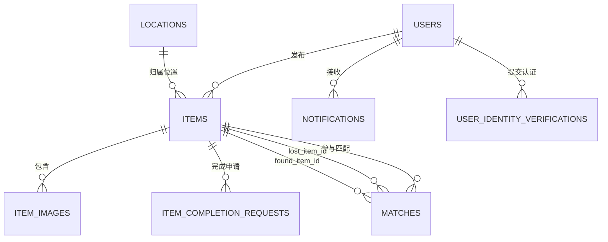
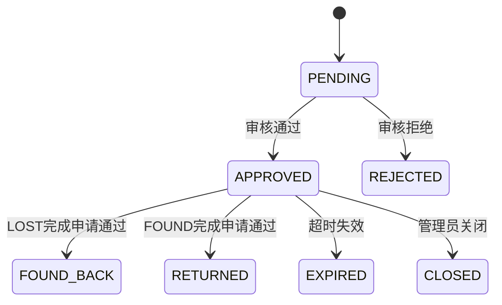
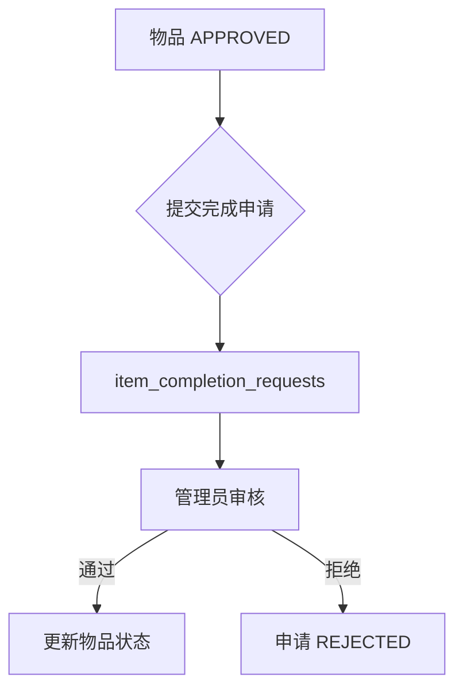

# 数据库设计

## 1. 数据表总览

| 表名 | 作用 |
|------|------|
| `users` | 用户主表 |
| `user_identity_verifications` | 实名认证申请记录 |
| `locations` | 校园位置字典 |
| `items` | 物品主表 |
| `item_images` | 物品图片 |
| `matches` | 匹配记录 |
| `item_completion_requests` | 已找到/已归还申请 |
| `notifications` | 站内通知 |
| `daily_statistics` | 每日统计 |

## 2. ER 关系图



## 3. 表结构

### users 用户表
| 字段 | 类型 | 说明 |
|------|------|------|
| id | BIGINT | 用户ID |
| username | VARCHAR(50) | 用户名 |
| password | VARCHAR(255) | 加密密码 |
| email | VARCHAR(100) | 邮箱 |
| student_id | VARCHAR(20) | 学号/工号 |
| phone | VARCHAR(20) | 手机号 |
| real_name | VARCHAR(50) | 真实姓名 |
| id_card | VARCHAR(18) | 身份证号 |
| identity_status | ENUM | 实名状态 |
| role | ENUM | 角色 |
| status | TINYINT | 状态 |
| notification_* | TINYINT | 通知开关 |
| deleted | TINYINT | 逻辑删除 |

### items 物品表
| 字段 | 类型 | 说明 |
|------|------|------|
| id | BIGINT | 物品ID |
| user_id | BIGINT | 发布者ID |
| type | ENUM | LOST/FOUND |
| category | VARCHAR(50) | 物品类别 |
| title | VARCHAR(100) | 标题 |
| description | TEXT | 详细描述 |
| brand | VARCHAR(50) | 品牌 |
| color | VARCHAR(20) | 颜色 |
| location_id | BIGINT | 位置ID |
| location | VARCHAR(100) | 详细位置 |
| lost_time | DATETIME | 丢失时间 |
| found_time | DATETIME | 拾取时间 |
| serial_number | VARCHAR(50) | 序列号/证件号 |
| contact_info | VARCHAR(100) | 联系方式 |
| status | ENUM | 物品状态 |
| view_count | INT | 浏览次数 |
| match_score | DECIMAL(5,2) | 最高匹配分数 |
| match_item_id | BIGINT | 匹配成功物品ID |

### matches 匹配记录表
| 字段 | 类型 | 说明 |
|------|------|------|
| id | BIGINT | 匹配ID |
| lost_item_id | BIGINT | 寻物启示ID |
| found_item_id | BIGINT | 失物招领ID |
| score | DECIMAL(5,2) | 匹配分数 |
| match_type | ENUM | 匹配类型 |
| status | ENUM | 状态 |
| is_read | TINYINT | 是否已读 |

### notifications 通知表
| 字段 | 类型 | 说明 |
|------|------|------|
| id | BIGINT | 通知ID |
| user_id | BIGINT | 接收用户ID |
| type | ENUM | 通知类型 |
| title | VARCHAR(100) | 标题 |
| content | TEXT | 内容 |
| related_id | BIGINT | 关联ID |
| is_read | TINYINT | 是否已读 |

## 4. 枚举值

### 用户角色
- `SUPER_ADMIN`：超级管理员
- `CAMPUS_ADMIN`：校园管理员
- `USER`：普通用户

### 实名状态
- `UNVERIFIED`：未实名
- `PENDING`：待审核
- `VERIFIED`：已认证
- `REJECTED`：已拒绝

### 物品状态
- `PENDING`：待审核
- `APPROVED`：已发布
- `REJECTED`：审核未通过
- `FOUND_BACK`：寻物已找到
- `RETURNED`：招领已归还
- `EXPIRED`：已过期
- `CLOSED`：已关闭

### 匹配状态
- `PENDING`：待确认
- `CONFIRMED`：已确认
- `REJECTED`：已拒绝

## 5. 状态流转

### 物品状态流转


### 完成申请审核流


## 6. 初始化

### 新库初始化
```bash
mysql -u root -p < docs/sql/schema.sql
mysql -u root -p < docs/sql/data.sql
```

### 旧库升级
```bash
mysql -u root -p campus_lostfound < docs/sql/phase9_migration.sql
mysql -u root -p campus_lostfound < docs/sql/phase10_remove_reward.sql
```

## 7. 设计约束

1. `users.id_card` 实名通过后用于证件失主精确匹配，需统一大写
2. `items.serial_number` 承载序列号与证件号双重语义
3. `item_images` 独立表支持多图排序
4. `notifications.related_id` 复用于物品、匹配、审核等多种业务对象
