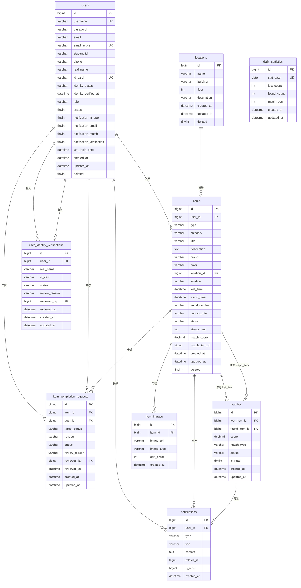

# 数据库设计

## 1. 数据库概述

- **数据库类型**：MySQL 8.0+
- **存储引擎**：InnoDB
- **字符编码**：utf8mb4
- **缓存**：Redis（会话、验证码、位置、统计数据缓存）
- **建表脚本**：`docs/sql/schema.sql`
- **初始化数据**：`docs/sql/data.sql`

---

## 2. 数据表设计

### 2.1 users（用户表）

| 字段名 | 类型 | 约束 | 说明 |
|--------|------|------|------|
| id | BIGINT | PRIMARY KEY, AUTO_INCREMENT | 用户ID |
| username | VARCHAR(50) | NOT NULL, UNIQUE | 用户名 |
| password | VARCHAR(255) | NOT NULL | BCrypt加密密码 |
| email | VARCHAR(100) | NOT NULL | 邮箱 |
| email_active | VARCHAR(100) | VIRTUAL GENERATED, UNIQUE KEY `uk_users_email_active` | `CASE WHEN deleted=0 THEN email ELSE NULL END`，确保未删除用户邮箱唯一 |
| student_id | VARCHAR(20) | NULL | 学号/工号 |
| phone | VARCHAR(20) | NULL | 手机号 |
| real_name | VARCHAR(50) | NULL | 真实姓名（实名认证） |
| id_card | VARCHAR(18) | UNIQUE | 身份证号（实名认证） |
| identity_status | ENUM('UNVERIFIED','PENDING','VERIFIED','REJECTED') | DEFAULT 'UNVERIFIED' | 实名认证状态 |
| identity_verified_at | DATETIME | NULL | 实名认证通过时间 |
| role | ENUM('SUPER_ADMIN','CAMPUS_ADMIN','USER') | DEFAULT 'USER' | 角色 |
| status | TINYINT | DEFAULT 1 | 账号状态：0禁用，1正常 |
| notification_in_app | TINYINT | DEFAULT 1 | 站内通知开关 |
| notification_email | TINYINT | DEFAULT 1 | 邮件通知开关 |
| notification_match | TINYINT | DEFAULT 1 | 匹配提醒开关 |
| notification_verification | TINYINT | DEFAULT 1 | 审核提醒开关 |
| last_login_time | DATETIME | NULL | 最后登录时间 |
| created_at | DATETIME | NOT NULL, DEFAULT CURRENT_TIMESTAMP | 创建时间 |
| updated_at | DATETIME | NOT NULL, DEFAULT CURRENT_TIMESTAMP ON UPDATE CURRENT_TIMESTAMP | 更新时间 |
| deleted | TINYINT | DEFAULT 0 | 逻辑删除标记 |

**索引**：
- PRIMARY KEY (`id`)
- UNIQUE KEY `username` (`username`)
- UNIQUE KEY `uk_users_email_active` (`email_active`)
- UNIQUE KEY `id_card` (`id_card`)
- KEY `idx_student_id` (`student_id`)
- KEY `idx_identity_status` (`identity_status`)
- KEY `idx_role` (`role`)

---

### 2.2 user_identity_verifications（实名认证申请表）

| 字段名 | 类型 | 约束 | 说明 |
|--------|------|------|------|
| id | BIGINT | PRIMARY KEY, AUTO_INCREMENT | 申请ID |
| user_id | BIGINT | NOT NULL, FOREIGN KEY → users.id | 用户ID |
| real_name | VARCHAR(50) | NOT NULL | 申请姓名 |
| id_card | VARCHAR(18) | NOT NULL | 申请身份证号 |
| status | ENUM('PENDING','VERIFIED','REJECTED') | DEFAULT 'PENDING' | 审核状态 |
| review_reason | VARCHAR(255) | NULL | 审核原因 |
| reviewed_by | BIGINT | FOREIGN KEY → users.id | 审核人ID |
| reviewed_at | DATETIME | NULL | 审核时间 |
| created_at | DATETIME | NOT NULL, DEFAULT CURRENT_TIMESTAMP | 创建时间 |
| updated_at | DATETIME | NOT NULL, DEFAULT CURRENT_TIMESTAMP ON UPDATE CURRENT_TIMESTAMP | 更新时间 |

**索引**：
- PRIMARY KEY (`id`)
- KEY `idx_user_id` (`user_id`)
- KEY `idx_status` (`status`)

---

### 2.3 locations（位置区域表）

| 字段名 | 类型 | 约束 | 说明 |
|--------|------|------|------|
| id | BIGINT | PRIMARY KEY, AUTO_INCREMENT | 位置ID |
| name | VARCHAR(100) | NOT NULL | 位置名称（如：A教学楼） |
| building | VARCHAR(50) | NULL | 所属建筑 |
| floor | INT | NULL | 楼层 |
| description | VARCHAR(255) | NULL | 位置描述 |
| created_at | DATETIME | NOT NULL, DEFAULT CURRENT_TIMESTAMP | 创建时间 |
| updated_at | DATETIME | NOT NULL, DEFAULT CURRENT_TIMESTAMP ON UPDATE CURRENT_TIMESTAMP | 更新时间 |
| deleted | TINYINT | DEFAULT 0 | 逻辑删除标记 |

**索引**：
- PRIMARY KEY (`id`)
- KEY `idx_name` (`name`)
- KEY `idx_building` (`building`)

---

### 2.4 items（失物招领表）

| 字段名 | 类型 | 约束 | 说明 |
|--------|------|------|------|
| id | BIGINT | PRIMARY KEY, AUTO_INCREMENT | 物品ID |
| user_id | BIGINT | NOT NULL, FOREIGN KEY → users.id | 发布者用户ID |
| type | ENUM('LOST','FOUND') | NOT NULL | 类型：LOST寻物，FOUND招领 |
| category | VARCHAR(50) | NOT NULL | 物品类别（电子产品/证件/钥匙/书籍/其他等） |
| title | VARCHAR(100) | NOT NULL | 标题 |
| description | TEXT | NULL | 详细描述 |
| brand | VARCHAR(50) | NULL | 品牌 |
| color | VARCHAR(20) | NULL | 颜色 |
| location_id | BIGINT | FOREIGN KEY → locations.id, NULL | 丢失/拾取地点ID |
| location | VARCHAR(100) | NULL | 详细位置文本 |
| lost_time | DATETIME | NULL | 丢失时间 |
| found_time | DATETIME | NULL | 拾取时间 |
| serial_number | VARCHAR(50) | NULL | 序列号/证件号（精确匹配） |
| contact_info | VARCHAR(100) | NULL | 联系方式 |
| status | ENUM('PENDING','APPROVED','REJECTED','FOUND_BACK','RETURNED','EXPIRED','CLOSED') | DEFAULT 'PENDING' | 状态 |
| view_count | INT | DEFAULT 0 | 浏览量 |
| match_score | DECIMAL(5,2) | NULL | 最高匹配分数 |
| match_item_id | BIGINT | NULL | 匹配成功的物品ID |
| created_at | DATETIME | NOT NULL, DEFAULT CURRENT_TIMESTAMP | 创建时间 |
| updated_at | DATETIME | NOT NULL, DEFAULT CURRENT_TIMESTAMP ON UPDATE CURRENT_TIMESTAMP | 更新时间 |
| deleted | TINYINT | DEFAULT 0 | 逻辑删除标记 |

**索引**：
- PRIMARY KEY (`id`)
- KEY `idx_user_id` (`user_id`)
- KEY `idx_type` (`type`)
- KEY `idx_category` (`category`)
- KEY `idx_status` (`status`)
- KEY `idx_location_id` (`location_id`)
- KEY `idx_serial_number` (`serial_number`)
- KEY `idx_created_at` (`created_at`)
- KEY `idx_type_status` (`type`, `status`)

---

### 2.5 item_images（物品图片表）

| 字段名 | 类型 | 约束 | 说明 |
|--------|------|------|------|
| id | BIGINT | PRIMARY KEY, AUTO_INCREMENT | 图片ID |
| item_id | BIGINT | NOT NULL, FOREIGN KEY → items.id | 物品ID |
| image_url | VARCHAR(255) | NOT NULL | 图片URL |
| image_type | ENUM('MAIN','DETAIL') | DEFAULT 'DETAIL' | 图片类型 |
| sort_order | INT | DEFAULT 0 | 排序序号 |
| created_at | DATETIME | NOT NULL, DEFAULT CURRENT_TIMESTAMP | 创建时间 |

**索引**：
- PRIMARY KEY (`id`)
- KEY `idx_item_id` (`item_id`)

---

### 2.6 matches（智能匹配记录表）

| 字段名 | 类型 | 约束 | 说明 |
|--------|------|------|------|
| id | BIGINT | PRIMARY KEY, AUTO_INCREMENT | 匹配ID |
| lost_item_id | BIGINT | NOT NULL, FOREIGN KEY → items.id | 寻物启示ID |
| found_item_id | BIGINT | NOT NULL, FOREIGN KEY → items.id | 失物招领ID |
| score | DECIMAL(5,2) | NOT NULL | 匹配得分（0.00-1.00） |
| match_type | ENUM('SERIAL_EXACT','WEIGHTED','NONE') | NOT NULL | 匹配类型 |
| status | ENUM('PENDING','CONFIRMED','REJECTED') | DEFAULT 'PENDING' | 状态 |
| is_read | TINYINT | DEFAULT 0 | 是否已读 |
| created_at | DATETIME | NOT NULL, DEFAULT CURRENT_TIMESTAMP | 创建时间 |
| updated_at | DATETIME | NOT NULL, DEFAULT CURRENT_TIMESTAMP ON UPDATE CURRENT_TIMESTAMP | 更新时间 |

**索引**：
- PRIMARY KEY (`id`)
- UNIQUE KEY `uk_item_pair` (`lost_item_id`, `found_item_id`)
- KEY `idx_lost_item_id` (`lost_item_id`)
- KEY `idx_found_item_id` (`found_item_id`)
- KEY `idx_status` (`status`)
- KEY `idx_score` (`score`)
- KEY `idx_created_at` (`created_at`)

---

### 2.7 item_completion_requests（完成申请表）

| 字段名 | 类型 | 约束 | 说明 |
|--------|------|------|------|
| id | BIGINT | PRIMARY KEY, AUTO_INCREMENT | 申请ID |
| item_id | BIGINT | NOT NULL, FOREIGN KEY → items.id | 物品ID |
| user_id | BIGINT | NOT NULL, FOREIGN KEY → users.id | 申请人ID |
| target_status | ENUM('FOUND_BACK','RETURNED') | NOT NULL | 目标状态 |
| reason | VARCHAR(255) | NULL | 申请说明 |
| status | ENUM('PENDING','APPROVED','REJECTED') | DEFAULT 'PENDING' | 审核状态 |
| review_reason | VARCHAR(255) | NULL | 审核原因 |
| reviewed_by | BIGINT | FOREIGN KEY → users.id, NULL | 审核人ID |
| reviewed_at | DATETIME | NULL | 审核时间 |
| created_at | DATETIME | NOT NULL, DEFAULT CURRENT_TIMESTAMP | 创建时间 |
| updated_at | DATETIME | NOT NULL, DEFAULT CURRENT_TIMESTAMP ON UPDATE CURRENT_TIMESTAMP | 更新时间 |

**索引**：
- PRIMARY KEY (`id`)
- KEY `idx_item_id` (`item_id`)
- KEY `idx_user_id` (`user_id`)
- KEY `idx_status` (`status`)

---

### 2.8 notifications（通知表）

| 字段名 | 类型 | 约束 | 说明 |
|--------|------|------|------|
| id | BIGINT | PRIMARY KEY, AUTO_INCREMENT | 通知ID |
| user_id | BIGINT | NOT NULL, FOREIGN KEY → users.id | 接收用户ID |
| type | ENUM('MATCH_FOUND','VERIFICATION_RESULT','COMPLETION_REVIEW_RESULT','SYSTEM') | NOT NULL | 通知类型 |
| title | VARCHAR(100) | NOT NULL | 标题 |
| content | TEXT | NOT NULL | 内容 |
| related_id | BIGINT | NULL | 关联ID（如 match_id） |
| is_read | TINYINT | DEFAULT 0 | 是否已读 |
| created_at | DATETIME | NOT NULL, DEFAULT CURRENT_TIMESTAMP | 创建时间 |

**索引**：
- PRIMARY KEY (`id`)
- KEY `idx_user_id` (`user_id`)
- KEY `idx_is_read` (`is_read`)
- KEY `idx_type` (`type`)
- KEY `idx_created_at` (`created_at`)

---

### 2.9 daily_statistics（每日统计表）

| 字段名 | 类型 | 约束 | 说明 |
|--------|------|------|------|
| id | BIGINT | PRIMARY KEY, AUTO_INCREMENT | 统计ID |
| stat_date | DATE | NOT NULL, UNIQUE | 统计日期 |
| lost_count | INT | DEFAULT 0 | 新增寻物启示数 |
| found_count | INT | DEFAULT 0 | 新增失物招领数 |
| match_count | INT | DEFAULT 0 | 匹配成功数 |
| created_at | DATETIME | NOT NULL, DEFAULT CURRENT_TIMESTAMP | 创建时间 |
| updated_at | DATETIME | NOT NULL, DEFAULT CURRENT_TIMESTAMP ON UPDATE CURRENT_TIMESTAMP | 更新时间 |

**索引**：
- PRIMARY KEY (`id`)
- UNIQUE KEY `stat_date` (`stat_date`)

---

## 3. ER 关系图

---

## 4. 设计要点

### 4.1 软删除与唯一约束

- 使用 `deleted` 字段标识逻辑删除
- `users.email_active` 使用生成列 + 唯一约束，确保未删除用户邮箱不重复，允许已删除用户再次注册

### 4.2 状态枚举

- 物品状态：PENDING → APPROVED → FOUND_BACK / RETURNED / EXPIRED / CLOSED，REJECTED 在审核阶段
- 匹配状态：PENDING → CONFIRMED / REJECTED（由用户操作）
- 完成申请：PENDING → APPROVED / REJECTED（由管理员审核）

### 4.3 匹配对唯一约束

`matches` 表的 `uk_item_pair` 保证同一个 lost/found 组合不会重复产生匹配记录。

### 4.4 索引策略

- 所有表的查询入口都建立了 B-tree 索引
- 复合索引 `idx_type_status` 优化"按类型+状态"的列表查询
- 时间字段索引支持按时间范围查询
