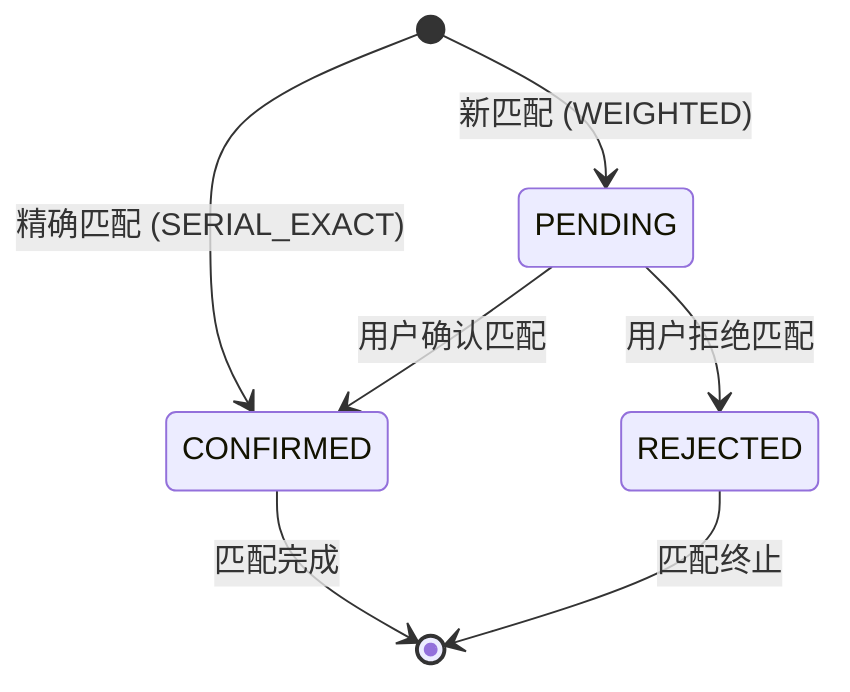

# 智能匹配系统设计文档

## 1. 系统概述

智能匹配系统是校园失物招领平台的核心功能，通过多维度加权算法自动将"寻物启事"与"失物招领"进行匹配，提高物品找回效率。

---

## 2. 核心设计原则

1. **精确匹配优先**：序列号（证件号）精确匹配直接确认为成功匹配
2. **多维度加权**：文本、类别、品牌、颜色、时间五维度综合评分
3. **冲突惩罚**：双方序列号都存在但不相同，惩罚总分降低
4. **Top-K 保留**：仅保留得分最高的 Top-20 条匹配
5. **人工确认**：加权匹配需要物品发布者确认后方为有效

---

## 3. 算法核心

### 3.1 权重配置（总计 100%）

| 维度 | 权重 | 说明 |
|------|------|------|
| 文本相似度（Text） | 35% | 标题+描述+位置文本 Dice 相似度 |
| 类别（Category） | 25% | 类别完全一致 / 包含关系 |
| 位置（Location） | 15% | 位置ID一致 / 文本相似 |
| 品牌（Brand） | 10% | 品牌完全一致 / 包含关系 |
| 颜色（Color） | 5% | 颜色完全一致（归一化后比较） |
| 时间（Time） | 10% | 发布时间差的指数衰减函数 |

**总分公式**：
```
总得分 = TEXT × 0.35 + CATEGORY × 0.25 + LOCATION × 0.15 + BRAND × 0.10 + COLOR × 0.05 + TIME × 0.10
```

**匹配阈值**：`MATCH_THRESHOLD = 0.65`（得分 ≥ 0.65 视为可能匹配）

**冲突惩罚**：`SERIAL_CONFLICT_PENALTY = 0.40`（双方都有序列号且不一致，总分 × 0.40）

---

### 3.2 分维度评分详解

#### 3.2.1 文本相似度（Text Score）

**数据源**：标题(title) + 描述(description) + 位置文本(location)
**算法**：Dice Coefficient（Sørensen–Dice index）

**Dice 公式**：
```
Dice = 2 × |A ∩ B| / (|A| + |B|)
```

**分词策略**：
- 英文/数字：以非字母数字字符为分隔，保留长度 ≥ 2 的词
- 中文：生成所有二元组（bigrams），例如"黑色书包" → ["黑色", "色书", "书包"]

**归一化**：
- 全部转为小写
- 连续空白压缩为单空格
- 修剪首尾空白

**特殊规则**：
- 左右任一文本文本为空时，返回 0.5（给予中性分数）
- 文本完全无交集但非空时，返回 0
- 完全重叠时返回 1.0

---

#### 3.2.2 类别评分（Category Score）

```
category1 == category2 → 1.0
category1 包含 category2 或 category2 包含 category1 → 0.8
其他 → 0
```

---

#### 3.2.3 位置评分（Location Score）

**优先使用位置 ID**：
```
locationId1 != null && locationId2 != null && locationId1 == locationId2 → 1.0
locationId1 != null && locationId2 != null && locationId1 != locationId2 → 0.35
```

**回退到位置文本**：
```
locationText 相似度为 0 → 0.5（中性）
locationText 相似度 > 0 → similarity × 0.8
```

---

#### 3.2.4 品牌评分（Brand Score）

```
任一为空 → 0.5
完全一致 → 1.0
互相包含（忽略大小写）→ 0.8
其他 → similarity × 0.7
```

---

#### 3.2.5 颜色评分（Color Score）

```
任一为空 → 0.5
完全一致（归一化后: toLowerCase + trim）→ 1.0
其他 → 0
```

---

#### 3.2.6 时间评分（Time Score）

**核心思想**：丢失时间和拾获时间越接近，得分越高。使用**指数衰减函数**。

```
tau = 10.0  (半衰期约 7 天)
days = |lostTime - foundTime|    (天数差，取绝对值)
score = e^(-days / tau)

days = 0   → score = 1.00
days = 7   → score = e^(-0.7) ≈ 0.50
days = 10  → score = e^(-1.0) ≈ 0.37
days = 30  → score = e^(-3.0) ≈ 0.05
days = 60  → score = e^(-6.0) ≈ 0.00
```

**特殊规则**：
- 任一时间为空 → 0.5（中性）

**关于 30 天匹配问题**：
- 30 天时间差，time score ≈ 0.05，按 10% 权重仅贡献 0.005 分
- 但如果其他 5 个维度都完美匹配（text=1.0, category=1.0, location=1.0, brand=1.0, color=1.0）
  → (0.35 + 0.25 + 0.15 + 0.10 + 0.05) × 1.0 + 0.10 × 0.05 = 0.90 + 0.005 = 0.905
  → 0.905 × 2 位四舍五入 = 0.90，远超 0.65 阈值
- **结论**：发布时间相差 30 天的物品仍可以被匹配，只要其他维度（类别、品牌、颜色、位置、文本）足够相似

---

### 3.3 序列号精确匹配

**触发条件**：双方物品都提供了 serialNumber（证件号/序列号），且完全相同（去首尾空白 + toUpperCase）

**结果**：直接返回 score = 1.00，`matchType = "SERIAL_EXACT"`，且匹配状态直接为 `CONFIRMED`（无需用户确认）

---

### 3.4 序列号冲突惩罚

**触发条件**：双方物品都提供了 serialNumber，但不相同。

**惩罚**：`totalScore = totalScore × 0.40`，即总分被砍掉 60%

---

### 3.5 候选集筛选（findCandidates）

```
输入：待匹配物品 item
输出：候选匹配物品列表（最多 300 条）

1. 类型反转：LOST ↔ FOUND
2. 状态筛选：仅匹配状态为 APPROVED 的物品
3. 排除自身：item.id ≠ candidate.id
4. 序列号匹配优先：
   - 如果 item.serialNumber 非空：仅筛选 serialNumber == item.serialNumber 的物品
   - 否则进入类别 + 时间筛选
5. 类别筛选：如果 item.category 非空，则 category == item.category
6. 时间窗口：±60 天范围
   - refTime = item 对应的时间（LOST→lostTime, FOUND→foundTime）
   - targetType = FOUND → foundTime ∈ [refTime - 60天, refTime + 60天]
   - targetType = LOST → lostTime ∈ [refTime - 60天, refTime + 60天]
7. 分页限制：page=1, pageSize=300
```

---

## 4. 匹配流程图

```mermaid
flowchart TD
    A[新物品发布<br>状态变为APPROVED] --> B[触发匹配任务]
    B --> C[获取当前物品 item]
    C --> D[确定目标类型<br>LOST→FOUND, FOUND→LOST]
    D --> E[筛选候选集<br>findCandidates(item, targetType)]
    E --> F{候选集为空?}
    F -->|是| G[结束：无匹配]
    F -->|否| H[遍历每条候选]
    H --> I[计算得分<br>calculateScore(item, candidate)]
    I --> J{score > 0?}
    J -->|是| K[加入 ScoredCandidate 列表]
    J -->|否| L[跳过]
    L --> H
    K --> H
    H --> M[列表按 score 降序排序]
    M --> N[保留 Top-20]
    N --> O[遍历 Top-20]
    O --> P[计算匹配类型<br>score==1.00→SERIAL_EXACT<br>score>=0.65→WEIGHTED<br>其他→NONE]
    P --> Q{matchType != NONE?}
    Q -->|否| R[跳过]
    Q -->|是| S[检查是否已存在匹配记录]
    S -->|存在| T[跳过]
    S -->|不存在| U[保存匹配记录]
    U --> V[设置状态<br>SERIAL_EXACT→CONFIRMED<br>WEIGHTED→PENDING]
    V --> W[更新物品 match_item_id 和 match_score<br>仅 SERIAL_EXACT]
    W --> X[发送站内通知 + 邮件通知<br>to 双方物品发布者]
    R --> O
    T --> O
    X --> O
    O --> Y[结束]
```

---

## 5. 匹配状态流转



---

## 6. API 接口

| 接口 | 方法 | 权限 | 说明 |
|------|------|------|------|
| `/api/matches` | GET | 已登录 | 当前用户物品的匹配列表（分页，按创建时间倒序） |
| `/api/matches/recent` | GET | 已登录 | 最近匹配列表（管理员看全部，用户看自己） |
| `/api/matches?itemId=xxx` | GET | 已登录 | 指定物品的匹配结果（按得分降序，不包含REJECTED） |
| `/api/matches/{id}/confirm` | PUT | 物品所有者 | 确认匹配（同时更新物品的 match_item_id 和 match_score） |
| `/api/matches/{id}/reject?reason=xxx` | PUT | 物品所有者 | 拒绝匹配（reason 可选参数） |
| `/api/matches/trigger?itemId=xxx` | POST | 管理员 | 手动触发指定物品的匹配（调试用） |
| `/api/matches/batch` | POST | 管理员 | 批量匹配所有已审核通过物品 |
| `/api/matches/test` | GET | 管理员 | 测试端点 |

---

## 7. 示例计算

### 示例 1：完美匹配

**场景**：丢失的黑色 iPhone 15，拾到同样的黑色 iPhone 15，同时间段。

```
serialNumber: 两者都为空
text_score = 0.90  （标题、描述高度相似）
category_score = 1.00  （同为 电子产品）
brand_score = 1.00  （同为 Apple）
color_score = 1.00  （同为 黑色）
time_score = 0.90  （相隔 1 天）

total = 0.35*0.90 + 0.25*1.00 + 0.15*1.00 + 0.10*1.00 + 0.15*0.90
      = 0.315 + 0.25 + 0.15 + 0.10 + 0.135
      = 0.95 → 四舍五入 0.95

matchType = WEIGHTED, status = PENDING
```

### 示例 2：序列号精确匹配

**场景**：丢失的学生证（身份证号 XXX），拾到同样学生证

```
serialNumber: 两者均为 "XXX" （trim + toUpperCase 后相等）
→ score = 1.00, matchType = SERIAL_EXACT, status = CONFIRMED
→ 自动更新两个物品的 match_item_id 和 match_score
→ 立即发送通知
```

### 示例 3：跨时间匹配（30 天差）

**场景**：30 天前丢的黑色书包，今天有人拾到同款黑色书包

```
text_score = 0.85  （描述相似）
category_score = 1.00  （同为 书包/其他）
brand_score = 0.00  （无品牌信息）
color_score = 1.00  （同为 黑色）
time_score = 0.05  （相隔 30 天，e^(-30/10) = e^(-3) ≈ 0.05）

total = 0.35*0.85 + 0.25*1.00 + 0.15*0.50 + 0.10*1.00 + 0.15*0.05
      = 0.298 + 0.25 + 0.075 + 0.10 + 0.0075
      = 0.73 → 四舍五入 0.73

0.73 >= 0.65 → 成功匹配！
matchType = WEIGHTED, status = PENDING
```

> **说明**：品牌字段为空时，brand_score = 0.5（中性分数），不会导致总分下降。

### 示例 4：序列号冲突

**场景**：丢失的手机有 IMEI = "ABC123"，拾到的手机有 IMEI = "XYZ789"

```
serialNumber 冲突 → totalScore × 0.40
假设原始 totalScore = 0.85
惩罚后 = 0.85 × 0.40 = 0.34
0.34 < 0.65 → 不产生匹配
```

---

## 8. 数据库相关

### 8.1 matches 表

| 字段 | 类型 | 说明 |
|------|------|------|
| id | BIGINT | 主键 |
| lost_item_id | BIGINT | 寻物启事物品ID |
| found_item_id | BIGINT | 失物招领物品ID |
| score | DECIMAL(5,4) | 匹配得分 0.00~1.00 |
| match_type | VARCHAR(30) | SERIAL_EXACT / WEIGHTED |
| status | VARCHAR(20) | PENDING / CONFIRMED / REJECTED |
| is_read | TINYINT | 是否已读 0/1 |
| created_at | DATETIME | 创建时间 |
| updated_at | DATETIME | 更新时间 |

**唯一约束**：`UNIQUE(lost_item_id, found_item_id)` — 防止同一对物品重复匹配

---

## 9. 触发机制

| 触发时机 | 说明 |
|----------|------|
| 物品审核通过 | 新物品状态从 PENDING → APPROVED 时，自动触发该物品的匹配 |
| 管理员手动触发 | POST `/api/matches/trigger?itemId=xxx` |
| 管理员批量匹配 | POST `/api/matches/batch`（O(n²) 遍历所有已审核物品） |

---

## 10. 注意事项

1. **评分保留 2 位小数**：所有最终得分通过 `setScale(2, RoundingMode.HALF_UP)` 标准化
2. **时间窗口 ±60 天**：超过时间窗口的物品不参与候选筛选（除非有精确序列号）
3. **精确匹配自动确认**：`SERIAL_EXACT` 类型的匹配跳过 PENDING 状态，直接 CONFIRMED
4. **Top-20 限制**：即使有大量候选，也仅保存得分最高的 20 条
5. **冲突惩罚作用显著**：序列号冲突时总分 × 0.40，通常导致低于 0.65 阈值
6. **空字段中性处理**：品牌、颜色、时间任一方为空时给予 0.5 中性分（而非 0 分惩罚）
7. **文本分词策略**：中文 bigram + 英文单词 token 混合，对中英文混杂的描述效果更佳
