# 校园失物招领平台 — 项目图表

> 本文档汇总项目的全部架构与流程图表，覆盖系统层级、模块结构、关键业务流程、时序交互、数据库关系、状态机、信息流、部署拓扑等。所有图表均使用 Mermaid 语法，可在 GitHub、IDEA、VSCode 等支持 Mermaid 的环境中直接渲染。

---

## 目录

0. [用例图总览](#0-用例图总览)
1. [系统总览架构图](#1-系统总览架构图)
2. [技术分层架构图](#2-技术分层架构图)
3. [后端模块结构图](#3-后端模块结构图)
4. [前端模块结构图](#4-前端模块结构图)
5. [部署拓扑图](#5-部署拓扑图)
6. [用户认证时序图](#6-用户认证时序图)
7. [物品发布与审核流程图](#7-物品发布与审核流程图)
8. [物品状态机](#8-物品状态机)
9. [智能匹配流程图](#9-智能匹配流程图)
10. [匹配时序图](#10-匹配时序图)
11. [匹配确认与拒绝流程](#11-匹配确认与拒绝流程)
12. [完成申请流程图](#12-完成申请流程图)
13. [实名认证流程图](#13-实名认证流程图)
14. [图片上传流程图](#14-图片上传流程图)
15. [通知与邮件发送流程图](#15-通知与邮件发送流程图)
16. [管理员控制台信息流](#16-管理员控制台信息流)
17. [ER 关系图](#17-er-关系图)

---

## 0. 用例图总览

> 说明：Mermaid 官方未提供 useCaseDiagram，这里用 `flowchart` + 圆角矩形模拟 UML 用例图，渲染效果一致。

### 0.1 系统顶层用例图

```mermaid
flowchart LR
    User([普通用户])
    Admin([管理员])
    SysAdmin([超级管理员])

    subgraph UserUC["普通用户用例"]
        UL((登录系统))
        UR((注册账号))
        UEV((邮箱验证))
        UP1((发布寻物))
        UP2((发布招领))
        UV1((浏览物品))
        UV2((查看匹配))
        UC((确认匹配))
        UJ((拒绝匹配))
        UA((申请完成))
        UVI((实名认证))
        UN((查看通知))
    end

    subgraph AdminUC["管理员用例"]
        AR1((审核物品))
        AR2((审核实名))
        AR3((审核完成))
        AS((查看统计))
        AT((触发匹配))
    end

    subgraph SysUC["超级管理员用例"]
        SM((用户管理))
        SC((系统配置))
    end

    User --> UL
    User --> UR
    User --> UEV
    User --> UP1
    User --> UP2
    User --> UV1
    User --> UV2
    User --> UC
    User --> UJ
    User --> UA
    User --> UVI
    User --> UN

    Admin --> UL
    Admin --> AR1
    Admin --> AR2
    Admin --> AR3
    Admin --> AS
    Admin --> AT
    Admin --> UN

    SysAdmin --> SM
    SysAdmin --> SC

    classDef actor fill:#e3f2fd,stroke:#0d47a1,color:#000
    classDef uc fill:#fff3e0,stroke:#e65100,color:#000
    class User,Admin,SysAdmin actor
    class UL,UR,UEV,UP1,UP2,UV1,UV2,UC,UJ,UA,UVI,UN,AR1,AR2,AR3,AL,AS,AT,SM,SC uc
```

### 0.2 用户角色详细用例图

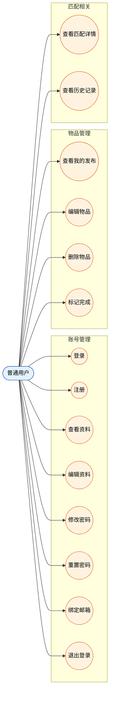

---

## 1. 系统总览架构图

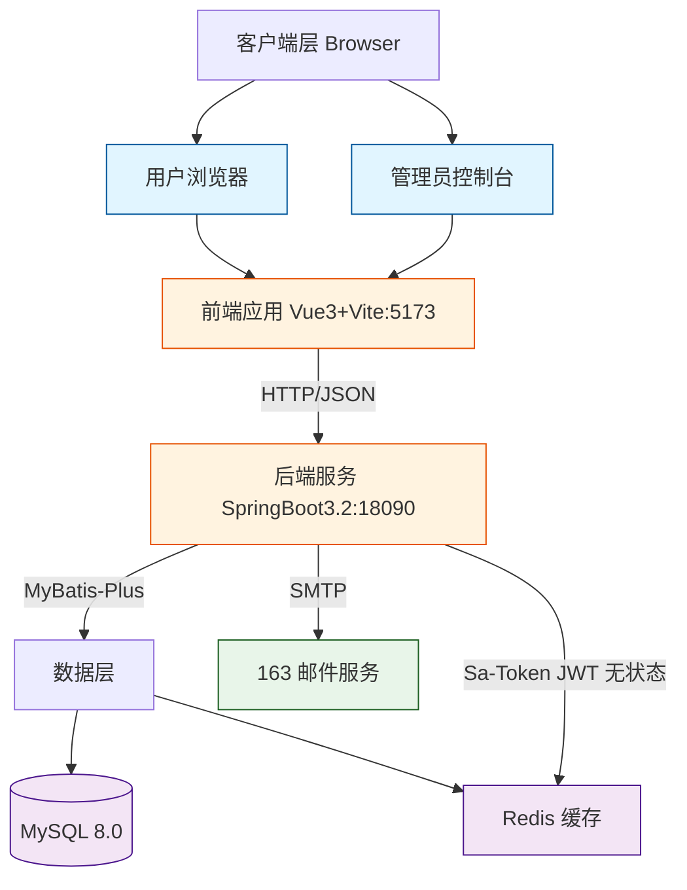

---

## 2. 技术分层架构图

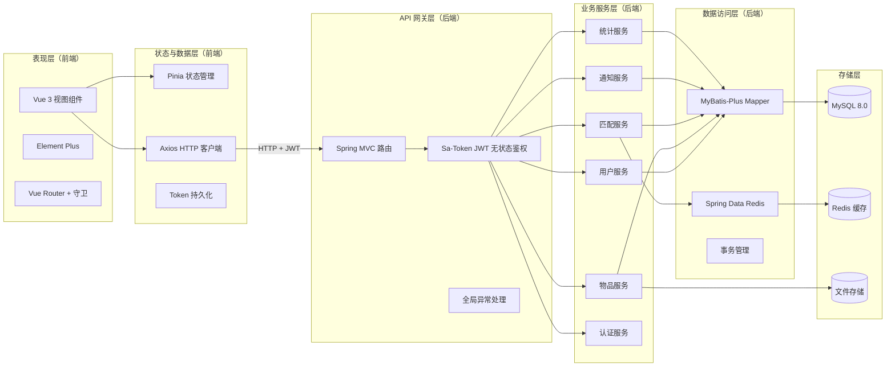

---

## 3. 后端模块结构图

```mermaid
flowchart TB
    Boot[CampusLostFoundApplication]

    subgraph common["common（公共层）"]
        C1[constant]
        C2[result/ApiResponse]
        C3[exception/GlobalExceptionHandler]
        C4[util/DataMaskUtils]
        C5[dto/request]
    end

    subgraph config["config（框架配置）"]
        CF1[CorsConfig]
        CF2[MybatisMetaObjectHandler]
        CF3[RedisConfig]
        CF4[MailConfig]
        CF5[HttpClientConfig]
        CF6[SwaggerConfig]
        CF7[DataInitializer]
        CF8[MyBatisPlusConfig]
        CF9[WebMvcConfig]
        CF10[AsyncConfig]
    end

    subgraph security["security（认证授权）"]
        S1[WebSecurityConfig]
        S2[SaTokenAuthenticationFilter]
    end

    subgraph commonService["modules/common（公共服务）"]
        CS1[RedisCacheService]
    end

    subgraph systemMod["modules/system（用户/认证）"]
        SY1[AuthController]
        SY2[UserController]
        SY3[EmailVerificationController]
        SY4[AdminUserController]
        SY5[AdminIdentityVerificationController]
        SY6[RootController]
        SY7[AuthService]
        SY8[UserService]
        SY9[EmailVerificationService]
    end

    subgraph itemMod["modules/item（物品相关）"]
        I1[ItemController]
        I2[AdminItemReviewController]
        I3[AdminCompletionRequestController]
        I4[ImageUploadController]
        I5[LocationController（简化版）]
        I6[ItemService]
        I7[ItemCompletionRequestService]
        I8[LocalImageUploadServiceImpl]
    end

    subgraph matchMod["modules/match（智能匹配）"]
        M1[MatchController]
        M2[MatchingServiceImpl]
        M3[MatchingEngine]
        M4[DocumentOwnerMatchServiceImpl]
    end

    subgraph notifMod["modules/notification（通知邮件）"]
        N1[NotificationController]
        N2[NotificationServiceImpl]
        N3[MailServiceImpl]
    end

    subgraph statsMod["modules/statistics（统计）"]
        ST1[PublicStatisticsController]
        ST2[StatisticsController]
        ST3[StatisticsServiceImpl]
    end

    Boot --> C1
    Boot --> CF1
    Boot --> S1
    Boot --> CS1
    Boot --> SY1
    Boot --> I1
    Boot --> M1
    Boot --> N1
    Boot --> ST1

    M2 --> M3
    M2 --> M4
    N3 --> CF4
    I8 --> CF5
    ST3 --> CS1
    SY9 --> CS1
```

---

## 4. 前端模块结构图

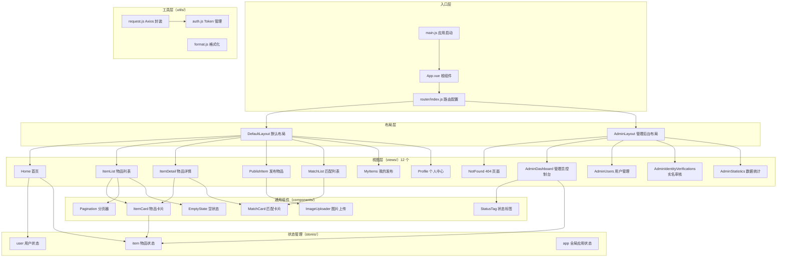

---

## 5. 部署拓扑图

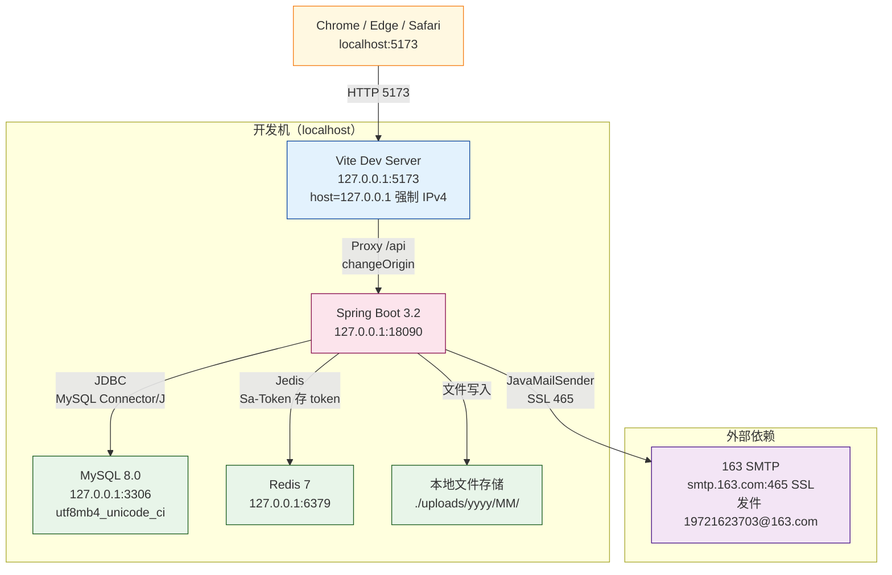

### 5.1 关键配置

| 配置项 | 值 | 来源 |
|--------|----|------|
| 后端端口 | 18090 | `application.yml: server.port` |
| 前端端口 | 5173 | `vite.config.js: server.port` |
| MySQL 端口 | 3306（默认） | `spring.datasource.url` |
| Redis 端口 | 6379（默认） | `spring.redis.*` |
| SMTP 端口 | 465（SSL） | `spring.mail.properties.mail.smtp.ssl.enable=true` |
| CORS 允许源 | `localhost:3000, 127.0.0.1:3000, :3001, :5173` | `app.cors.allowed-origins` |
| 单文件上传上限 | 10MB | `spring.servlet.multipart.max-file-size` |
| 单请求上限 | 20MB | `spring.servlet.multipart.max-request-size` |
| 本地存储路径 | `./uploads/` | `app.upload.path` |
| Access Token TTL | 7 天 | `sa-token.timeout=604800` |
| JWT 签名密钥 | HS256 ≥32 字节 | `sa-token.jwt-secret-key` |
| DbFix 条件装配 | 默认关闭 | `app.db-fix-enabled=false` |
| 邮箱验证强制 | 默认关闭 | `app.auth.email-verification-required=false` |

### 5.2 端口选择说明

| 端口 | 用途 | 备注 |
|------|------|------|
| 5173 | 前端 Vite | 避开 Win 保留区 |
| 18090 | 后端 Spring Boot | 避开常见端口 |
| 3306 | MySQL | 默认 |
| 6379 | Redis | 默认 |
| 465 | 163 SMTP SSL | 隐式 TLS（非 STARTTLS） |

---

## 6. 用户认证时序图

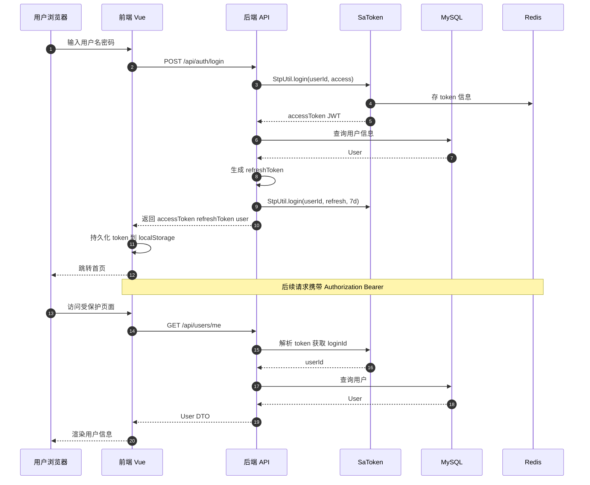

---

## 7. 物品发布与审核流程图

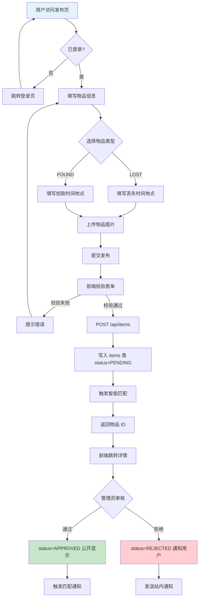

---

## 8. 物品状态机

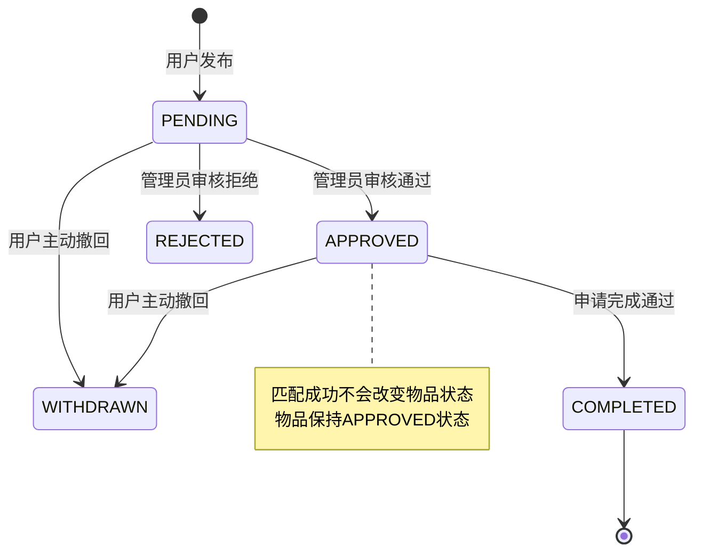

---

## 9. 智能匹配流程图

> v2 算法（2026-06 升级）：优化中文文本相似度，支持关键词匹配，阈值调整为 70%。

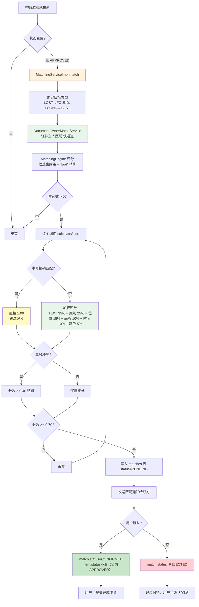

---

## 10. 匹配时序图

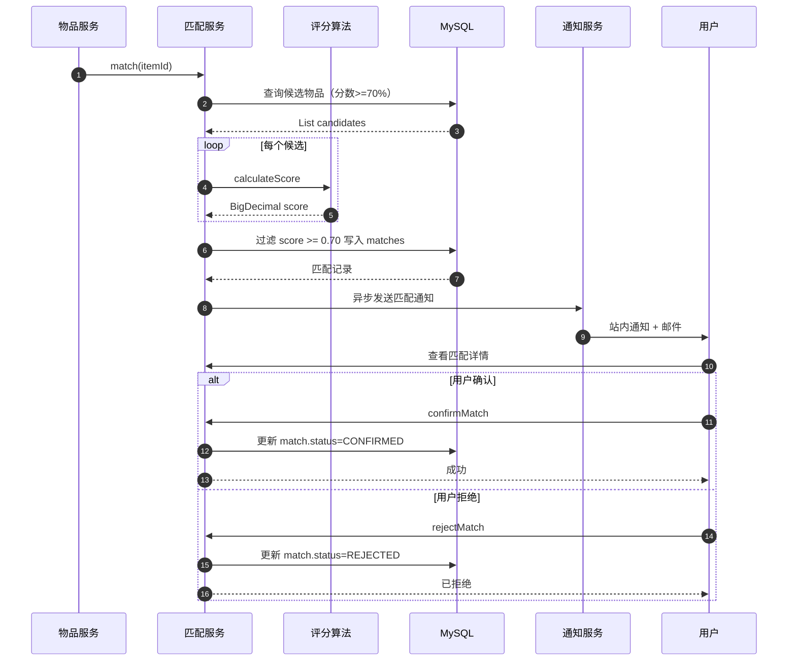

---

## 11. 匹配确认与拒绝流程

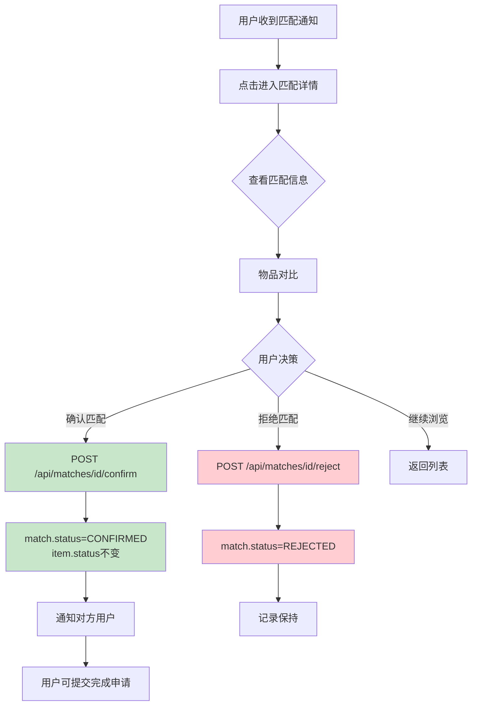

---

## 12. 完成申请流程图

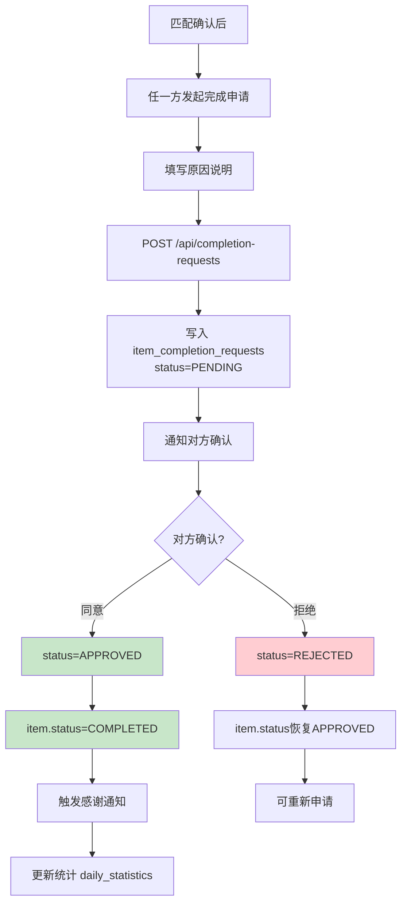

---

## 13. 实名认证流程图

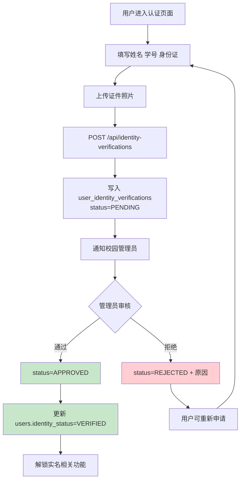

---

## 14. 图片上传流程图

> 图片存储在本地 `uploads/` 目录，不再使用外部图床。

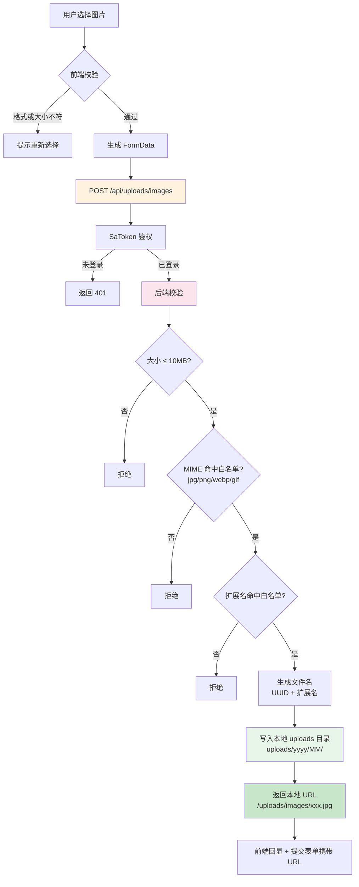

---

## 15. 通知与邮件发送流程图

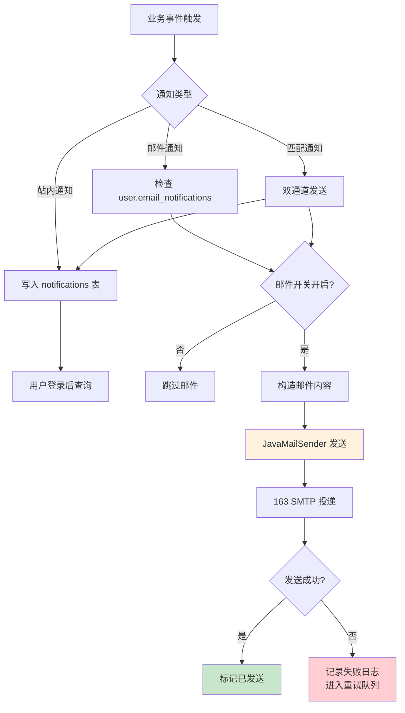

---

## 16. 管理员控制台信息流

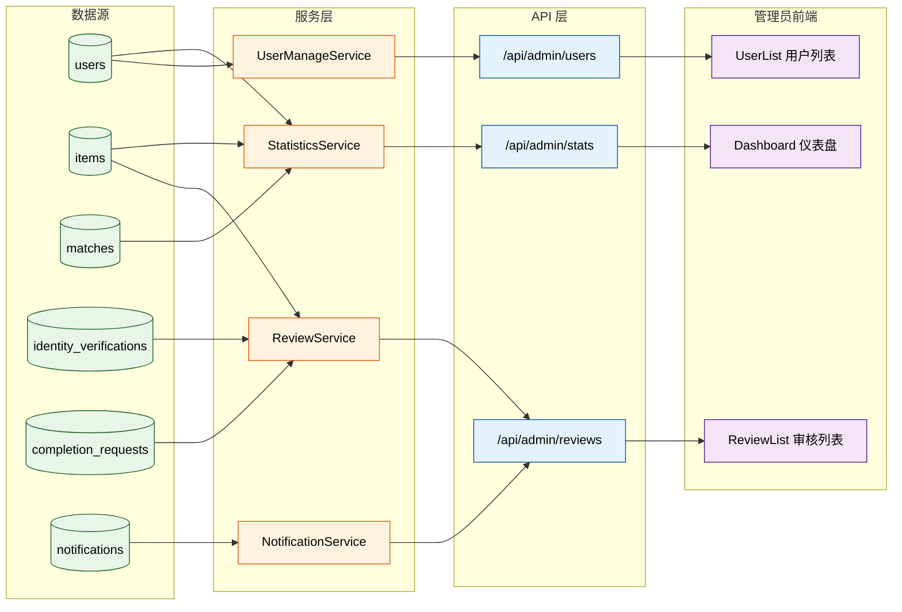

---

## 17. ER 关系图

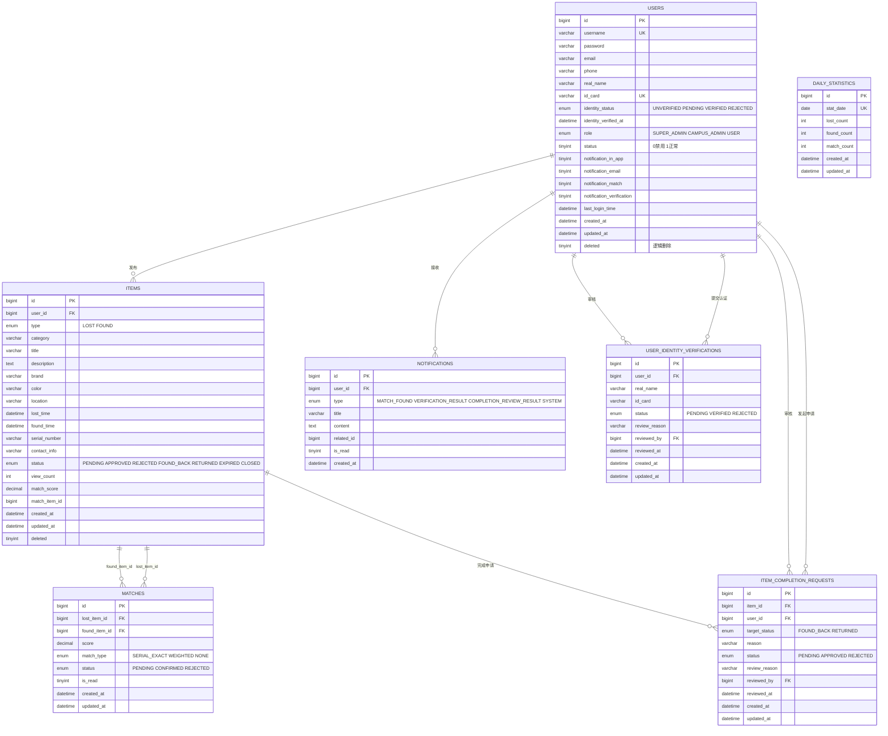

### 17.1 关键约束

- `users.id_card` UNIQUE，承载证件主人精确匹配
- `matches(lost_item_id, found_item_id)` UNIQUE 联合键，防止重复匹配
- `items.serial_number` 建索引，匹配引擎串号快通道使用
- 9 张表全部使用 `utf8mb4_unicode_ci` 排序规则，支持完整 UTF-8 字符集
- 所有外键都带 `ON DELETE CASCADE` 或 `SET NULL`，删除用户/物品时自动清理附属记录
- `items.status` 7 态枚举：`PENDING` → `APPROVED` → `FOUND_BACK` / `RETURNED` / `EXPIRED` / `CLOSED`（详见 §8 / §18 状态机）

### 17.2 字段变更历史

| 阶段 | 变更 | SQL 脚本 |
|------|------|----------|
| Phase 9 | 旧库升级迁移 | `phase9_migration.sql` |
| Phase 10 | 移除 `items.reward` 字段 | `phase10_remove_reward.sql` |
| Phase 17 | 邮箱唯一索引 | `phase17_email_unique.sql` |

---

## 18. 物品状态机（状态流转）

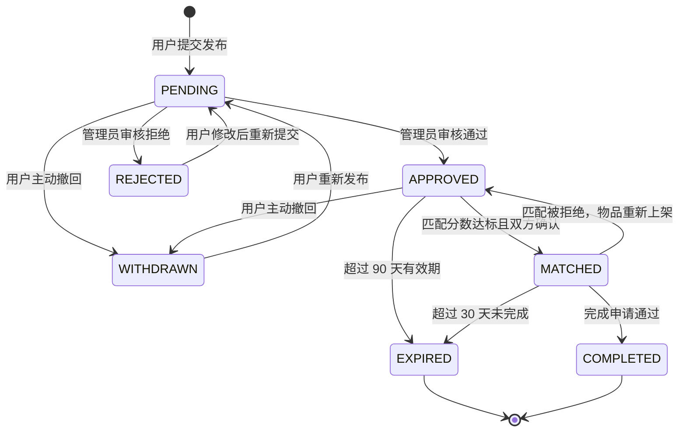

---

## 19. 匹配状态机

```mermaid
stateDiagram-v2
    [*] --> PENDING: 匹配算法生成
    PENDING --> NOTIFIED: 通知发送完成
    NOTIFIED --> CONFIRMED: 用户确认匹配
    NOTIFIED --> REJECTED: 用户拒绝匹配
    NOTIFIED --> EXPIRED: 7 天未处理
    CONFIRMED --> [*]
    REJECTED --> [*]
    EXPIRED --> [*]
```

---

## 20. 实名认证状态机

```mermaid
stateDiagram-v2
    [*] --> UNVERIFIED: 注册默认状态
    UNVERIFIED --> PENDING: 提交认证申请
    PENDING --> APPROVED: 管理员审核通过
    PENDING --> REJECTED: 管理员审核拒绝
    REJECTED --> PENDING: 用户重新提交
    APPROVED --> [*]
```

---

## 21. 完成申请状态机

```mermaid
stateDiagram-v2
    [*] --> PENDING: 发起完成申请
    PENDING --> APPROVED: 对方确认 或 7 天超时
    PENDING --> REJECTED: 对方拒绝
    PENDING --> CANCELLED: 发起方撤回
    REJECTED --> PENDING: 重新发起
    CANCELLED --> [*]
    APPROVED --> [*]
```

---

## 22. 匹配算法评分模型

> v2 实现（2026-05 升级），代码位于 `MatchingEngine.java`。引入文本相似度、平滑时间衰减、串号冲突惩罚。

### 22.1 评分维度与权重

| 维度 | 权重 | 说明 |
|------|------|------|
| TEXT 文本相似度 | 35% | 标题+描述+位置的文本相似度（归一化到 0-1） |
| CATEGORY 类别 | 25% | 相同 +1.0，相似的二级类目 +0.6 |
| LOCATION 位置 | 15% | 同一 location_id +1.0，同区域 +0.5 |
| BRAND 品牌 | 10% | 相同 +1.0，都为空 +0.5 |
| TIME 时间 | 10% | 平滑衰减 exp(-Δt / τ) |
| COLOR 颜色 | 5% | 相同 +1.0，一空 +0.3 |

### 22.2 评分流程

```mermaid
flowchart TD
    Start[calculateScore 入口] --> Serial{串号精确匹配?<br/>trim + uppercase 后相等}
    Serial -->|是| Direct[直接返回 1.00<br/>跳过所有评分]
    Serial -->|否| Dim[计算 6 维子分]

    Dim --> S1[TEXT 文本相似度]
    Dim --> S2[CATEGORY 类别]
    Dim --> S3[LOCATION 位置]
    Dim --> S4[BRAND 品牌]
    Dim --> S5[TIME 时间]
    Dim --> S6[COLOR 颜色]

    S1 --> Weighted[加权求和<br/>保留 2 位小数 HALF_UP]
    S2 --> Weighted
    S3 --> Weighted
    S4 --> Weighted
    S5 --> Weighted
    S6 --> Weighted

    Weighted --> Conflict{串号冲突?<br/>双方都填了但不等的串号}
    Conflict -->|是| Penalize[total × 0.40 惩罚]
    Conflict -->|否| Threshold
    Penalize --> Threshold{分数 >= 0.65?}

    Threshold -->|是| Return[返回分数<br/>生成匹配记录]
    Threshold -->|否| Zero[返回 0<br/>不生成匹配]

    Direct --> End[结束]
    Return --> End
    Zero --> End

    style Direct fill:#fff9c4
    style Penalize fill:#ffcdd2
    style Threshold fill:#fce4ec
    style Return fill:#c8e6c9
    style Zero fill:#eeeeee
```

### 22.3 平滑时间衰减公式

```
score_time = exp(-Δt / τ)
```

- Δt = 双方时间戳差（小时）
- τ = 半衰期常数（默认 168h = 7 天）
- 含义：间隔 7 天的两个物品时间维得分约 0.37，间隔 30 天约 0.11

### 22.4 关键常数

| 常量 | 值 | 含义 |
|------|----|------|
| MATCH_THRESHOLD | 0.65 | 最低匹配分数 |
| SERIAL_CONFLICT_PENALTY | 0.40 | 串号冲突惩罚系数 |
| WEIGHT_TEXT | 0.35 | 文本相似度权重 |
| WEIGHT_CATEGORY | 0.25 | 类别权重 |
| WEIGHT_LOCATION | 0.15 | 位置权重 |
| WEIGHT_BRAND | 0.10 | 品牌权重 |
| WEIGHT_TIME | 0.10 | 时间权重 |
| WEIGHT_COLOR | 0.05 | 颜色权重 |

### 22.5 优化策略

- **候选集约束**：按 `category` + `location` + 时间窗口预过滤，避免全表扫描

- **TopK 精排**：对过滤后的候选按分数排序，仅取 TopK 进入匹配队列

- **串号快通道**：精确匹配直接命中 1.00，跳过评分

- **冲突惩罚**：双方都填了串号但不匹配，强制降权避免误匹配

- **DocumentOwnerMatchService**：基于证件号/学号的主人匹配，单独快通道

  ---

  ## 23. 接口权限矩阵

| 模块 | 接口                                    |  USER   | CAMPUS_ADMIN | SUPER_ADMIN | 匿名 |
| ---- | --------------------------------------- | :-----: | :----------: | :---------: | :--: |
| 认证 | POST /api/auth/register                 |    -    |      -       |      -      |  OK  |
| 认证 | POST /api/auth/login                    |    -    |      -       |      -      |  OK  |
| 认证 | POST /api/auth/logout                   |   OK    |      OK      |     OK      |  -   |
| 用户 | GET /api/users/me                       |   OK    |      OK      |     OK      |  -   |
| 用户 | PUT /api/users/me                       |   OK    |      OK      |     OK      |  -   |
| 用户 | GET /api/admin/users                    |    -    |      OK      |     OK      |  -   |
| 用户 | DELETE /api/admin/users/{id}            |    -    |      -       |     OK      |  -   |
| 物品 | POST /api/items                         |   OK    |      OK      |     OK      |  -   |
| 物品 | GET /api/items                          |   OK    |      OK      |     OK      |  -   |
| 物品 | GET /api/items/{id}                     |   OK    |      OK      |     OK      |  OK  |
| 物品 | PUT /api/items/{id}                     | OK 本人 |      OK      |     OK      |  -   |
| 物品 | DELETE /api/items/{id}                  | OK 本人 |      OK      |     OK      |  -   |
| 物品 | POST /api/admin/items/{id}/approve      |    -    |      OK      |     OK      |  -   |
| 物品 | POST /api/admin/items/{id}/reject       |    -    |      OK      |     OK      |  -   |
| 匹配 | GET /api/matches                        |   OK    |      OK      |     OK      |  -   |
| 匹配 | POST /api/matches/{id}/confirm          |   OK    |      OK      |     OK      |  -   |
| 匹配 | POST /api/matches/{id}/reject           |   OK    |      OK      |     OK      |  -   |
| 匹配 | POST /api/admin/matches/trigger         |    -    |      OK      |     OK      |  -   |
| 完成 | POST /api/completion-requests           |   OK    |      OK      |     OK      |  -   |
| 完成 | POST /api/admin/completion/{id}/approve |    -    |      OK      |     OK      |  -   |
| 认证 | POST /api/identity-verifications        |   OK    |      OK      |     OK      |  -   |
| 认证 | POST /api/admin/identity/{id}/review    |    -    |      OK      |     OK      |  -   |
| 通知 | GET /api/notifications                  |   OK    |      OK      |     OK      |  -   |
| 上传 | POST /api/upload/image                  |   OK    |      OK      |     OK      |  -   |
| 邮箱 | POST /api/auth/email/send               |    -    |      -       |      -      |  OK  |
| 邮箱 | POST /api/auth/email/verify             |    -    |      -       |      -      |  OK  |
| 匹配 | POST /api/admin/matches/{id}/recompute  |    -    |      OK      |     OK      |  -   |
| 完成 | POST /api/admin/completion/{id}/reject  |    -    |      OK      |     OK      |  -   |
| 认证 | GET /api/admin/identity/pending         |    -    |      OK      |     OK      |  -   |
| 系统 | GET /api/admin/dashboard                |    -    |      OK      |     OK      |  -   |
| 系统 | GET /api/public/stats                   |   OK    |      OK      |     OK      |  OK  |
| 统计 | GET /api/admin/stats/overview           |    -    |      OK      |     OK      |  -   |
| 位置 | GET /api/locations                      |   OK    |      OK      |     OK      |  OK  |
| 位置 | POST /api/admin/locations               |    -    |      OK      |     OK      |  -   |

## 24. 数据缓存与一致性

```mermaid
flowchart LR
    subgraph CacheStrategy["缓存策略"]
        C1[用户 Token<br/>Redis TTL = access 30min refresh 7d]
        C2[物品列表查询<br/>Redis Hash TTL = 5min]
        C3[匹配结果<br/>Redis ZSet 按分数排序]
        C4[统计数据<br/>Redis 定时刷新 10min]
        C5[位置字典<br/>Redis Hash TTL = 1h]
    end

    subgraph Consistency["一致性保障"]
        CS1[Cache Aside 模式]
        CS2[写入时先更新 DB<br/>再失效缓存]
        CS3[TTL 自动兜底]
        CS4[分布式锁<br/>防止击穿]
    end

    C1 --> CS1
    C2 --> CS1
    C3 --> CS1
    C4 --> CS1

    CS1 --> CS2
    CS1 --> CS3
    CS1 --> CS4

    style CS1 fill:#c8e6c9
    style CS2 fill:#fff3e0
    style CS4 fill:#ffcdd2
```

缓存更新流程：

```mermaid
sequenceDiagram
    autonumber
    participant Client as 客户端
    participant Service as 业务服务
    participant Cache as Redis
    participant DB as MySQL

    Note over Service,DB: 读流程 Cache Aside
    Client->>Service: 读请求
    Service->>Cache: GET key
    alt 缓存命中
        Cache-->>Service: 返回数据
        Service-->>Client: 响应
    else 缓存未命中
        Service->>DB: SELECT
        DB-->>Service: 数据
        Service->>Cache: SET key value EX 300
        Service-->>Client: 响应
    end

    Note over Service,DB: 写流程
    Client->>Service: 写请求
    Service->>DB: UPDATE INSERT
    DB-->>Service: OK
    Service->>Cache: DEL key
    Service-->>Client: 响应成功
```

---

## 25. 异常处理与降级路径

```mermaid
flowchart TD
    A[请求进入] --> B{统一异常处理}
    B -->|BusinessException| C[业务异常]
    B -->|AuthException| D[认证异常]
    B -->|ValidationException| E[参数校验异常]
    B -->|SQLException| F[数据库异常]
    B -->|UnknownException| G[未知异常]

    C --> H[返回 400 + 业务码]
    D --> I{Token 问题?}
    I -->|过期| J[401 + TOKEN_EXPIRED]
    I -->|无效| K[401 + TOKEN_INVALID]
    I -->|无权限| L[403 + FORBIDDEN]
    E --> M[返回 400 + 字段错误]
    F --> N[记录日志 + 告警]
    G --> N

    H --> O[前端提示]
    J --> O
    K --> O
    L --> O
    M --> O
    N --> P[返回 500 + 通用错误]
    P --> O

    O --> Q{关键路径降级?}
    Q -->|邮件发送失败| R[本地重试队列]
    Q -->|匹配算法超时| S[返回空匹配 + 标记重试]
    Q -->|图片上传失败| T[返回错误 + 建议重试]
    Q -->|Redis 不可用| U[降级直查 MySQL]

    style H fill:#fff3e0
    style J fill:#ffcdd2
    style K fill:#ffcdd2
    style L fill:#ffcdd2
    style P fill:#ffcdd2
    style U fill:#c8e6c9
```

关键降级策略表：

| 故障点 | 检测方式 | 降级行为 | 用户感知 |
|--------|----------|----------|----------|
| Redis 不可用 | 连接超时或异常 | 直查 MySQL | 无感知 性能略降 |
| 邮件服务失败 | SMTP 异常 | 进入重试队列 3 次 | 通知稍后到达 |
| 匹配算法超时 | 超过 5 秒 | 返回空匹配 + 异步重试 | 暂无匹配推荐 |
| 图片上传失败 | IO 异常 | 返回错误码 + 建议 | 提示重试 |
| MySQL 主从延迟 | 读从库时间戳 | 切换到主库读取 | 无感知 |
| Sa-Token 异常 | 401 触发 | 前端自动 refresh token | 静默刷新 |

---

## 26. 邮箱验证流程

> 用于注册时的身份验证、密码重置和敏感操作确认。验证码有效期 10 分钟，每分钟最多发送 1 次。

```mermaid
flowchart TD
    A[用户触发发送 注册/重置密码]
    B[POST /api/auth/email/send]
    C{频率限制<br/>1分钟1次}
    D[生成6位数字验证码]
    E[写入Redis TTL=600s]
    F[JavaMailSender<br/>163 SMTP发送]
    H[返回200]
    I[记录日志<br/>进入重试队列]
    J[用户输入验证码]
    K[POST /api/auth/email/verify]
    L[Redis查询验证码]
    M{存在且匹配?}
    N[400 验证码错误]
    O[标记邮箱已验证]
    P[返回200+token]
    Q[前端跳转下一步]
    R1[返回429<br/>请稍后再试]

    A --> B
    B --> C
    C -->|超限| R1
    C -->|通过| D
    D --> E
    E --> F
    F -->|成功| H
    F -->|失败| I
    H --> J
    I --> J
    J --> K
    K --> L
    L --> M
    M -->|否| N
    M -->|是| O
    O --> P
    P --> Q

    style R1 fill:#ffcdd2
    style I fill:#fff3e0
    style N fill:#ffcdd2
    style P fill:#c8e6c9
```

关键代码：`EmailVerificationController` + `EmailVerificationService`，`MailConfig` 配置 163 SMTP（465 SSL）。

---

## 27. 测试架构

> 经过 17 轮迭代，测试覆盖已覆盖关键链路：单元测试 + 集成测试 + 前端组件测试 + 端到端并发测试。

### 27.1 后端测试分层

```mermaid
graph TB
    subgraph UnitTest["单元测试 src/test/java"]
        U1[ServiceImplTest<br/>业务逻辑]
        U2[ControllerTest<br/>Web 层参数校验]
        U3[MatchingEngineTest<br/>评分算法]
        U4[WebSecurityConfigTest<br/>权限拦截]
    end

    subgraph IntegrationTest["集成测试"]
        I1[ReviewConcurrencyIntegrationTest<br/>真实 H2 + 双线程并发]
        I2[DbFixControllerConditionalTest<br/>条件装配]
    end

    subgraph TestUtils["测试工具"]
        T1[H2 内存数据库<br/>最小建表脚本]
        T2[DataInitializer 重用]
        T3[测试事务回滚]
    end

    UnitTest --> TestUtils
    IntegrationTest --> TestUtils
    IntegrationTest --> H2[(H2 内存库)]

    classDef unit fill:#e3f2fd,stroke:#0d47a1
    classDef integ fill:#fff3e0,stroke:#e65100
    classDef util fill:#e8f5e9,stroke:#1b5e20

    class U1,U2,U3,U4 unit
    class I1,I2 integ
    class T1,T2,T3 util
```

### 27.2 前端测试

- **测试框架**：Vitest（第十七轮引入）
- **测试脚本**：`npm test`
- **覆盖范围**：
  - 路由守卫（未登录跳转登录页、已登录跳转首页）
  - 401 自动 refresh token
  - 表单校验
- **可测试性改造**：`router/index.js` 导出 guard 工厂，`utils/axios.js` 导出 client 工厂

### 27.3 关键测试用例

| 测试类 | 覆盖场景 |
|--------|----------|
| `WebSecurityConfigTest` | 匿名/USER/ADMIN 三角色访问控制 |
| `MatchingEngineTest` | 6 维评分、串号精确匹配、串号冲突惩罚 |
| `VerificationServiceImplTest` | 重复审核拦截、通知失败兜底 |
| `ItemCompletionRequestServiceImplTest` | 完成申请通过/拒绝、并发二次审核拦截 |
| `LocalImageUploadServiceImplTest` | 空文件、超大文件、非法类型、本地存储成功 |
| `DbFixControllerConditionalTest` | `app.db-fix-enabled` 关闭不注册、开启才注册 |
| `ReviewConcurrencyIntegrationTest` | H2 真实事务 + 双线程数据库级并发拦截 |
| `ItemCompletionRequestServiceImplTest` | 关联物品状态漂移保护 |

### 27.4 持续集成命令

```bash
# 后端
cd backend
mvn test                                       # 全量单元 + 集成测试
mvn -Dtest=WebSecurityConfigTest test          # 单类
mvn -DskipTests package                        # 跳过测试打包

# 前端
cd frontend
npm test                                       # Vitest 单元测试
npm run build                                  # 生产构建
```

---

## 28. 并发审核与状态漂移保护

> 第十五、十六轮加强：审核改为按 `id + PENDING` 条件原子更新，缩小"先查后改"窗口。

```mermaid
sequenceDiagram
    autonumber
    participant A as 管理员 A
    participant B as 管理员 B
    participant API as 后端 API
    participant DB as MySQL

    par 并发请求
        A->>API: POST /approve
        B->>API: POST /approve
    end

    API->>DB: UPDATE matches<br/>SET status=APPROVED<br/>WHERE id=? AND status='PENDING'
    DB-->>API: A 更新 1 行
    DB-->>API: B 更新 0 行
    API-->>A: 200 成功
    API-->>B: 409 已被审核
    B->>B: 提示"该申请已被处理"

    Note over API,DB: 关联物品状态漂移保护
    API->>DB: UPDATE items<br/>SET status=COMPLETED<br/>WHERE id=? AND status='MATCHED'
    alt 物品状态已变
        DB-->>API: 0 行受影响
        API->>API: 事务回滚
        API-->>A: 409 关联物品状态已变更
    else 正常完成
        DB-->>API: 1 行受影响
        API-->>A: 200 成功
    end
```

关键代码：`VerificationServiceImpl.confirmVerification`、`ItemCompletionRequestServiceImpl.approve`，使用 `LambdaUpdateWrapper` + `eq("id", id).eq("status", "PENDING")` 实现条件原子更新。

---

> 文档版本 v2.0  最后更新 2026-06-08  合并 17 轮迭代变更
