# 校园失物招领平台 — 项目图表

> 本文档汇总项目的全部架构与流程图表，覆盖系统层级、模块结构、关键业务流程、时序交互、数据库关系、状态机、信息流、部署拓扑等。所有图表均使用 Mermaid 语法，可在 GitHub、IDEA、VSCode 等支持 Mermaid 的环境直接渲染。

---

## 目录

1. [系统总览架构图](#1-系统总览架构图)
2. [技术分层架构图](#2-技术分层架构图)
3. [后端模块结构图](#3-后端模块结构图)
4. [前端模块结构图](#4-前端模块结构图)
5. [部署拓扑图](#5-部署拓扑图)
6. [用户认证时序图](#6-用户认证时序图)
7. [物品发布与审核流程图](#7-物品发布与审核流程图)
8. [智能匹配流程图](#9-智能匹配流程图)
9. [匹配时序图](#10-匹配时序图)
10. [匹配确认与拒绝流程](#11-匹配确认与拒绝流程)
11. [完成申请流程图](#12-完成申请流程图)
12. [实名认证流程图](#13-实名认证流程图)
13. [图片上传流程图](#14-图片上传流程图)
14. [通知与邮件发送流程图](#15-通知与邮件发送流程图)
15. [管理员控制台信息流](#16-管理员控制台信息流)
16. [ER 关系图](#17-er-关系图)
17. [物品状态机](#18-物品状态机)
18. [匹配状态机](#19-匹配状态机)
19. [实名认证状态机](#20-实名认证状态机)
20. [完成申请状态机](#21-完成申请状态机)
21. [匹配算法评分模型](#22-匹配算法评分模型)
22. [接口权限矩阵](#23-接口权限矩阵)
23. [数据缓存与一致性](#24-数据缓存与一致性)
24. [异常处理与降级路径](#25-异常处理与降级路径)

---

## 1. 系统总览架构图

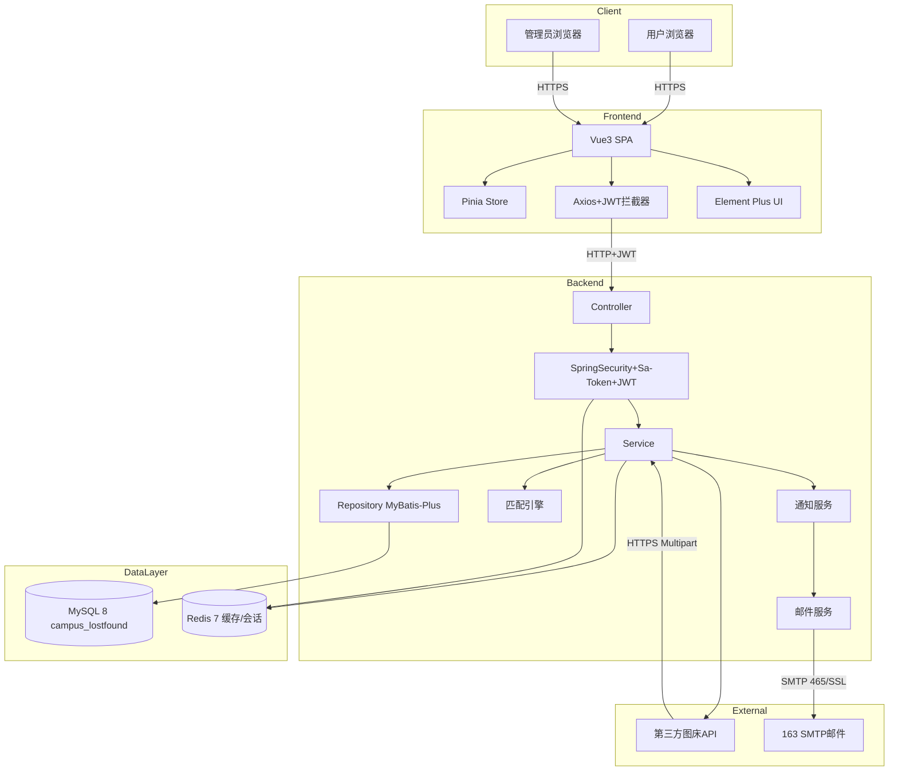
```mermaid
graph TB
    Client[客户端层 Browser]
    Frontend[前端层 Vue3+Vite:3000]
    Backend[后端层 SpringBoot3.2:18090]
    External[外部依赖]
    DataLayer[数据层]

    %% 客户端
    U[用户浏览器]
    ADM[管理员浏览器]

    %% 前端组件
    V[Vue3 SPA]
    PIN[Pinia Store]
    AX[Axios+JWT拦截器]
    EL[Element Plus UI]

    %% 后端组件
    CTRL[Controller]
    SVC[Service]
    REPO[Repository MyBatis-Plus]
    SEC[SpringSecurity+Sa-Token+JWT]
    MATCH[匹配引擎]
    NOTI[通知服务]
    MAIL[邮件服务]

    %% 外部服务
    IMG[第三方图床API]
    SMTP[163 SMTP邮件]

    %% 数据存储
    DB[(MySQL 8 campus_lostfound)]
    CACHE[(Redis 7 缓存/会话)]

    %% 分组
    subgraph Client
        U
        ADM
    end
    subgraph Frontend
        V
        PIN
        AX
        EL
    end
    subgraph Backend
        CTRL
        SVC
        REPO
        SEC
        MATCH
        NOTI
        MAIL
    end
    subgraph External
        IMG
        SMTP
    end
    subgraph DataLayer
        DB
        CACHE
    end

    %% 连线
    U -->|HTTPS| V
    ADM -->|HTTPS| V
    V --> PIN
    V --> AX
    V --> EL
    AX -->|HTTP+JWT| CTRL
    CTRL --> SEC
    SEC --> SVC
    SVC --> REPO
    SVC --> MATCH
    SVC --> NOTI
    NOTI --> MAIL
    MAIL -->|SMTP 465/SSL| SMTP
    SVC --> IMG
    IMG -->|HTTPS Multipart| SVC
    REPO --> DB
    SVC --> CACHE
    SEC --> CACHE
```

---

## 2. 技术分层架构图

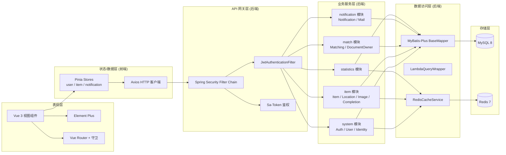
```mermaid
graph LR
    subgraph L1["表现层"]
        A1[Vue 3 视图组件]
        A2[Element Plus]
        A3[Vue Router + 守卫]
    end

    subgraph L2["状态/数据层 (前端)"]
        B1[Pinia Stores<br/>user / item / notification]
        B2[Axios HTTP 客户端]
    end

    subgraph L3["API 网关层 (后端)"]
        C1[Spring Security Filter Chain]
        C2[JwtAuthenticationFilter]
        C3[Sa-Token 鉴权]
    end

    subgraph L4["业务服务层 (后端)"]
        D1[system 模块<br/>Auth / User / Identity]
        D2[item 模块<br/>Item / Location / Image / Completion]
        D3[match 模块<br/>Matching / DocumentOwner]
        D4[notification 模块<br/>Notification / Mail]
        D5[statistics 模块]
    end

    subgraph L5["数据访问层 (后端)"]
        E1[MyBatis-Plus BaseMapper]
        E2[LambdaQueryWrapper]
        E3[RedisCacheService]
    end

    subgraph L6["存储层"]
        F1[(MySQL 8)]
        F2[(Redis 7)]
    end

    A1 --> A3
    A1 --> A2
    A1 --> B1
    B1 --> B2
    B2 --> C1
    C1 --> C2
    C1 --> C3
    C2 --> D1
    C2 --> D2
    C2 --> D3
    C2 --> D4
    C2 --> D5
    D1 --> E1
    D2 --> E1
    D3 --> E1
    D4 --> E1
    D5 --> E1
    D1 --> E3
    D2 --> E3
    D5 --> E3
    E1 --> F1
    E3 --> F2
```

---

## 3. 后端模块结构图

```mermaid
graph TB
    Boot[CampusLostFoundApplication<br/>@SpringBootApplication + @MapperScan]

    subgraph common["common 公共层"]
        C1[constant<br/>ItemConstants / UserConstants]
        C2[dto/request<br/>登录注册物品 DTO]
        C3[exception<br/>BusinessException + GlobalExceptionHandler]
        C4[result<br/>ApiResponse / PageResponse]
        C5[util<br/>JwtUtils / DataMaskUtils]
    end

    subgraph config["config 配置层"]
        CF1[CorsConfig 跨域]
        CF2[RedisConfig Redis]
        CF3[JacksonConfig 序列化]
        CF4[HttpClientConfig RestTemplate]
        CF5[MailConfig 邮件]
        CF6[SwaggerConfig API 文档]
        CF7[DataInitializer 演示数据]
    end

    subgraph security["security 安全层"]
        S1[WebSecurityConfig<br/>Filter Chain]
        S2[JwtAuthenticationFilter]
        S3[SaTokenConfig]
        S4[StpInterfaceImpl 角色权限]
    end

    subgraph modules["modules 业务模块"]
        M1[system<br/>Auth/User/Identity]
        M2[item<br/>Item/Image/Location/Completion]
        M3[match<br/>Matching/DocumentOwner]
        M4[notification<br/>Notification/Mail]
        M5[statistics<br/>Statistics]
        M6[common<br/>RedisCacheService]
    end

    Boot --> common
    Boot --> config
    Boot --> security
    Boot --> modules
    M1 --> M2
    M2 --> M3
    M2 --> M4
    M3 --> M4
    M5 --> M2
    M5 --> M3
    M5 --> M1
    M5 --> M6
```

---

## 4. 前端模块结构图

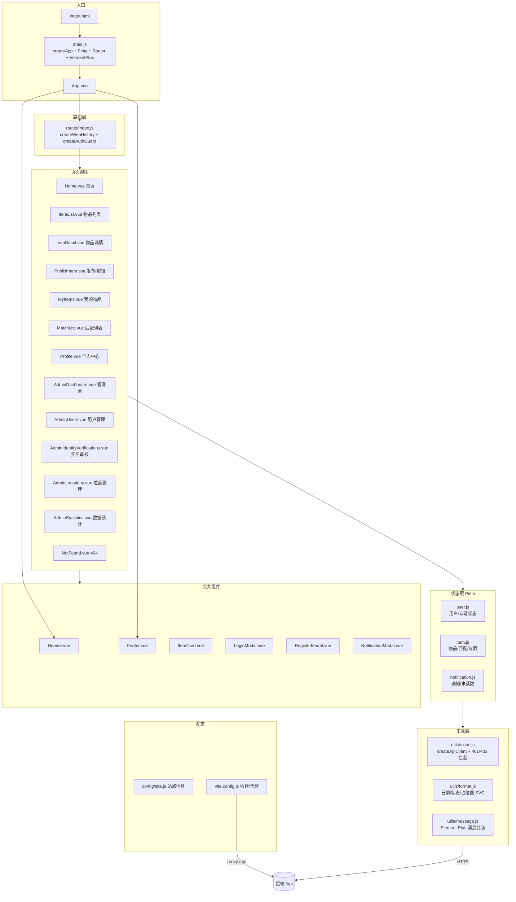
```mermaid
graph TB
    subgraph Entry["入口"]
        E1[index.html]
        E2[main.js<br/>createApp + Pinia + Router + ElementPlus]
        E3[App.vue]
    end

    subgraph Router["路由层"]
        R1[router/index.js<br/>createWebHistory + createAuthGuard]
    end

    subgraph Stores["状态层 Pinia"]
        ST1[user.js<br/>用户/认证状态]
        ST2[item.js<br/>物品/匹配/位置]
        ST3[notification.js<br/>通知/未读数]
    end

    subgraph Utils["工具层"]
        U1[utils/axios.js<br/>createApiClient + 401/403 拦截]
        U2[utils/format.js<br/>日期/状态/占位图 SVG]
        U3[utils/message.js<br/>Element Plus 消息封装]
    end

    subgraph Components["公共组件"]
        C1[Header.vue]
        C2[Footer.vue]
        C3[ItemCard.vue]
        C4[LoginModal.vue]
        C5[RegisterModal.vue]
        C6[NotificationModal.vue]
    end

    subgraph Views["页面视图"]
        V1[Home.vue 首页]
        V2[ItemList.vue 物品列表]
        V3[ItemDetail.vue 物品详情]
        V4[PublishItem.vue 发布/编辑]
        V5[MyItems.vue 我的物品]
        V6[MatchList.vue 匹配列表]
        V7[Profile.vue 个人中心]
        V8[AdminDashboard.vue 管理台]
        V9[AdminUsers.vue 用户管理]
        V10[AdminIdentityVerifications.vue 实名审核]
        V11[AdminLocations.vue 位置管理]
        V12[AdminStatistics.vue 数据统计]
        V13[NotFound.vue 404]
    end

    subgraph Config["配置"]
        CG1[config/site.js 站点信息]
        CG2[vite.config.js 构建/代理]
    end

    E1 --> E2 --> E3
    E3 --> R1
    E3 --> C1
    E3 --> C2
    R1 --> Views
    Views --> Components
    Views --> Stores
    Stores --> Utils
    Utils -->|HTTP| Backend[(后端 /api)]
    CG2 -->|proxy /api| Backend
```

---

## 5. 部署拓扑图

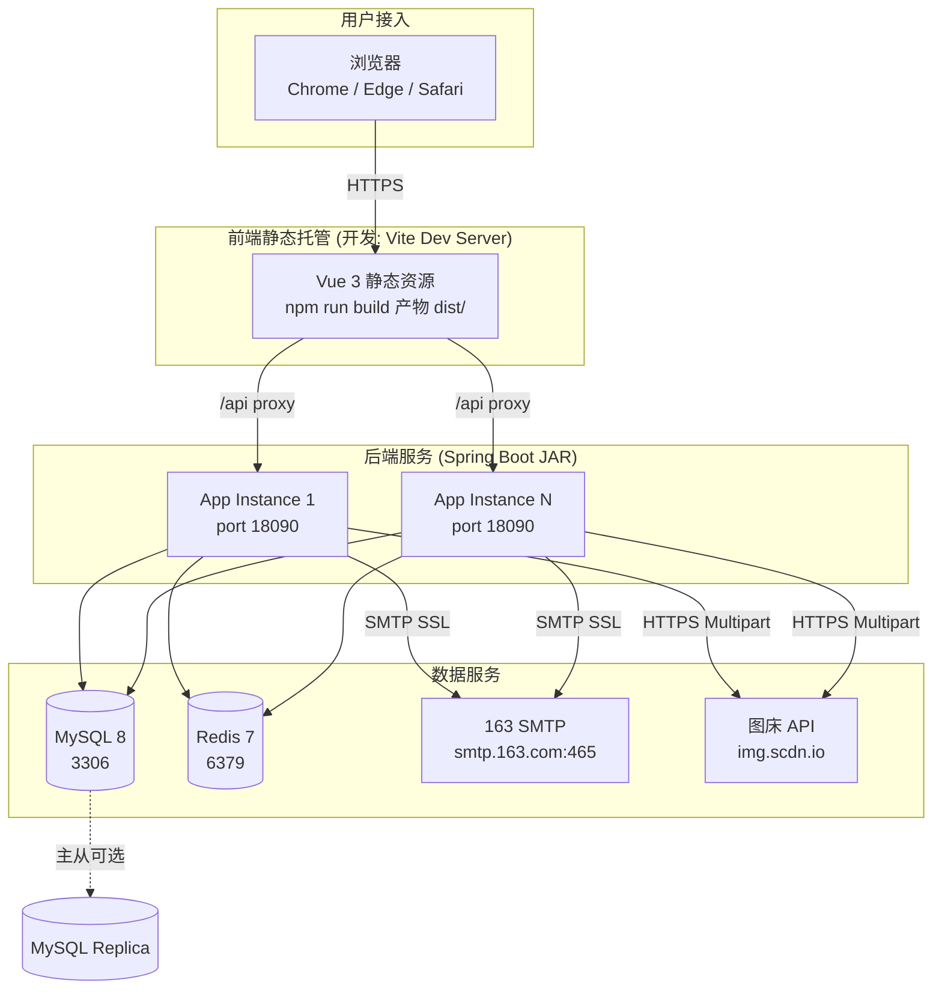
```mermaid
graph TB
    subgraph User["用户接入"]
        BROWSER[浏览器<br/>Chrome / Edge / Safari]
    end

    subgraph FrontendHost["前端静态托管 (开发: Vite Dev Server)"]
        FE[Vue 3 静态资源<br/>npm run build 产物 dist/]
    end

    subgraph BackendHost["后端服务 (Spring Boot JAR)"]
        APP1[App Instance 1<br/>port 18090]
        APP2[App Instance N<br/>port 18090]
    end

    subgraph DataServices["数据服务"]
        MYSQL[(MySQL 8<br/>3306)]
        REDIS[(Redis 7<br/>6379)]
        MAILSMTP[163 SMTP<br/>smtp.163.com:465]
        IMGAPI[图床 API<br/>img.scdn.io]
    end

    BROWSER -->|HTTPS| FE
    FE -->|/api proxy| APP1
    FE -->|/api proxy| APP2
    APP1 --> MYSQL
    APP2 --> MYSQL
    APP1 --> REDIS
    APP2 --> REDIS
    APP1 -->|SMTP SSL| MAILSMTP
    APP1 -->|HTTPS Multipart| IMGAPI
    APP2 -->|SMTP SSL| MAILSMTP
    APP2 -->|HTTPS Multipart| IMGAPI

    MYSQL -.->|主从可选| MYSQL_REPLICA[(MySQL Replica)]
```

---

## 6. 用户认证时序图

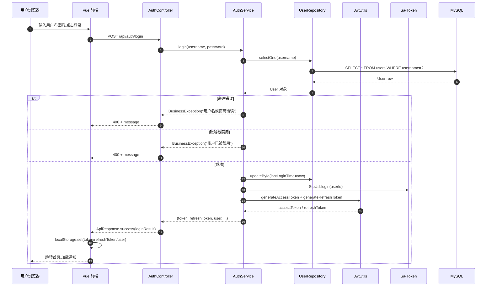
```mermaid
sequenceDiagram
    autonumber
    participant U as 用户浏览器
    participant FE as Vue 前端
    participant AC as AuthController
    participant AS as AuthService
    participant US as UserRepository
    participant JU as JwtUtils
    participant ST as Sa-Token
    participant DB as MySQL

    U->>FE: 输入用户名密码,点击登录
    FE->>AC: POST /api/auth/login
    AC->>AS: login(username, password)
    AS->>US: selectOne(username)
    US->>DB: SELECT * FROM users WHERE username=?
    DB-->>US: User row
    US-->>AS: User 对象
    alt 密码错误
        AS-->>AC: BusinessException("用户名或密码错误")
        AC-->>FE: 400 + message
    else 账号被禁用
        AS-->>AC: BusinessException("账户已被禁用")
        AC-->>FE: 400 + message
    else 成功
        AS->>US: updateById(lastLoginTime=now)
        AS->>ST: StpUtil.login(userId)
        AS->>JU: generateAccessToken + generateRefreshToken
        JU-->>AS: accessToken / refreshToken
        AS-->>AC: {token, refreshToken, user, ...}
        AC-->>FE: ApiResponse.success(loginResult)
        FE->>FE: localStorage.set(token/refreshToken/user)
        FE-->>U: 跳转首页,加载通知
    end
```

---

## 7. 物品发布与审核流程图

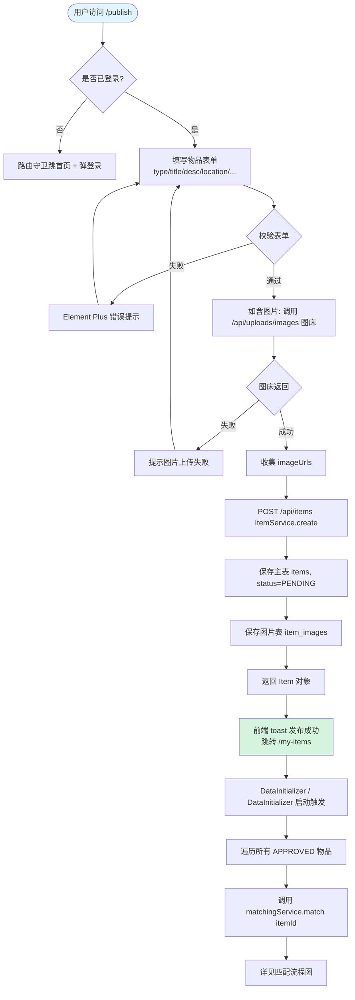
```mermaid
flowchart TD
    A([用户访问 /publish]) --> B{是否已登录?}
    B -->|否| C[路由守卫跳首页 + 弹登录]
    B -->|是| D[填写物品表单<br/>type/title/desc/location/...]
    D --> E{校验表单}
    E -->|失败| F[Element Plus 错误提示] --> D
    E -->|通过| G[如含图片: 调用 /api/uploads/images 图床]
    G --> G1{图床返回}
    G1 -->|失败| G2[提示图片上传失败] --> D
    G1 -->|成功| H[收集 imageUrls]
    H --> I[POST /api/items ItemService.create]
    I --> J[保存主表 items, status=PENDING]
    J --> K[保存图片表 item_images]
    K --> L[返回 Item 对象]
    L --> M[前端 toast 发布成功<br/>跳转 /my-items]

    M --> N[DataInitializer / DataInitializer 启动触发]
    N --> O[遍历所有 APPROVED 物品]
    O --> P[调用 matchingService.match itemId]
    P --> Q[详见匹配流程图]

    style A fill:#e1f5ff
    style M fill:#d4f4dd
```

---

## 8. 物品状态机

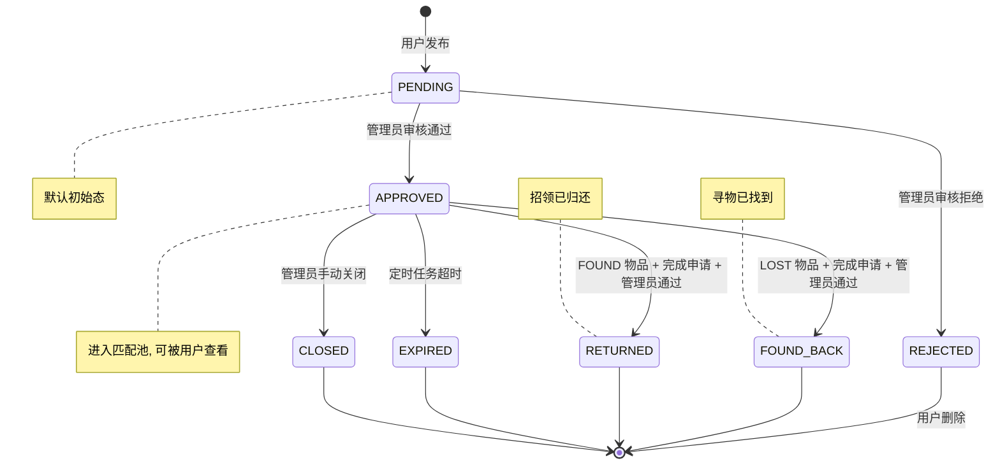
```mermaid
stateDiagram-v2
    [*] --> PENDING : 用户发布
    PENDING --> APPROVED : 管理员审核通过
    PENDING --> REJECTED : 管理员审核拒绝
    APPROVED --> FOUND_BACK : LOST 物品 + 完成申请 + 管理员通过
    APPROVED --> RETURNED : FOUND 物品 + 完成申请 + 管理员通过
    APPROVED --> EXPIRED : 定时任务超时
    APPROVED --> CLOSED : 管理员手动关闭
    REJECTED --> [*] : 用户删除
    FOUND_BACK --> [*]
    RETURNED --> [*]
    EXPIRED --> [*]
    CLOSED --> [*]

    note right of PENDING : 默认初始态
    note right of APPROVED : 进入匹配池, 可被用户查看
    note left of FOUND_BACK : 寻物已找到
    note left of RETURNED : 招领已归还
```

---

## 9. 智能匹配流程图

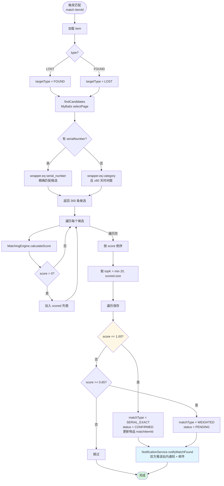
```mermaid
flowchart TD
    Start([触发匹配<br/>match itemId]) --> Load[加载 item]
    Load --> Type{type?}

    Type -->|LOST| T_LOST[targetType = FOUND]
    Type -->|FOUND| T_FOUND[targetType = LOST]

    T_LOST --> Find[findCandidates<br/>MyBatis selectPage]
    T_FOUND --> Find

    Find --> Cond{有 serialNumber?}
    Cond -->|是| Serial[wrapper.eq serial_number<br/>精确匹配候选]
    Cond -->|否| Cat[wrapper.eq category<br/>且 ±60 天时间窗]

    Serial --> Candidates[返回 300 条候选]
    Cat --> Candidates

    Candidates --> Loop[遍历每个候选]
    Loop --> Score[MatchingEngine.calculateScore]
    Score --> Conf{score > 0?}

    Conf -->|否| Loop
    Conf -->|是| Add[加入 scored 列表]

    Add --> Loop
    Loop -->|遍历完| Sort[按 score 倒序]
    Sort --> TopK[取 topK = min 20, scored.size]

    TopK --> Save[遍历保存]
    Save --> SerialEx{score == 1.00?}
    SerialEx -->|是| TypeSE[matchType = SERIAL_EXACT<br/>status = CONFIRMED<br/>更新物品 matchItemId]
    SerialEx -->|否| IsMatch{score >= 0.65?}
    IsMatch -->|是| TypeWM[matchType = WEIGHTED<br/>status = PENDING]
    IsMatch -->|否| Skip[跳过]

    TypeSE --> Notif
    TypeWM --> Notif
    Skip --> Done([完成])

    Notif[NotificationService.notifyMatchFound<br/>双方推送站内通知 + 邮件]
    Notif --> Done

    style SerialEx fill:#fff7e6
    style Notif fill:#e1f5ff
    style Done fill:#d4f4dd
```

---

## 10. 匹配时序图

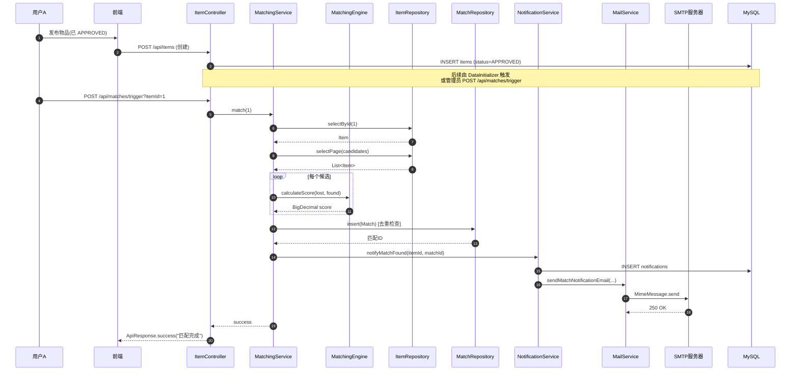
```mermaid
sequenceDiagram
    autonumber
    participant U as 用户A
    participant FE as 前端
    participant IC as ItemController
    participant MS as MatchingService
    participant ME as MatchingEngine
    participant IR as ItemRepository
    participant MR as MatchRepository
    participant NS as NotificationService
    participant MAIL as MailService
    participant SMTP as SMTP服务器
    participant DB as MySQL

    U->>FE: 发布物品(已 APPROVED)
    FE->>IC: POST /api/items (创建)
    IC->>DB: INSERT items (status=APPROVED)
    Note over IC,DB: 后续由 DataInitializer 触发<br/>或管理员 POST /api/matches/trigger
    U->>IC: POST /api/matches/trigger?itemId=1
    IC->>MS: match(1)
    MS->>IR: selectById(1)
    IR-->>MS: Item
    MS->>IR: selectPage(candidates)
    IR-->>MS: List<Item>
    loop 每个候选
        MS->>ME: calculateScore(lost, found)
        ME-->>MS: BigDecimal score
    end
    MS->>MR: insert(Match) [去重检查]
    MR-->>MS: 匹配ID
    MS->>NS: notifyMatchFound(itemId, matchId)
    NS->>DB: INSERT notifications
    NS->>MAIL: sendMatchNotificationEmail(...)
    MAIL->>SMTP: MimeMessage.send
    SMTP-->>MAIL: 250 OK
    MS-->>IC: success
    IC-->>FE: ApiResponse.success("匹配完成")
```

---

## 11. 匹配确认与拒绝流程

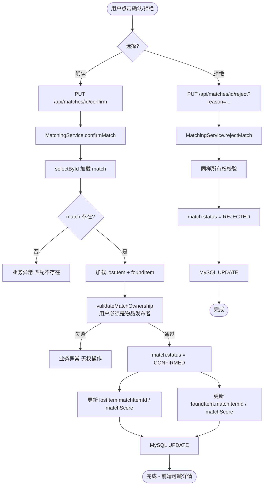
```mermaid
flowchart TD
    A([用户点击确认/拒绝]) --> B{选择?}
    B -->|确认| C[PUT /api/matches/id/confirm]
    B -->|拒绝| D[PUT /api/matches/id/reject?reason=...]

    C --> E[MatchingService.confirmMatch]
    E --> F[selectById 加载 match]
    F --> G{match 存在?}
    G -->|否| H[业务异常 匹配不存在]
    G -->|是| I[加载 lostItem + foundItem]
    I --> J[validateMatchOwnership<br/>用户必须是物品发布者]
    J -->|失败| K[业务异常 无权操作]
    J -->|通过| L[match.status = CONFIRMED]
    L --> M[更新 lostItem.matchItemId / matchScore]
    L --> N[更新 foundItem.matchItemId / matchScore]
    M --> O[MySQL UPDATE]
    N --> O
    O --> P([完成 - 前端可跳详情])

    D --> Q[MatchingService.rejectMatch]
    Q --> R[同样所有权校验]
    R --> S[match.status = REJECTED]
    S --> T[MySQL UPDATE]
    T --> P2([完成])
```

---

## 12. 完成申请流程图

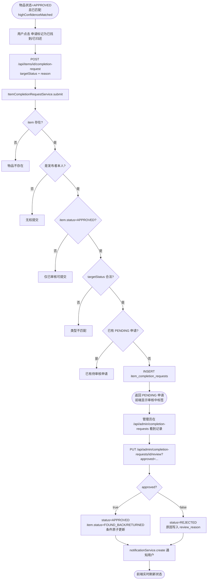
```mermaid
flowchart TD
    A([物品状态=APPROVED<br/>且已匹配 highConfidenceMatched]) --> B[用户点击 申请标记为已找到/已归还]
    B --> C[POST /api/items/id/completion-request<br/>targetStatus + reason]
    C --> D[ItemCompletionRequestService.submit]
    D --> E{item 存在?}
    E -->|否| E1[物品不存在]
    E -->|是| F{是发布者本人?}
    F -->|否| F1[无权提交]
    F -->|是| G{item.status=APPROVED?}
    G -->|否| G1[仅已审核可提交]
    G -->|是| H{targetStatus 合法?}
    H -->|否| H1[类型不匹配]
    H -->|是| I{已有 PENDING 申请?}
    I -->|是| I1[已有待审核申请]
    I -->|否| J[INSERT item_completion_requests]
    J --> K([返回 PENDING 申请<br/>前端显示审核中标签])

    K --> L[管理员在 /api/admin/completion-requests 看到记录]
    L --> M[PUT /api/admin/completion-requests/id/review?approved=...]
    M --> N{approved?}
    N -->|true| O[status=APPROVED<br/>item.status=FOUND_BACK/RETURNED<br/>条件原子更新]
    N -->|false| P[status=REJECTED<br/>原因写入 review_reason]
    O --> Q[notificationService.create 通知用户]
    P --> Q
    Q --> R([前端实时刷新状态])
```

---

## 13. 实名认证流程图

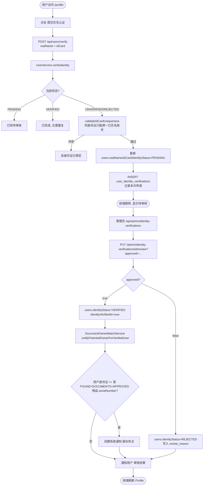
```mermaid
flowchart TD
    A([用户访问 /profile]) --> B[点击 提交实名认证]
    B --> C[POST /api/users/verify<br/>realName + idCard]
    C --> D[UserService.verifyIdentity]
    D --> E{当前状态?}
    E -->|PENDING| E1[已有待审核]
    E -->|VERIFIED| E2[已完成, 无需重复]
    E -->|UNVERIFIED/REJECTED| F[validateIdCardUniqueness<br/>同身份证只能绑一已实名账号]
    F -->|冲突| F1[该身份证已绑定]
    F -->|通过| G[更新 users.realName/idCard/identityStatus=PENDING]
    G --> H[INSERT user_identity_verifications<br/>记录本次申请]
    H --> I([前端跳转, 显示待审核])

    I --> J[管理员 /api/admin/identity-verifications]
    J --> K[PUT /admin/identity-verifications/id/review?approved=...]
    K --> L{approved?}
    L -->|true| M[users.identityStatus=VERIFIED<br/>identityVerifiedAt=now]
    L -->|false| N[users.identityStatus=REJECTED<br/>写入 review_reason]
    M --> O[DocumentOwnerMatchService<br/>.notifyPotentialOwnerForVerifiedUser]
    O --> O1{用户身份证 == 某 FOUND+DOCUMENTS+APPROVED 物品.serialNumber?}
    O1 -->|是| O2[创建系统通知 疑似失主]
    O1 -->|否| P
    O2 --> P[通知用户 审核结果]
    N --> P
    P --> Q([前端刷新 Profile])
```

---

## 14. 图片上传流程图

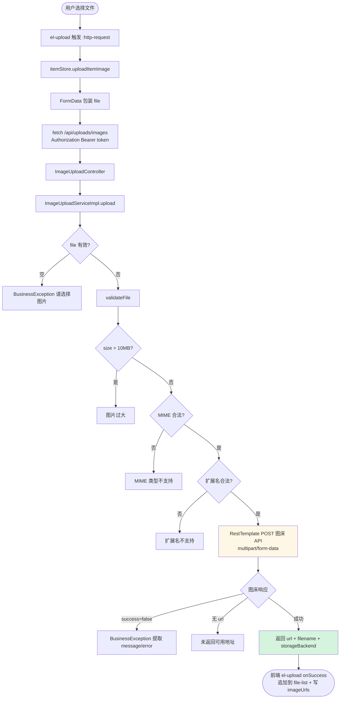
```mermaid
flowchart TD
    A([用户选择文件]) --> B[el-upload 触发 :http-request]
    B --> C[itemStore.uploadItemImage]
    C --> D[FormData 包装 file]
    D --> E[fetch /api/uploads/images<br/>Authorization Bearer token]
    E --> F[ImageUploadController]
    F --> G[ImageUploadServiceImpl.upload]
    G --> H{file 有效?}
    H -->|空| H1[BusinessException 请选择图片]
    H -->|否| I[validateFile]
    I --> I1{size > 10MB?}
    I1 -->|是| I2[图片过大]
    I1 -->|否| I3{MIME 合法?}
    I3 -->|否| I4[MIME 类型不支持]
    I3 -->|是| I5{扩展名合法?}
    I5 -->|否| I6[扩展名不支持]
    I5 -->|是| J[RestTemplate POST 图床 API<br/>multipart/form-data]
    J --> K{图床响应}
    K -->|success=false| K1[BusinessException 提取 message/error]
    K -->|无 url| K2[未返回可用地址]
    K -->|成功| L[返回 url + filename + storageBackend]
    L --> M([前端 el-upload onSuccess<br/>追加到 file-list + 写 imageUrls])
    style J fill:#fff7e6
    style L fill:#d4f4dd
```

---

## 15. 通知与邮件发送流程图

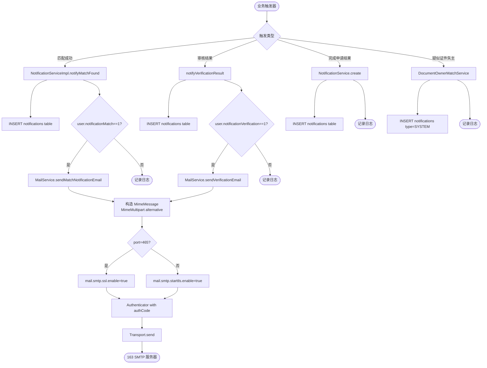
```mermaid
flowchart TD
    Trigger([业务触发器]) --> Types{触发类型}
    Types -->|匹配成功| M1[NotificationServiceImpl.notifyMatchFound]
    Types -->|审核结果| M2[notifyVerificationResult]
    Types -->|完成申请结果| M3[NotificationService.create]
    Types -->|疑似证件失主| M4[DocumentOwnerMatchService]

    M1 --> InApp1[INSERT notifications table]
    M1 --> CheckEmail1{user.notificationMatch==1?}
    CheckEmail1 -->|是| Mail1[MailService.sendMatchNotificationEmail]
    CheckEmail1 -->|否| Done1

    M2 --> InApp2[INSERT notifications table]
    M2 --> CheckEmail2{user.notificationVerification==1?}
    CheckEmail2 -->|是| Mail2[MailService.sendVerificationEmail]
    CheckEmail2 -->|否| Done2

    M3 --> InApp3[INSERT notifications table]
    M3 --> Done3

    M4 --> InApp4[INSERT notifications type=SYSTEM]
    M4 --> Done4

    Mail1 --> Mime[构造 MimeMessage<br/>MimeMultipart alternative]
    Mail2 --> Mime
    Mime --> SSL{port=465?}
    SSL -->|是| SSLSet[mail.smtp.ssl.enable=true]
    SSL -->|否| TLS[mail.smtp.starttls.enable=true]
    SSLSet --> Auth[Authenticator with authCode]
    TLS --> Auth
    Auth --> Send[Transport.send]
    Send --> SMTP([163 SMTP 服务器])
    Done1([记录日志])
    Done2([记录日志])
    Done3([记录日志])
    Done4([记录日志])
```

---

## 16. 管理员控制台信息流

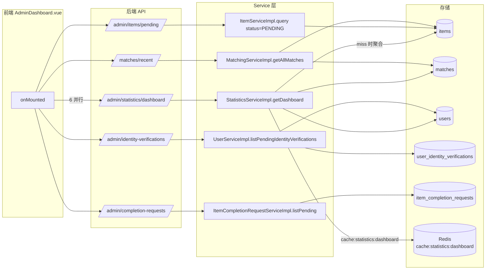
```mermaid
flowchart LR
    subgraph Frontend["前端 AdminDashboard.vue"]
        F1[onMounted]
    end

    subgraph BackendAPI["后端 API"]
        A1[/admin/statistics/dashboard/]
        A2[/admin/items/pending/]
        A3[/admin/identity-verifications/]
        A4[/admin/completion-requests/]
        A5[/matches/recent/]
    end

    subgraph Service["Service 层"]
        S1[StatisticsServiceImpl.getDashboard]
        S2[ItemServiceImpl.query status=PENDING]
        S3[UserServiceImpl.listPendingIdentityVerifications]
        S4[ItemCompletionRequestServiceImpl.listPending]
        S5[MatchingServiceImpl.getAllMatches]
    end

    subgraph Storage["存储"]
        DB1[(items)]
        DB2[(matches)]
        DB3[(users)]
        DB4[(user_identity_verifications)]
        DB5[(item_completion_requests)]
        CACHE[(Redis<br/>cache:statistics:dashboard)]
    end

    F1 -->|6 并行| A1
    F1 --> A2
    F1 --> A3
    F1 --> A4
    F1 --> A5

    A1 --> S1
    A2 --> S2
    A3 --> S3
    A4 --> S4
    A5 --> S5

    S1 -->|cache:statistics:dashboard| CACHE
    S1 -->|miss 时聚合| DB1
    S1 --> DB2
    S1 --> DB3
    S2 --> DB1
    S3 --> DB4
    S3 --> DB3
    S4 --> DB5
    S5 --> DB2
    S5 --> DB1
```

---

## 17. ER 关系图

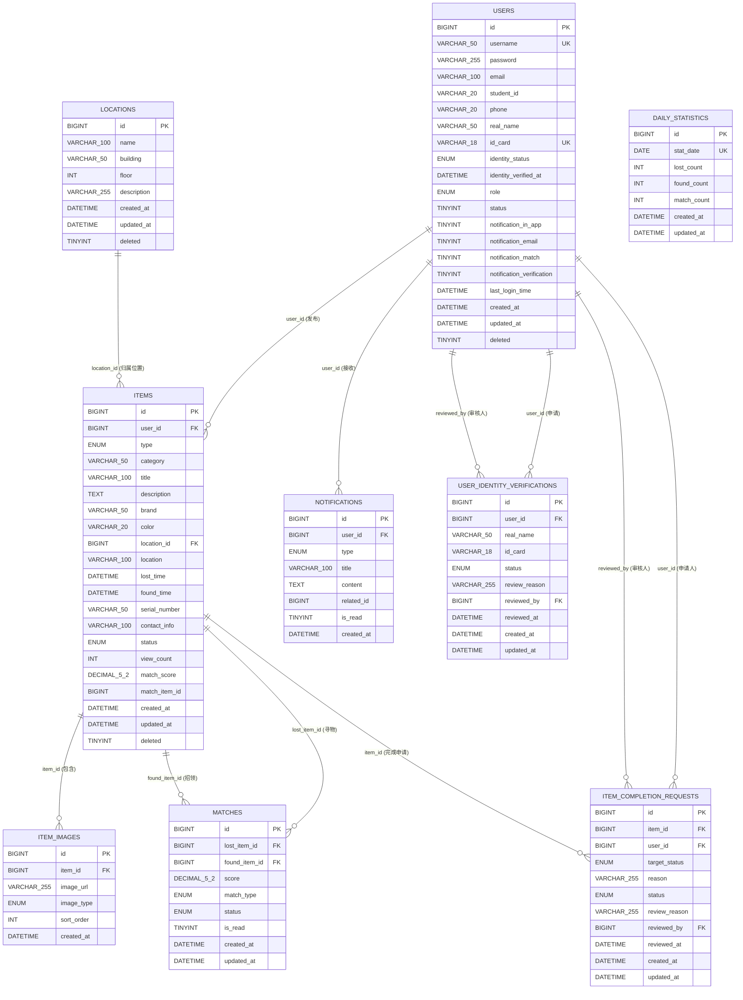
```mermaid
erDiagram
    USERS ||--o{ ITEMS : "user_id (发布)"
    USERS ||--o{ NOTIFICATIONS : "user_id (接收)"
    USERS ||--o{ USER_IDENTITY_VERIFICATIONS : "user_id (申请)"
    USERS ||--o{ USER_IDENTITY_VERIFICATIONS : "reviewed_by (审核人)"
    USERS ||--o{ ITEM_COMPLETION_REQUESTS : "user_id (申请人)"
    USERS ||--o{ ITEM_COMPLETION_REQUESTS : "reviewed_by (审核人)"

    LOCATIONS ||--o{ ITEMS : "location_id (归属位置)"

    ITEMS ||--o{ ITEM_IMAGES : "item_id (包含)"
    ITEMS ||--o{ ITEM_COMPLETION_REQUESTS : "item_id (完成申请)"

    ITEMS ||--o{ MATCHES : "lost_item_id (寻物)"
    ITEMS ||--o{ MATCHES : "found_item_id (招领)"

    USERS {
        BIGINT id PK
        VARCHAR_50 username UK
        VARCHAR_255 password
        VARCHAR_100 email
        VARCHAR_20 student_id
        VARCHAR_20 phone
        VARCHAR_50 real_name
        VARCHAR_18 id_card UK
        ENUM identity_status
        DATETIME identity_verified_at
        ENUM role
        TINYINT status
        TINYINT notification_in_app
        TINYINT notification_email
        TINYINT notification_match
        TINYINT notification_verification
        DATETIME last_login_time
        DATETIME created_at
        DATETIME updated_at
        TINYINT deleted
    }

    USER_IDENTITY_VERIFICATIONS {
        BIGINT id PK
        BIGINT user_id FK
        VARCHAR_50 real_name
        VARCHAR_18 id_card
        ENUM status
        VARCHAR_255 review_reason
        BIGINT reviewed_by FK
        DATETIME reviewed_at
        DATETIME created_at
        DATETIME updated_at
    }

    LOCATIONS {
        BIGINT id PK
        VARCHAR_100 name
        VARCHAR_50 building
        INT floor
        VARCHAR_255 description
        DATETIME created_at
        DATETIME updated_at
        TINYINT deleted
    }

    ITEMS {
        BIGINT id PK
        BIGINT user_id FK
        ENUM type
        VARCHAR_50 category
        VARCHAR_100 title
        TEXT description
        VARCHAR_50 brand
        VARCHAR_20 color
        BIGINT location_id FK
        VARCHAR_100 location
        DATETIME lost_time
        DATETIME found_time
        VARCHAR_50 serial_number
        VARCHAR_100 contact_info
        ENUM status
        INT view_count
        DECIMAL_5_2 match_score
        BIGINT match_item_id
        DATETIME created_at
        DATETIME updated_at
        TINYINT deleted
    }

    ITEM_IMAGES {
        BIGINT id PK
        BIGINT item_id FK
        VARCHAR_255 image_url
        ENUM image_type
        INT sort_order
        DATETIME created_at
    }

    MATCHES {
        BIGINT id PK
        BIGINT lost_item_id FK
        BIGINT found_item_id FK
        DECIMAL_5_2 score
        ENUM match_type
        ENUM status
        TINYINT is_read
        DATETIME created_at
        DATETIME updated_at
    }

    ITEM_COMPLETION_REQUESTS {
        BIGINT id PK
        BIGINT item_id FK
        BIGINT user_id FK
        ENUM target_status
        VARCHAR_255 reason
        ENUM status
        VARCHAR_255 review_reason
        BIGINT reviewed_by FK
        DATETIME reviewed_at
        DATETIME created_at
        DATETIME updated_at
    }

    NOTIFICATIONS {
        BIGINT id PK
        BIGINT user_id FK
        ENUM type
        VARCHAR_100 title
        TEXT content
        BIGINT related_id
        TINYINT is_read
        DATETIME created_at
    }

    DAILY_STATISTICS {
        BIGINT id PK
        DATE stat_date UK
        INT lost_count
        INT found_count
        INT match_count
        DATETIME created_at
        DATETIME updated_at
    }
```

---

## 18. 物品状态机 (状态流转)

> 详细说明参见上文 8 节。补充转化表：

| 起始态 | 触发动作 | 目标态 | 触发者 | 备注 |
|--------|----------|--------|--------|------|
| (无)  | POST /api/items | PENDING | 用户 | 默认初态 |
| PENDING | 管理员审核通过 | APPROVED | 管理员 | 进入匹配池 |
| PENDING | 管理员审核拒绝 | REJECTED | 管理员 | 不可见 |
| APPROVED | 完成申请通过(LOST) | FOUND_BACK | 用户提交 + 管理员通过 | 寻物已找到 |
| APPROVED | 完成申请通过(FOUND) | RETURNED | 用户提交 + 管理员通过 | 招领已归还 |
| APPROVED | 定时任务超时 | EXPIRED | 调度器 | 当前未实现 |
| APPROVED | 管理员手动关闭 | CLOSED | 管理员 | 当前未实现 |

---

## 19. 匹配状态机

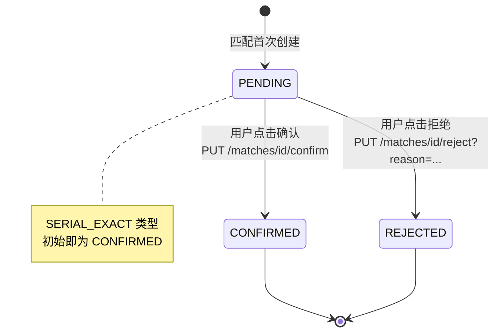
```mermaid
stateDiagram-v2
    [*] --> PENDING : 匹配首次创建
    PENDING --> CONFIRMED : 用户点击确认<br/>PUT /matches/id/confirm
    PENDING --> REJECTED : 用户点击拒绝<br/>PUT /matches/id/reject?reason=...
    CONFIRMED --> [*]
    REJECTED --> [*]
    note right of PENDING : SERIAL_EXACT 类型<br/>初始即为 CONFIRMED
```

---

## 20. 实名认证状态机

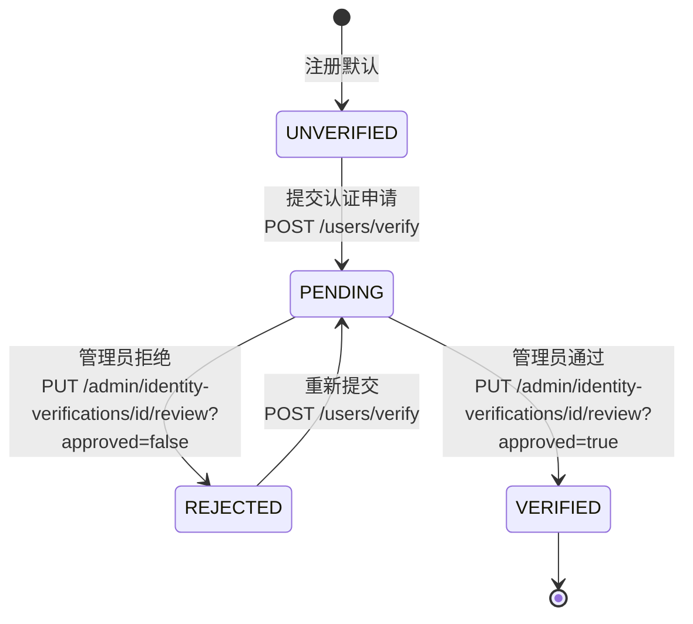
```mermaid
stateDiagram-v2
    [*] --> UNVERIFIED : 注册默认
    UNVERIFIED --> PENDING : 提交认证申请<br/>POST /users/verify
    REJECTED --> PENDING : 重新提交<br/>POST /users/verify
    PENDING --> VERIFIED : 管理员通过<br/>PUT /admin/identity-verifications/id/review?approved=true
    PENDING --> REJECTED : 管理员拒绝<br/>PUT /admin/identity-verifications/id/review?approved=false
    VERIFIED --> [*]
```

---

## 21. 完成申请状态机

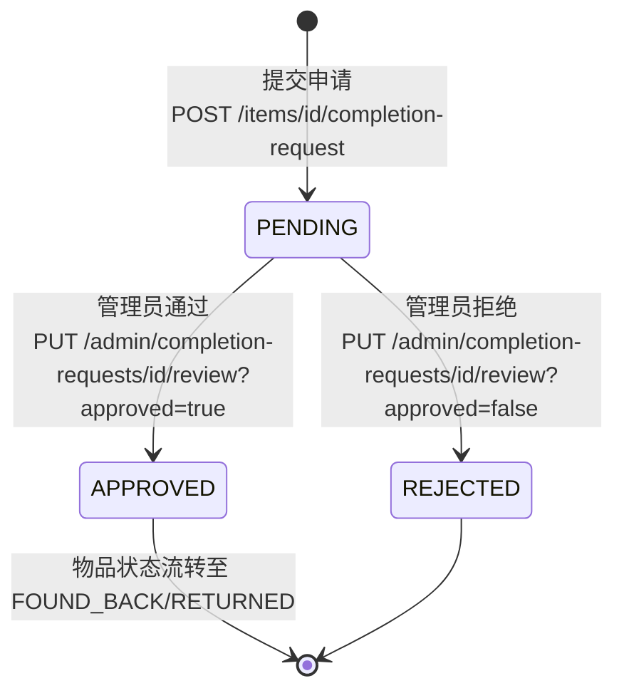
```mermaid
stateDiagram-v2
    [*] --> PENDING : 提交申请<br/>POST /items/id/completion-request
    PENDING --> APPROVED : 管理员通过<br/>PUT /admin/completion-requests/id/review?approved=true
    PENDING --> REJECTED : 管理员拒绝<br/>PUT /admin/completion-requests/id/review?approved=false
    APPROVED --> [*] : 物品状态流转至 FOUND_BACK/RETURNED
    REJECTED --> [*]
```

---

## 22. 匹配算法评分模型

```mermaid
graph TB
    Input[LostItem + FoundItem] --> S1{hasSerialMatch?<br/>trim + toUpperCase + equals}
    S1 -->|是| S1R[score = 1.00<br/>matchType = SERIAL_EXACT]
    S1 -->|否| S2[hasSerialConflict?]

    S2 -->|是| S2P[最终 score *= 0.40 惩罚]
    S2 -->|否| S2N[无惩罚]

    S2P --> S3
    S2N --> S3[加权分计算]

    S3 --> C1[category: 0.25<br/>eq=1.0 / contains=0.8 / else 0]
    S3 --> C2[location: 0.15<br/>id 相等=1.0 / id 不同=0.35 / 文本相似 * 0.8]
    S3 --> C3[brand: 0.10<br/>eq=1.0 / contains=0.8 / 相似 * 0.7]
    S3 --> C4[color: 0.05<br/>normalize 后 eq=1.0 / else 0]
    S3 --> C5[time: 0.10<br/>exp -days/10 衰减]
    S3 --> C6[text: 0.35<br/>title+description+location 文本 Dice 相似度]

    C1 --> Sum[加权和, setScale 2]
    C2 --> Sum
    C3 --> Sum
    C4 --> Sum
    C5 --> Sum
    C6 --> Sum

    Sum --> Threshold{score >= 0.65?}
    Threshold -->|是| Out[保留 score<br/>matchType = WEIGHTED]
    Threshold -->|否| Zero[返回 ZERO, 跳过]

    style S1R fill:#d4f4dd
    style Out fill:#d4f4dd
    style Zero fill:#ffe1e1
```

**权重常量参考**(`MatchingEngine.java`):

| 维度 | 权重 | 满分条件 |
|------|------|----------|
| 文本相似度 (title/desc/location) | 0.35 | Dice 系数 1.0 |
| 类别 | 0.25 | 相等 / 包含 |
| 地点 (locationId) | 0.15 | id 相等 |
| 时间衰减 | 0.10 | 同一天 |
| 品牌 | 0.10 | 相等 / 包含 |
| 颜色 | 0.05 | normalize 后相等 |
| **合计** | **1.00** | - |

匹配阈值 `MATCH_THRESHOLD = 0.65`,高分匹配阈值 `HIGH_CONFIDENCE_MATCH_THRESHOLD = 0.80`。

---

## 23. 接口权限矩阵

```mermaid
graph TB
    subgraph Public["公开接口 无需登录"]
        P1[GET /]
        P2[POST /api/auth/register]
        P3[POST /api/auth/login]
        P4[POST /api/auth/refresh]
        P5[GET /swagger-ui/**]
        P6[GET /v3/api-docs/**]
        P7[GET /api/statistics/overview]
        P8[GET /api/locations]
        P9[GET /api/locations/id]
        P10[GET /api/items GET]
        P11[GET /api/items/id]
        P12[GET /api/matches/test]
    end

    subgraph User["普通用户 USER+"]
        U1[POST /api/items]
        U2[PUT /api/items/id]
        U3[DELETE /api/items/id]
        U4[GET /api/items/my]
        U5[POST /api/items/id/completion-request]
        U6[GET /api/matches]
        U7[GET /api/matches/recent]
        U8[PUT /api/matches/id/confirm]
        U9[PUT /api/matches/id/reject]
        U10[GET /api/notifications]
        U11[GET /api/notifications/unread-count]
        U12[POST /api/notifications/id/read]
        U13[POST /api/notifications/read-all]
        U14[GET /api/users/profile]
        U15[PUT /api/users/profile]
        U16[POST /api/users/verify]
        U17[POST /api/users/change-password]
        U18[PUT /api/users/notification-settings]
        U19[POST /api/users/logout]
        U20[POST /api/uploads/images]
    end

    subgraph Admin["管理员 CAMPUS_ADMIN / SUPER_ADMIN"]
        A1[GET /api/admin/users]
        A2[PUT /api/admin/users/id]
        A3[PUT /api/admin/users/id/role]
        A4[PUT /api/admin/users/id/status]
        A5[DELETE /api/admin/users/id]
        A6[GET /api/admin/identity-verifications]
        A7[GET /api/admin/identity-verifications/history]
        A8[PUT /api/admin/identity-verifications/id/review]
        A9[POST /api/locations]
        A10[PUT /api/locations/id]
        A11[DELETE /api/locations/id]
        A12[GET /api/admin/statistics/dashboard]
        A13[GET /api/admin/statistics/today]
        A14[GET /api/admin/statistics/period]
        A15[GET /api/admin/statistics/categories]
        A16[GET /api/admin/statistics/locations]
        A17[GET /api/admin/completion-requests]
        A18[PUT /api/admin/completion-requests/id/review]
        A19[POST /api/matches/trigger]
        A20[POST /api/matches/batch]
    end

    subgraph Super["超管 SUPER_ADMIN"]
        S1[全部 /api/admin/users 修改/删除/改角色]
        S2[DbFixController 条件装配]
    end
```

详细列表参见 `docs/功能与API.md`。

---

## 24. 数据缓存与一致性

```mermaid
flowchart LR
    subgraph CacheKeys["Redis Key 命名空间"]
        K1[cache:statistics:dashboard<br/>5 分钟]
        K2[cache:statistics:overview<br/>5 分钟]
        K3[cache:statistics:today<br/>1 分钟]
        K4[cache:location:all<br/>60 分钟]
        K5[cache:item:id<br/>5 分钟]
    end

    subgraph Invalidators["缓存清除触发点"]
        I1[itemRepository.deleteById]
        I2[LocationController delete]
        I3[LocationController create]
        I4[DataInitializer 完成匹配]
    end

    I1 -->|clearItemCache id| K5
    I1 -->|clearStatisticsCache| K1
    I1 -->|clearStatisticsCache| K2
    I1 -->|clearStatisticsCache| K3
    I2 -->|clearLocationCache| K4
    I3 -->|clearLocationCache| K4
    I4 -->|clearStatisticsCache| K1
    I4 -->|clearStatisticsCache| K2

    subgraph WriteThrough["写穿透策略"]
        W1[统计数据 UPDATE 物品] --> W2[清相关缓存]
        W2 --> W3[下次读 miss → 重算]
    end

    subgraph CachedOps["缓存操作"]
        C1[getStatistics type]
        C2[setStatistics type, data, 5min]
        C3[cacheNullValue 防穿透]
    end

    C1 --> K1
    C2 --> K1
```

---

## 25. 异常处理与降级路径

```mermaid
flowchart TD
    A([任意 HTTP 请求]) --> B{Filter Chain}
    B -->|401 无 token| B1[GlobalExceptionHandler → 400]
    B -->|鉴权失败| B2[AuthenticationEntryPoint → 401]

    B --> C[Controller]
    C --> D{异常类型}

    D -->|BusinessException| E1[400 BadRequest<br/>echo code + message]
    D -->|MethodArgumentNotValid| E2[400<br/>取第一个 FieldError]
    D -->|BindException| E3[400<br/>取第一个 FieldError]
    D -->|TypeMismatch| E4[400 参数格式不正确]
    D -->|MissingParam| E5[400 参数不能为空]
    D -->|Exception 其它| E6{debugErrors?}
    E6 -->|true| E7[500 + 类名+message]
    E6 -->|false| E8[500 通用 系统异常 请稍后重试]

    E1 --> Log1[log.error 业务异常]
    E2 --> Log2[log.error 参数校验]
    E6 --> Log3[log.error 完整堆栈]

    subgraph FrontendFallback["前端兜底"]
        F1[401 → 清 token → 重试公开接口 → 失败 onUnauthorized]
        F2[403 → 清 token → 重试公开接口]
        F3[code != 200 → reject Error]
        F4[网络异常 → reject message]
    end

    subgraph MailFallback["邮件失败兜底"]
        M1[NotificationService.create 失败被 catch 不影响主流程]
        M2[MailService.send* 失败仅 log.error]
    end

    style E1 fill:#d4f4dd
    style E2 fill:#d4f4dd
    style E6 fill:#ffe1e1
    style F1 fill:#fff7e6
```

